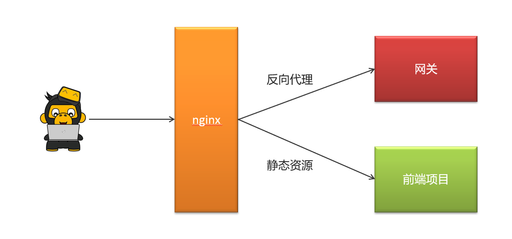

# 基于微服务的头条类项目

## 一、项目背景介绍

### 1. 项目概述

&emsp;类似于今日头条/腾讯新闻，是一个新闻资讯类项目。随着智能手机的普及，人们更加习惯于通过手机来看新闻。由于生活节奏的加快，很多人只能利用碎片时间来获取信息，因此，对于移动资讯客户端的需求也越来越高。头条项目采用当下火热的微服务+大数据技术架构实现。本项目主要着手于获取最新最热新闻资讯，通过大数据分析用户喜好精确推送咨询新闻

### 2. 功能架构图

|  |
| :---------------------------------------------: |

### 3. 技术栈说明

#### 3.1 基础层

|  |
| :-------------------------------------: |

#### 3.2 服务层

|  |
| :-------------------------------------: |

- Spring-Cloud-Gateway : 微服务之前架设的网关服务，实现服务注册中的API请求路由，以及控制流速控制和熔断处理都是常用的架构手段，而这些功能Gateway天然支持
- 运用Spring Boot快速开发框架，构建项目工程；并结合Spring Cloud全家桶技术，实现后端个人中心、自媒体、管理中心等微服务。
- 运用Spring Cloud Alibaba Nacos作为项目中的注册中心和配置中心
- 运用mybatis-plus作为持久层提升开发效率
- 运用Kafka完成内部系统消息通知；与客户端系统消息通知；以及实时数据计算
- 运用Redis缓存技术，实现热数据的计算，提升系统性能指标
- 使用Mysql存储用户数据，以保证上层数据查询的高性能
- 使用Mongo存储用户热数据，以保证用户热数据高扩展和高性能指标
- 使用FastDFS作为静态资源存储器，在其上实现热静态资源缓存、淘汰等功能
- 运用Hbase技术，存储系统中的冷数据，保证系统数据的可靠性
- 运用ES搜索技术，对冷数据、文章数据建立索引，以保证冷数据、文章查询性能
- 运用AI技术，来完成系统自动化功能，以提升效率及节省成本。比如实名认证自动化
- PMD&P3C : 静态代码扫描工具，在项目中扫描项目代码，检查异常点、优化点、代码规范等，为开发团队提供规范统一，提升项目代码质量

### 4. 项目主体结构

|  |
| :-------------------------------------------------: |


## 二、登录功能实现

### 1. 需求设计

- 用户点击**开始使用**

  登录后的用户权限较大，可以查看，也可以操作（点赞，关注，评论）

- 用户点击**不登录，先看看**

​       游客只有查看的权限

### 2. 表结构分析

&emsp;关于app端用户相关的内容较多，可以单独设置一个库leadnews_user

| **表名称**       | **说明**          |
| ---------------- | :---------------- |
| ap_user          | APP用户信息表     |
| ap_user_fan      | APP用户粉丝信息表 |
| ap_user_follow   | APP用户关注信息表 |
| ap_user_realname | APP实名认证信息表 |

### 3. ap_user表结构如下：

```mysql
-- auto-generated definition
create table ap_user
(
    id                         int unsigned auto_increment comment '主键'
        primary key,
    salt                       varchar(32)      null comment '密码、通信等加密盐',
    name                       varchar(20)      null comment '用户名',
    password                   varchar(32)      null comment '密码,md5加密',
    phone                      varchar(11)      null comment '手机号',
    image                      varchar(255)     null comment '头像',
    sex                        tinyint unsigned null comment '0 男
            1 女
            2 未知',
    is_certification           tinyint unsigned null comment '0 未
            1 是',
    is_identity_authentication tinyint(1)       null comment '是否身份认证',
    status                     tinyint unsigned null comment '0正常
            1锁定',
    flag                       tinyint unsigned null comment '0 普通用户
            1 自媒体人
            2 大V',
    created_time               datetime         null comment '注册时间'
)
    comment 'APP用户信息表' row_format = DYNAMIC;
```

|  |
| :---------------------------------------: |

#### 3.1 使用mybais-plus逆向生成对应的实体类

&emsp;项目中的持久层使用的mybatis-plus，一般都使用mybais-plus逆向生成对应的实体类

app_user表对应的实体类如下：

```java
package com.heima.model.user.pojos;

import com.baomidou.mybatisplus.annotation.IdType;
import com.baomidou.mybatisplus.annotation.TableField;
import com.baomidou.mybatisplus.annotation.TableId;
import com.baomidou.mybatisplus.annotation.TableName;
import lombok.Data;

import java.io.Serializable;
import java.util.Date;

/**
 * <p>
 * APP用户信息表
 * </p>
 *
 * @author itheima
 */
@Data
@TableName("ap_user")
public class ApUser implements Serializable {

    private static final long serialVersionUID = 1L;

    /**
     * 主键
     */
    @TableId(value = "id", type = IdType.AUTO)
    private Integer id;

    /**
     * 密码、通信等加密盐
     */
    @TableField("salt")
    private String salt;

    /**
     * 用户名
     */
    @TableField("name")
    private String name;

    /**
     * 密码,md5加密
     */
    @TableField("password")
    private String password;

    /**
     * 手机号
     */
    @TableField("phone")
    private String phone;

    /**
     * 头像
     */
    @TableField("image")
    private String image;

    /**
     * 0 男
            1 女
            2 未知
     */
    @TableField("sex")
    private Boolean sex;

    /**
     * 0 未
            1 是
     */
    @TableField("is_certification")
    private Boolean certification;

    /**
     * 是否身份认证
     */
    @TableField("is_identity_authentication")
    private Boolean identityAuthentication;

    /**
     * 0正常
            1锁定
     */
    @TableField("status")
    private Boolean status;

    /**
     * 0 普通用户
            1 自媒体人
            2 大V
     */
    @TableField("flag")
    private Short flag;

    /**
     * 注册时间
     */
    @TableField("created_time")
    private Date createdTime;

}
```

### 4. 手动加密（md5+随机字符串）

&emsp;md5是不可逆加密，md5相同的密码每次加密都一样，不太安全。在md5的基础上手动加盐（salt）处理

注册->生成盐

|  |
| :---------------------------------: |

登录->使用盐来配合验证

|  |
| :---------------------------------: |

### 5. 思路分析

|  |
| :-----------------------------------------: |

1. 用户输入了用户名和密码进行登录，校验成功后返回jwt**(基于当前用户的id生成，数据库id必大于0)**

2. 用户游客登录，生成jwt返回**(基于默认值0生成)**

#### 5.1 核心代码

```java
package com.heima.user.service.impl;

import com.baomidou.mybatisplus.core.toolkit.Wrappers;
import com.baomidou.mybatisplus.extension.service.impl.ServiceImpl;
import com.heima.model.common.dtos.ResponseResult;
import com.heima.model.common.enums.AppHttpCodeEnum;
import com.heima.model.user.dtos.LoginDto;
import com.heima.model.user.pojos.ApUser;
import com.heima.user.mapper.ApUserMapper;
import com.heima.user.service.ApUserService;
import com.heima.utils.common.AppJwtUtil;
import org.apache.commons.lang3.StringUtils;
import org.springframework.stereotype.Service;
import org.springframework.util.DigestUtils;

import java.util.HashMap;
import java.util.Map;


@Service
public class ApUserServiceImpl extends ServiceImpl<ApUserMapper, ApUser> implements ApUserService {

    @Override
    public ResponseResult login(LoginDto dto) {

        //1.正常登录（手机号+密码登录）
        if (!StringUtils.isBlank(dto.getPhone()) && !StringUtils.isBlank(dto.getPassword())) {
            //1.1查询用户
            ApUser apUser = getOne(Wrappers.<ApUser>lambdaQuery().eq(ApUser::getPhone, dto.getPhone()));
            if (apUser == null) {
                return ResponseResult.errorResult(AppHttpCodeEnum.DATA_NOT_EXIST,"用户不存在");
            }

            //1.2 比对密码
            String salt = apUser.getSalt();
            String pswd = dto.getPassword();
            pswd = DigestUtils.md5DigestAsHex((pswd + salt).getBytes());
            if (!pswd.equals(apUser.getPassword())) {
                return ResponseResult.errorResult(AppHttpCodeEnum.LOGIN_PASSWORD_ERROR);
            }
            //1.3 返回数据  jwt
            Map<String, Object> map = new HashMap<>();
            map.put("token", AppJwtUtil.getToken(apUser.getId().longValue()));
            apUser.setSalt("");
            apUser.setPassword("");
            map.put("user", apUser);
            return ResponseResult.okResult(map);
        } else {
            //2.游客  同样返回token  id = 0
            Map<String, Object> map = new HashMap<>();
            map.put("token", AppJwtUtil.getToken(0l));
            return ResponseResult.okResult(map);
        }
    }
}
```

### 6.  全局过滤器实现jwt校验

|  |
| :----------------------------------------------------------: |

思路分析：

1. 用户进入网关开始登陆，网关过滤器进行判断，如果是登录，则路由到后台管理微服务进行登录
2. 用户登录成功，后台管理微服务签发JWT TOKEN信息返回给用户
3. 用户再次进入网关开始访问，网关过滤器接收用户携带的TOKEN 
4. 网关过滤器解析TOKEN ，判断是否有权限，如果有，则放行，如果没有则返回未认证错误

具体实现：

1. 在认证过滤器中需要用到jwt的解析，所以需要把工具类拷贝一份到网关微服务

2. 在网关微服务中新建全局过滤器：

```java
package com.heima.app.gateway.filter;


import com.heima.app.gateway.util.AppJwtUtil;
import io.jsonwebtoken.Claims;
import lombok.extern.slf4j.Slf4j;
import org.apache.commons.lang.StringUtils;
import org.springframework.cloud.gateway.filter.GatewayFilterChain;
import org.springframework.cloud.gateway.filter.GlobalFilter;
import org.springframework.core.Ordered;
import org.springframework.http.HttpStatus;
import org.springframework.http.server.reactive.ServerHttpRequest;
import org.springframework.http.server.reactive.ServerHttpResponse;
import org.springframework.stereotype.Component;
import org.springframework.web.server.ServerWebExchange;
import reactor.core.publisher.Mono;

@Component
@Slf4j
public class AuthorizeFilter implements Ordered, GlobalFilter {
    @Override
    public Mono<Void> filter(ServerWebExchange exchange, GatewayFilterChain chain) {
        //1.获取request和response对象
        ServerHttpRequest request = exchange.getRequest();
        ServerHttpResponse response = exchange.getResponse();

        //2.判断是否是登录
        if(request.getURI().getPath().contains("/login")){
            //放行
            return chain.filter(exchange);
        }


        //3.获取token
        String token = request.getHeaders().getFirst("token");

        //4.判断token是否存在
        if(StringUtils.isBlank(token)){
            response.setStatusCode(HttpStatus.UNAUTHORIZED);
            return response.setComplete();
        }

        //5.判断token是否有效
        try {
            Claims claimsBody = AppJwtUtil.getClaimsBody(token);
            //是否是过期
            int result = AppJwtUtil.verifyToken(claimsBody);
            if(result == 1 || result  == 2){
                response.setStatusCode(HttpStatus.UNAUTHORIZED);
                return response.setComplete();
            }
        }catch (Exception e){
            e.printStackTrace();
            response.setStatusCode(HttpStatus.UNAUTHORIZED);
            return response.setComplete();
        }

        //6.放行
        return chain.filter(exchange);
    }

    /**
     * 优先级设置  值越小  优先级越高
     * @return
     */
    @Override
    public int getOrder() {
        return 0;
    }
}
```


## 三、接口测试工具postman、swagger、knife4j

### 1. postman

&emsp;Postman是一款功能强大的网页调试与发送网页HTTP请求的Chrome插件。postman被500万开发者和超100,000家公司用于每月访问1.3亿个API。官方网址：https://www.postman.com/

### 2.swagger

&emsp;Swagger 是一个规范和完整的框架，用于生成、描述、调用和可视化 RESTful 风格的 Web 服务(<https://swagger.io/>)。 它的主要作用是：

1. 使得前后端分离开发更加方便，有利于团队协作

2. 接口的文档在线自动生成，降低后端开发人员编写接口文档的负担

3. 功能测试：Spring已经将Swagger纳入自身的标准，建立了Spring-swagger项目，现在叫Springfox。通过在项目中引入Springfox ，即可非常简单快捷的使用Swagger。


#### 2.1 Swagger常用注解

在Java类中添加Swagger的注解即可生成Swagger接口文档，常用Swagger注解如下：

@Api：修饰整个类，描述Controller的作用  

@ApiOperation：描述一个类的一个方法，或者说一个接口  

@ApiParam：单个参数的描述信息  

@ApiModel：用对象来接收参数  

@ApiModelProperty：用对象接收参数时，描述对象的一个字段  

@ApiResponse：HTTP响应其中1个描述  

@ApiResponses：HTTP响应整体描述  

@ApiIgnore：使用该注解忽略这个API  

@ApiError ：发生错误返回的信息  

@ApiImplicitParam：一个请求参数  

@ApiImplicitParams：多个请求参数的描述信息

#### 2.2 访问接口文档

&emsp;启动user微服务，访问地址：http://localhost:port/swagger-ui.html

### 3. knife4j

&emsp;knife4j是为Java MVC框架集成Swagger生成Api文档的增强解决方案,前身是swagger-bootstrap-ui,取名kni4j是希望它能像一把匕首一样小巧,轻量,并且功能强悍!

gitee地址：https://gitee.com/xiaoym/knife4j

官方文档：https://doc.xiaominfo.com/

效果演示：http://knife4j.xiaominfo.com/doc.html

#### 3.1 核心功能

该UI增强包主要包括两大核心功能：文档说明 和 在线调试

- 文档说明：根据Swagger的规范说明，详细列出接口文档的说明，包括接口地址、类型、请求示例、请求参数、响应示例、响应参数、响应码等信息，使用swagger-bootstrap-ui能根据该文档说明，对该接口的使用情况一目了然。
- 在线调试：提供在线接口联调的强大功能，自动解析当前接口参数,同时包含表单验证，调用参数可返回接口响应内容、headers、Curl请求命令实例、响应时间、响应状态码等信息，帮助开发者在线调试，而不必通过其他测试工具测试接口是否正确，简洁、强大。
- 个性化配置：通过个性化ui配置项，可自定义UI的相关显示信息
- 离线文档：根据标准规范，生成的在线markdown离线文档，开发者可以进行拷贝生成markdown接口文档，通过其他第三方markdown转换工具转换成html或pdf，这样也可以放弃swagger2markdown组件
- 接口排序：自1.8.5后，ui支持了接口排序功能，例如一个注册功能主要包含了多个步骤,可以根据swagger-bootstrap-ui提供的接口排序规则实现接口的排序，step化接口操作，方便其他开发者进行接口对接

#### 3.2 访问接口文档

&emsp;在浏览器输入地址：`http://host:port/doc.html`

## 四、Nginx

|  |
| :-----------------------------------: |

通过nginx来进行配置，功能如下

- 通过nginx的**反向代理**功能访问后台的网关资源
- 通过nginx的**静态服务器**功能访问前端静态页面

## 五、文章列表加载

### 1. 需求分析


