- [基于微服务的头条类项目](#基于微服务的头条类项目)
  - [一、项目背景介绍](#一项目背景介绍)
    - [1. 项目概述](#1-项目概述)
    - [2. 功能架构图](#2-功能架构图)
    - [3. 技术栈说明](#3-技术栈说明)
      - [3.1 基础层](#31-基础层)
      - [3.2 服务层](#32-服务层)
    - [4. 项目主体结构](#4-项目主体结构)
  - [二、登录功能实现](#二登录功能实现)
    - [1. 需求设计](#1-需求设计)
    - [2. 表结构分析](#2-表结构分析)
    - [3. ap\_user表结构如下：](#3-ap_user表结构如下)
      - [3.1 使用mybais-plus逆向生成对应的实体类](#31-使用mybais-plus逆向生成对应的实体类)
    - [4. 手动加密（md5+随机字符串）](#4-手动加密md5随机字符串)
    - [5. 思路分析](#5-思路分析)
      - [5.1 核心代码](#51-核心代码)
    - [6.  全局过滤器实现jwt校验](#6--全局过滤器实现jwt校验)
  - [三、接口测试工具postman、swagger、knife4j](#三接口测试工具postmanswaggerknife4j)
    - [1. postman](#1-postman)
    - [2.swagger](#2swagger)
      - [2.1 Swagger常用注解](#21-swagger常用注解)
      - [2.2 访问接口文档](#22-访问接口文档)
    - [3. knife4j](#3-knife4j)
      - [3.1 核心功能](#31-核心功能)
      - [3.2 访问接口文档](#32-访问接口文档)
  - [四、Nginx](#四nginx)
  - [五、文章列表加载](#五文章列表加载)
    - [1. 需求分析](#1-需求分析)
    - [2. 表结构分析](#2-表结构分析-1)
      - [2.1 表的拆分-垂直分表](#21-表的拆分-垂直分表)
    - [3. 实现思路](#3-实现思路)
    - [4. 数据库查询](#4-数据库查询)
    - [5. 核心代码](#5-核心代码)
  - [六、freemarker](#六freemarker)
    - [1. 基础语法种类](#1-基础语法种类)
    - [2. 集合指令（List和Map）](#2-集合指令list和map)
    - [3. if指令](#3-if指令)
    - [4. 运算符](#4-运算符)
      - [4.1. 算数运算符](#41-算数运算符)
      - [4.2. 比较运算符](#42-比较运算符)
      - [4.3. 逻辑运算符](#43-逻辑运算符)
    - [5. 空值处理](#5-空值处理)
    - [6. 内建函数](#6-内建函数)
    - [7. 静态化测试](#7-静态化测试)
  - [七、对象存储服务MinIO](#七对象存储服务minio)
    - [1. MinIO简介](#1-minio简介)
    - [2. MinIO特点](#2-minio特点)
    - [3. 使用docker进行环境部署和启动](#3-使用docker进行环境部署和启动)
    - [4. 核心代码](#4-核心代码)
  - [八、文章详情](#八文章详情)
    - [1. 需求分析](#1-需求分析-1)
    - [2. 实现方案](#2-实现方案)
    - [3. 核心代码](#3-核心代码)
  - [九、自媒体文章发布](#九自媒体文章发布)
    - [1. 后台搭建](#1-后台搭建)
    - [2. 前台搭建](#2-前台搭建)
    - [3. 自媒体素材管理](#3-自媒体素材管理)
      - [3.1 素材上传](#31-素材上传)
        - [3.1.1 需求分析](#311-需求分析)
        - [3.1.2 表结构](#312-表结构)
        - [3.1.3 实现思路](#313-实现思路)
        - [3.1.4 接口定义](#314-接口定义)
        - [3.1.5 核心代码](#315-核心代码)
      - [3.2 素材列表查询](#32-素材列表查询)
        - [3.2.1 核心代码](#321-核心代码)
    - [4. 自媒体文章管理](#4-自媒体文章管理)
      - [4.1 查询所有频道](#41-查询所有频道)
        - [4.1.1 需求分析](#411-需求分析)
        - [4.1.2 表结构](#412-表结构)
        - [4.1.3 接口定义](#413-接口定义)
        - [4.1.4 核心代码](#414-核心代码)
      - [4.2 查询自媒体文章](#42-查询自媒体文章)
        - [4.2.1 需求说明](#421-需求说明)
        - [4.2.2 表结构分析](#422-表结构分析)
        - [4.2.3 枚举类](#423-枚举类)
        - [4.2.4 接口定义](#424-接口定义)
        - [4.2.5 核心代码](#425-核心代码)
      - [4.3 文章发布](#43-文章发布)
        - [4.3.1 需求分析](#431-需求分析)
        - [4.3.2 表结构分析](#432-表结构分析)
        - [4.3.3 实现思路](#433-实现思路)
        - [4.3.4 接口定义](#434-接口定义)
        - [4.3.5 核心代码](#435-核心代码)
  - [十、自媒体文章-自动审核](#十自媒体文章-自动审核)
    - [1. 自媒体文章自动审核流程](#1-自媒体文章自动审核流程)
    - [2. 内容安全第三方接口](#2-内容安全第三方接口)
    - [3. app端文章保存接口](#3-app端文章保存接口)
      - [3.1 表结构说明](#31-表结构说明)
      - [3.2 分布式id](#32-分布式id)
      - [3.3 思路分析](#33-思路分析)
      - [3.4 feign接口](#34-feign接口)
      - [3.5 核心代码](#35-核心代码)
    - [4. 自媒体文章自动审核功能实现](#4-自媒体文章自动审核功能实现)
      - [4.1 表结构说明](#41-表结构说明)
      - [4.2 核心代码](#42-核心代码)
      - [4.3 feign远程接口调用方式](#43-feign远程接口调用方式)
      - [4.4 服务降级处理](#44-服务降级处理)
        - [4.4.1 降级逻辑](#441-降级逻辑)
    - [5. 发布文章提交审核集成](#5-发布文章提交审核集成)
      - [5.1 同步调用与异步调用](#51-同步调用与异步调用)
      - [5.2 Springboot集成异步线程调用](#52-springboot集成异步线程调用)
    - [6. 新需求-自管理敏感词](#6-新需求-自管理敏感词)
      - [6.1 需求分析](#61-需求分析)
      - [6.2 敏感词-过滤](#62-敏感词-过滤)
      - [6.3 DFA实现原理](#63-dfa实现原理)
      - [6.4 自管理敏感词集成到文章审核中](#64-自管理敏感词集成到文章审核中)
        - [6.4.1 核心代码](#641-核心代码)
    - [7. 新需求-图片识别文字审核敏感词](#7-新需求-图片识别文字审核敏感词)
      - [7.1 需求分析](#71-需求分析)
      - [7.2 图片文字识别](#72-图片文字识别)
      - [7.3 Tess4j案例](#73-tess4j案例)
    - [8. 文章详情-静态文件生成](#8-文章详情-静态文件生成)
      - [8.1 思路分析](#81-思路分析)
  - [十一、延迟任务精准发布文章](#十一延迟任务精准发布文章)
    - [1. 概述](#1-概述)
      - [1.1 什么是延迟任务](#11-什么是延迟任务)
      - [2.2 技术对比](#22-技术对比)
        - [2.2.1 DelayQueue](#221-delayqueue)
          - [DelayQueue问题-未持久化](#delayqueue问题-未持久化)
        - [2.2.2 RabbitMQ实现延迟任务](#222-rabbitmq实现延迟任务)
        - [2.2.3 redis实现](#223-redis实现)
    - [2. redis实现延迟任务](#2-redis实现延迟任务)
    - [3. 延迟任务服务实现](#3-延迟任务服务实现)
      - [3.1 表结构](#31-表结构)
      - [3.2 添加任务](#32-添加任务)
        - [3.2.1 核心代码](#321-核心代码-1)
      - [3.3 取消任务](#33-取消任务)
        - [3.3.1 核心代码](#331-核心代码)
      - [3.4 消费任务](#34-消费任务)
        - [3.4.1 核心代码](#341-核心代码)
      - [3.5 未来数据定时刷新](#35-未来数据定时刷新)
        - [3.5.1 reids key值匹配](#351-reids-key值匹配)
        - [3.5.2 reids管道](#352-reids管道)
        - [3.5.3 核心代码](#353-核心代码)
      - [3.6 分布式锁解决集群下的方法抢占执行](#36-分布式锁解决集群下的方法抢占执行)
        - [3.6.1 问题描述](#361-问题描述)
        - [3.6.2 分布式锁](#362-分布式锁)
        - [3.6.3 redis分布式锁](#363-redis分布式锁)
        - [3.6.4 在工具类CacheService中添加方法](#364-在工具类cacheservice中添加方法)
      - [3.7 数据库同步到redis](#37-数据库同步到redis)
    - [4. 延迟队列解决精准时间发布文章](#4-延迟队列解决精准时间发布文章)
        - [4.1 延迟队列服务提供对外接口](#41-延迟队列服务提供对外接口)
        - [4.2 发布文章集成添加延迟队列接口](#42-发布文章集成添加延迟队列接口)
          - [4.2.1 序列化工具对比](#421-序列化工具对比)
          - [4.2.2 核心代码](#422-核心代码)
        - [4.3 消费任务进行审核文章](#43-消费任务进行审核文章)
  - [十二、kafka及异步通知文章上下架](#十二kafka及异步通知文章上下架)
    - [1. 自媒体文章上下架](#1-自媒体文章上下架)
    - [2. kafka概述](#2-kafka概述)
    - [3. kafka安装配置](#3-kafka安装配置)
    - [4. kafka高可用设计](#4-kafka高可用设计)
      - [4.1 集群](#41-集群)
      - [4.2 备份机制(Replication）](#42-备份机制replication)
        - [同步方式](#同步方式)
    - [5. 生产者详解](#5-生产者详解)
      - [5.1 参数详解](#51-参数详解)
    - [6.消费者详解](#6消费者详解)
      - [6.1 消费者组](#61-消费者组)
      - [6.2 消息有序性](#62-消息有序性)
      - [6.3 提交和偏移量](#63-提交和偏移量)
    - [7. 自媒体文章上下架功能完成](#7-自媒体文章上下架功能完成)
      - [7.1 需求分析](#71-需求分析-1)
      - [7.2 流程说明](#72-流程说明)
      - [7.3 接口定义](#73-接口定义)
      - [7.4 核心代码](#74-核心代码)
      - [7.5 消息通知article端文章上下架](#75-消息通知article端文章上下架)
  - [十三、app端文章搜索](#十三app端文章搜索)
    - [1. App端搜索-效果图](#1-app端搜索-效果图)
    - [2. 搭建ElasticSearch环境](#2-搭建elasticsearch环境)
      - [2.1 拉取镜像](#21-拉取镜像)
      - [2.2 创建容器](#22-创建容器)
      - [2.3 配置中文分词器 ik](#23-配置中文分词器-ik)
    - [3. app端文章搜索](#3-app端文章搜索)
      - [3.1 需求分析](#31-需求分析)
      - [3.2 思路分析](#32-思路分析)
      - [3.3 创建索引和映射](#33-创建索引和映射)
    - [4. 数据初始化到索引库](#4-数据初始化到索引库)
      - [4.1 核心代码](#41-核心代码)
    - [5. 文章搜索功能实现](#5-文章搜索功能实现)
      - [5.1 搭建搜索微服务](#51-搭建搜索微服务)
      - [5.2 核心代码](#52-核心代码)
    - [6. 文章自动审核构建索引](#6-文章自动审核构建索引)
      - [6.1 思路分析](#61-思路分析)
      - [6.2 文章微服务发送消息](#62-文章微服务发送消息)
      - [6.4 搜索微服务接收消息并创建索引](#64-搜索微服务接收消息并创建索引)
        - [6.4.1 核心代码](#641-核心代码-1)
    - [7. app端搜索-搜索记录](#7-app端搜索-搜索记录)
      - [7.1 需求分析](#71-需求分析-2)
      - [7.2 数据存储说明](#72-数据存储说明)
      - [7.3MongoDB安装及集成](#73mongodb安装及集成)
        - [3.1 安装MongoDB](#31-安装mongodb)
      - [7.3 核心方法](#73-核心方法)
      - [7.4 保存搜索记录](#74-保存搜索记录)
        - [7.4.1 实现思路](#741-实现思路)
        - [7.4.2 核心代码](#742-核心代码)
      - [7.5 加载搜索记录列表](#75-加载搜索记录列表)
        - [7.5.1 思路分析](#751-思路分析)
        - [7.5.2核心代码](#752核心代码)
      - [7.6 删除搜索记录](#76-删除搜索记录)
        - [7.6.1 思路分析](#761-思路分析)
    - [8. app端搜索-关键字联想词](#8-app端搜索-关键字联想词)
      - [8.1 需求分析](#81-需求分析)
      - [8.2 搜索词-数据来源](#82-搜索词-数据来源)
      - [8.3 核心代码](#83-核心代码)
  - [十四、xxl-Job分布式任务调度](#十四xxl-job分布式任务调度)
    - [1. 需求分析](#1-需求分析-2)
    - [2. 实现思路](#2-实现思路)
    - [3. 定时任务框架-xxljob](#3-定时任务框架-xxljob)
    - [4. 分布式任务调度](#4-分布式任务调度)
      - [4.1 什么是分布式任务调度](#41-什么是分布式任务调度)
      - [4.2 xxl-Job简介](#42-xxl-job简介)
      - [4.3 8张表](#43-8张表)
      - [4.4 配置部署调度中心-docker安装](#44-配置部署调度中心-docker安装)
      - [4.5 配置](#45-配置)
      - [4.6 路由策略(分片广播)](#46-路由策略分片广播)
        - [4.6.1 分片逻辑](#461-分片逻辑)
    - [5. 热点文章-定时计算](#5-热点文章-定时计算)
      - [5.1 实现思路](#51-实现思路)
      - [5.2 实现步骤](#52-实现步骤)
      - [5.3 频道列表远程接口准备](#53-频道列表远程接口准备)
      - [5.3.4 热文章业务层](#534-热文章业务层)
      - [3.3.5 xxl-job定时计算-步骤](#335-xxl-job定时计算-步骤)
    - [6. 查询文章接口改造](#6-查询文章接口改造)
      - [6.1 思路分析](#61-思路分析-1)
      - [6.2 核心代码](#62-核心代码)
  - [十五、热点文章-实时计算](#十五热点文章-实时计算)
    - [1. 定时计算与实时计算](#1-定时计算与实时计算)
    - [2. 实时流式计算](#2-实时流式计算)
      - [2.1 概念](#21-概念)
      - [2.2 应用场景](#22-应用场景)
      - [2.3 技术方案选型](#23-技术方案选型)
    - [3. Kafka Stream](#3-kafka-stream)
      - [3.1 概述](#31-概述)
      - [3.2 Kafka Streams的关键概念](#32-kafka-streams的关键概念)
      - [3.3 KStream](#33-kstream)
      - [3.4 Kafka Stream入门案例编写](#34-kafka-stream入门案例编写)
        - [3.4.1 需求分析，求单词个数（word count）](#341-需求分析求单词个数word-count)
        - [3.4.2 引入依赖](#342-引入依赖)
        - [3.4.3 创建原生的kafka staream入门案例](#343-创建原生的kafka-staream入门案例)
      - [3.5 SpringBoot集成Kafka Stream](#35-springboot集成kafka-stream)
        - [3.5.1 自定配置参数](#351-自定配置参数)
    - [4. app端热点文章计算](#4-app端热点文章计算)
      - [4.1 思路说明](#41-思路说明)
      - [4.2 功能实现](#42-功能实现)
        - [4.2.1 用户行为（阅读量，评论，点赞，收藏）发送消息，以阅读和点赞为例](#421-用户行为阅读量评论点赞收藏发送消息以阅读和点赞为例)
        - [4.2.2 使用kafkaStream实时接收消息，聚合内容](#422-使用kafkastream实时接收消息聚合内容)
        - [4.2.3 重新计算文章的分值，更新到数据库和缓存中](#423-重新计算文章的分值更新到数据库和缓存中)
  - [十六、项目部署\_持续集成](#十六项目部署_持续集成)
    - [1.概念](#1概念)
      - [1.1 什么是持续集成](#11-什么是持续集成)
      - [1.2 持续集成的好处](#12-持续集成的好处)
    - [2. 软件开发模式](#2-软件开发模式)
      - [2.1 软件开发生命周期](#21-软件开发生命周期)
      - [2.2 软件开发瀑布模型](#22-软件开发瀑布模型)
      - [2.3 软件的敏捷开发](#23-软件的敏捷开发)
    - [3. Jenkins安装配置](#3-jenkins安装配置)
      - [3.1 Jenkins介绍](#31-jenkins介绍)
      - [3.2 Jenkins环境搭建](#32-jenkins环境搭建)
        - [3.2.1  Jenkins安装配置](#321--jenkins安装配置)
        - [3.2.2  Jenkins插件安装](#322--jenkins插件安装)
    - [4. 后端项目部署](#4-后端项目部署)
      - [4.1 多环境切换-微服务中多环境配置](#41-多环境切换-微服务中多环境配置)
      - [4.2 整体思路](#42-整体思路)
      - [4.3 服务集成Docker配置](#43-服务集成docker配置)
      - [4.4 jenkins微服务打包配置](#44-jenkins微服务打包配置)
      - [4.4 部署服务到远程服务器上](#44-部署服务到远程服务器上)
        - [4.4.1 安装配置私有仓库](#441-安装配置私有仓库)
        - [4.4.2 jenkins中安装插件](#442-jenkins中安装插件)
        - [4.4.3 jenkins系统配置远程服务器链接](#443-jenkins系统配置远程服务器链接)
        - [4.4.4 在远程服务器上执行脚本](#444-在远程服务器上执行脚本)
        - [4.4.5 构建完成以后，可以登录130服务器，查看是否有相关的镜像和容器](#445-构建完成以后可以登录130服务器查看是否有相关的镜像和容器)
      - [4.5 联调测试](#45-联调测试)
    - [5. jenkins触发器配置](#5-jenkins触发器配置)
      - [5.1 URL触发远程构建](#51-url触发远程构建)
      - [5.2 其他工程构建后触发](#52-其他工程构建后触发)
      - [5.3 定时构建](#53-定时构建)
      - [5.4 轮询](#54-轮询)

# 基于微服务的头条类项目

## 一、项目背景介绍

### 1. 项目概述

&emsp;类似于今日头条/腾讯新闻，是一个新闻资讯类项目。随着智能手机的普及，人们更加习惯于通过手机来看新闻。由于生活节奏的加快，很多人只能利用碎片时间来获取信息，因此，对于移动资讯客户端的需求也越来越高。头条项目采用当下火热的微服务+大数据技术架构实现。本项目主要着手于获取最新最热新闻资讯，通过大数据分析用户喜好精确推送咨询新闻。

&emsp;本系统分为普通用户、作者、管理员三种角色

- 普通用户：注册登录 浏览文章 关注 点赞 喜欢 评论 回复评论 点赞评论 搜索文章 搜索历史记录
- 作者：拥有普通用户所有功能 图片素材管理 发布文章 上下架文章

- 管理员：用户列表 用户申请成为作者列表 审核 频道管理（文章类型管理）文章管理审核 敏感词管理

文章发布还接入了阿里云文字和图片识别，内容安全涉黄涉黑检测

### 2. 功能架构图

<div align="center">
    
</div>

### 3. 技术栈说明

#### 3.1 基础层

<div align="center">
    
</div>

#### 3.2 服务层

<div align="center">
    
</div>

- Spring-Cloud-Gateway : 微服务之前架设的网关服务，实现服务注册中的API请求路由，以及控制流速控制和熔断处理都是常用的架构手段，而这些功能Gateway天然支持
- 运用Spring Boot快速开发框架，构建项目工程；并结合Spring Cloud全家桶技术，实现后端个人中心、自媒体、管理中心等微服务。
- 运用Spring Cloud Alibaba Nacos作为项目中的注册中心和配置中心
- 运用mybatis-plus作为持久层提升开发效率
- 运用Kafka完成内部系统消息通知；与客户端系统消息通知；以及实时数据计算
- 运用Redis缓存技术，实现热数据的计算，提升系统性能指标
- 使用Mysql存储用户数据，以保证上层数据查询的高性能
- 使用Mongo存储用户热数据，以保证用户热数据高扩展和高性能指标
- 使用FastDFS作为静态资源存储器，在其上实现热静态资源缓存、淘汰等功能
- 运用Hbase技术，存储系统中的冷数据，保证系统数据的可靠性
- 运用ES搜索技术，对冷数据、文章数据建立索引，以保证冷数据、文章查询性能
- 运用AI技术，来完成系统自动化功能，以提升效率及节省成本。比如实名认证自动化
- PMD&P3C : 静态代码扫描工具，在项目中扫描项目代码，检查异常点、优化点、代码规范等，为开发团队提供规范统一，提升项目代码质量

### 4. 项目主体结构

<div align="center">
    
</div>


## 二、登录功能实现

### 1. 需求设计

- 用户点击**开始使用**

  登录后的用户权限较大，可以查看，也可以操作（点赞，关注，评论）

- 用户点击**不登录，先看看**

​       游客只有查看的权限

### 2. 表结构分析

&emsp;关于app端用户相关的内容较多，可以单独设置一个库leadnews_user

| **表名称**       | **说明**          |
| ---------------- | :---------------- |
| ap_user          | APP用户信息表     |
| ap_user_fan      | APP用户粉丝信息表 |
| ap_user_follow   | APP用户关注信息表 |
| ap_user_realname | APP实名认证信息表 |

### 3. ap_user表结构如下：

```mysql
-- auto-generated definition
create table ap_user
(
    id                         int unsigned auto_increment comment '主键'
        primary key,
    salt                       varchar(32)      null comment '密码、通信等加密盐',
    name                       varchar(20)      null comment '用户名',
    password                   varchar(32)      null comment '密码,md5加密',
    phone                      varchar(11)      null comment '手机号',
    image                      varchar(255)     null comment '头像',
    sex                        tinyint unsigned null comment '0 男
            1 女
            2 未知',
    is_certification           tinyint unsigned null comment '0 未
            1 是',
    is_identity_authentication tinyint(1)       null comment '是否身份认证',
    status                     tinyint unsigned null comment '0正常
            1锁定',
    flag                       tinyint unsigned null comment '0 普通用户
            1 自媒体人
            2 大V',
    created_time               datetime         null comment '注册时间'
)
    comment 'APP用户信息表' row_format = DYNAMIC;
```

<div align="center">
    
</div>


#### 3.1 使用mybais-plus逆向生成对应的实体类

&emsp;项目中的持久层使用的mybatis-plus，一般都使用mybais-plus逆向生成对应的实体类

app_user表对应的实体类如下：

```java
package com.heima.model.user.pojos;

import com.baomidou.mybatisplus.annotation.IdType;
import com.baomidou.mybatisplus.annotation.TableField;
import com.baomidou.mybatisplus.annotation.TableId;
import com.baomidou.mybatisplus.annotation.TableName;
import lombok.Data;

import java.io.Serializable;
import java.util.Date;

/**
 * <p>
 * APP用户信息表
 * </p>
 *
 * @author itheima
 */
@Data
@TableName("ap_user")
public class ApUser implements Serializable {

    private static final long serialVersionUID = 1L;

    /**
     * 主键
     */
    @TableId(value = "id", type = IdType.AUTO)
    private Integer id;

    /**
     * 密码、通信等加密盐
     */
    @TableField("salt")
    private String salt;

    /**
     * 用户名
     */
    @TableField("name")
    private String name;

    /**
     * 密码,md5加密
     */
    @TableField("password")
    private String password;

    /**
     * 手机号
     */
    @TableField("phone")
    private String phone;

    /**
     * 头像
     */
    @TableField("image")
    private String image;

    /**
     * 0 男
            1 女
            2 未知
     */
    @TableField("sex")
    private Boolean sex;

    /**
     * 0 未
            1 是
     */
    @TableField("is_certification")
    private Boolean certification;

    /**
     * 是否身份认证
     */
    @TableField("is_identity_authentication")
    private Boolean identityAuthentication;

    /**
     * 0正常
            1锁定
     */
    @TableField("status")
    private Boolean status;

    /**
     * 0 普通用户
            1 自媒体人
            2 大V
     */
    @TableField("flag")
    private Short flag;

    /**
     * 注册时间
     */
    @TableField("created_time")
    private Date createdTime;

}
```

### 4. 手动加密（md5+随机字符串）

&emsp;md5是不可逆加密，md5相同的密码每次加密都一样，不太安全。在md5的基础上手动加盐（salt）处理

注册->生成盐

<div align="center">
    
</div>


登录->使用盐来配合验证

<div align="center">
    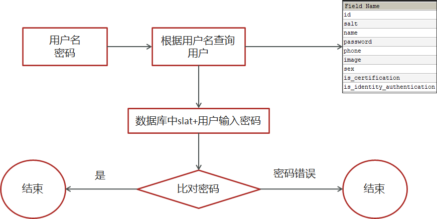
</div>


### 5. 思路分析

<div align="center">
    
</div>


1. 用户输入了用户名和密码进行登录，校验成功后返回jwt**(基于当前用户的id生成，数据库id必大于0)**

2. 用户游客登录，生成jwt返回**(基于默认值0生成)**

#### 5.1 核心代码

```java
package com.heima.user.service.impl;

import com.baomidou.mybatisplus.core.toolkit.Wrappers;
import com.baomidou.mybatisplus.extension.service.impl.ServiceImpl;
import com.heima.model.common.dtos.ResponseResult;
import com.heima.model.common.enums.AppHttpCodeEnum;
import com.heima.model.user.dtos.LoginDto;
import com.heima.model.user.pojos.ApUser;
import com.heima.user.mapper.ApUserMapper;
import com.heima.user.service.ApUserService;
import com.heima.utils.common.AppJwtUtil;
import org.apache.commons.lang3.StringUtils;
import org.springframework.stereotype.Service;
import org.springframework.util.DigestUtils;

import java.util.HashMap;
import java.util.Map;


@Service
public class ApUserServiceImpl extends ServiceImpl<ApUserMapper, ApUser> implements ApUserService {

    @Override
    public ResponseResult login(LoginDto dto) {

        //1.正常登录（手机号+密码登录）
        if (!StringUtils.isBlank(dto.getPhone()) && !StringUtils.isBlank(dto.getPassword())) {
            //1.1查询用户
            ApUser apUser = getOne(Wrappers.<ApUser>lambdaQuery().eq(ApUser::getPhone, dto.getPhone()));
            if (apUser == null) {
                return ResponseResult.errorResult(AppHttpCodeEnum.DATA_NOT_EXIST,"用户不存在");
            }

            //1.2 比对密码
            String salt = apUser.getSalt();
            String pswd = dto.getPassword();
            pswd = DigestUtils.md5DigestAsHex((pswd + salt).getBytes());
            if (!pswd.equals(apUser.getPassword())) {
                return ResponseResult.errorResult(AppHttpCodeEnum.LOGIN_PASSWORD_ERROR);
            }
            //1.3 返回数据  jwt
            Map<String, Object> map = new HashMap<>();
            map.put("token", AppJwtUtil.getToken(apUser.getId().longValue()));
            apUser.setSalt("");
            apUser.setPassword("");
            map.put("user", apUser);
            return ResponseResult.okResult(map);
        } else {
            //2.游客  同样返回token  id = 0
            Map<String, Object> map = new HashMap<>();
            map.put("token", AppJwtUtil.getToken(0l));
            return ResponseResult.okResult(map);
        }
    }
}
```

### 6.  全局过滤器实现jwt校验

<div align="center">
    
</div>

思路分析：

1. 用户进入网关开始登陆，网关过滤器进行判断，如果是登录，则路由到后台管理微服务进行登录
2. 用户登录成功，后台管理微服务签发JWT TOKEN信息返回给用户
3. 用户再次进入网关开始访问，网关过滤器接收用户携带的TOKEN 
4. 网关过滤器解析TOKEN ，判断是否有权限，如果有，则放行，如果没有则返回未认证错误

具体实现：

1. 在认证过滤器中需要用到jwt的解析，所以需要把工具类拷贝一份到网关微服务

2. 在网关微服务中新建全局过滤器：

```java
package com.heima.app.gateway.filter;


import com.heima.app.gateway.util.AppJwtUtil;
import io.jsonwebtoken.Claims;
import lombok.extern.slf4j.Slf4j;
import org.apache.commons.lang.StringUtils;
import org.springframework.cloud.gateway.filter.GatewayFilterChain;
import org.springframework.cloud.gateway.filter.GlobalFilter;
import org.springframework.core.Ordered;
import org.springframework.http.HttpStatus;
import org.springframework.http.server.reactive.ServerHttpRequest;
import org.springframework.http.server.reactive.ServerHttpResponse;
import org.springframework.stereotype.Component;
import org.springframework.web.server.ServerWebExchange;
import reactor.core.publisher.Mono;

@Component
@Slf4j
public class AuthorizeFilter implements Ordered, GlobalFilter {
    @Override
    public Mono<Void> filter(ServerWebExchange exchange, GatewayFilterChain chain) {
        //1.获取request和response对象
        ServerHttpRequest request = exchange.getRequest();
        ServerHttpResponse response = exchange.getResponse();

        //2.判断是否是登录
        if(request.getURI().getPath().contains("/login")){
            //放行
            return chain.filter(exchange);
        }


        //3.获取token
        String token = request.getHeaders().getFirst("token");

        //4.判断token是否存在
        if(StringUtils.isBlank(token)){
            response.setStatusCode(HttpStatus.UNAUTHORIZED);
            return response.setComplete();
        }

        //5.判断token是否有效
        try {
            Claims claimsBody = AppJwtUtil.getClaimsBody(token);
            //是否是过期
            int result = AppJwtUtil.verifyToken(claimsBody);
            if(result == 1 || result  == 2){
                response.setStatusCode(HttpStatus.UNAUTHORIZED);
                return response.setComplete();
            }
        }catch (Exception e){
            e.printStackTrace();
            response.setStatusCode(HttpStatus.UNAUTHORIZED);
            return response.setComplete();
        }

        //6.放行
        return chain.filter(exchange);
    }

    /**
     * 优先级设置  值越小  优先级越高
     * @return
     */
    @Override
    public int getOrder() {
        return 0;
    }
}
```


## 三、接口测试工具postman、swagger、knife4j

### 1. postman

&emsp;Postman是一款功能强大的网页调试与发送网页HTTP请求的Chrome插件。postman被500万开发者和超100,000家公司用于每月访问1.3亿个API。官方网址：https://www.postman.com/

### 2.swagger

&emsp;Swagger 是一个规范和完整的框架，用于生成、描述、调用和可视化 RESTful 风格的 Web 服务(<https://swagger.io/>)。 它的主要作用是：

1. 使得前后端分离开发更加方便，有利于团队协作

2. 接口的文档在线自动生成，降低后端开发人员编写接口文档的负担

3. 功能测试：Spring已经将Swagger纳入自身的标准，建立了Spring-swagger项目，现在叫Springfox。通过在项目中引入Springfox ，即可非常简单快捷的使用Swagger。


#### 2.1 Swagger常用注解

在Java类中添加Swagger的注解即可生成Swagger接口文档，常用Swagger注解如下：

@Api：修饰整个类，描述Controller的作用  

@ApiOperation：描述一个类的一个方法，或者说一个接口  

@ApiParam：单个参数的描述信息  

@ApiModel：用对象来接收参数  

@ApiModelProperty：用对象接收参数时，描述对象的一个字段  

@ApiResponse：HTTP响应其中1个描述  

@ApiResponses：HTTP响应整体描述  

@ApiIgnore：使用该注解忽略这个API  

@ApiError ：发生错误返回的信息  

@ApiImplicitParam：一个请求参数  

@ApiImplicitParams：多个请求参数的描述信息

#### 2.2 访问接口文档

&emsp;启动user微服务，访问地址：http://localhost:port/swagger-ui.html

### 3. knife4j

&emsp;knife4j是为Java MVC框架集成Swagger生成Api文档的增强解决方案,前身是swagger-bootstrap-ui,取名kni4j是希望它能像一把匕首一样小巧,轻量,并且功能强悍!

gitee地址：https://gitee.com/xiaoym/knife4j

官方文档：https://doc.xiaominfo.com/

效果演示：http://knife4j.xiaominfo.com/doc.html

#### 3.1 核心功能

该UI增强包主要包括两大核心功能：文档说明 和 在线调试

- 文档说明：根据Swagger的规范说明，详细列出接口文档的说明，包括接口地址、类型、请求示例、请求参数、响应示例、响应参数、响应码等信息，使用swagger-bootstrap-ui能根据该文档说明，对该接口的使用情况一目了然。
- 在线调试：提供在线接口联调的强大功能，自动解析当前接口参数,同时包含表单验证，调用参数可返回接口响应内容、headers、Curl请求命令实例、响应时间、响应状态码等信息，帮助开发者在线调试，而不必通过其他测试工具测试接口是否正确，简洁、强大。
- 个性化配置：通过个性化ui配置项，可自定义UI的相关显示信息
- 离线文档：根据标准规范，生成的在线markdown离线文档，开发者可以进行拷贝生成markdown接口文档，通过其他第三方markdown转换工具转换成html或pdf，这样也可以放弃swagger2markdown组件
- 接口排序：自1.8.5后，ui支持了接口排序功能，例如一个注册功能主要包含了多个步骤,可以根据swagger-bootstrap-ui提供的接口排序规则实现接口的排序，step化接口操作，方便其他开发者进行接口对接

#### 3.2 访问接口文档

&emsp;在浏览器输入地址：`http://host:port/doc.html`

## 四、Nginx

<div align="center">
    
</div>

通过nginx来进行配置，功能如下

- 通过nginx的**反向代理**功能访问后台的网关资源
- 通过nginx的**静态服务器**功能访问前端静态页面

## 五、文章列表加载

### 1. 需求分析

文章布局展示

<div align="center">
    
</div>

### 2. 表结构分析

ap_article  文章基本信息表

```mysql
-- auto-generated definition
create table ap_article
(
    id           bigint unsigned auto_increment
        primary key,
    title        varchar(50)                  null comment '标题',
    author_id    int unsigned                 null comment '文章作者的ID',
    author_name  varchar(20)                  null comment '作者昵称',
    channel_id   int unsigned                 null comment '文章所属频道ID',
    channel_name varchar(10)                  null comment '频道名称',
    layout       tinyint unsigned             null comment '文章布局
            0 无图文章
            1 单图文章
            2 多图文章',
    flag         tinyint unsigned             null comment '文章标记
            0 普通文章
            1 热点文章
            2 置顶文章
            3 精品文章
            4 大V 文章',
    images       varchar(1000)                null comment '文章图片
            多张逗号分隔',
    labels       varchar(500)                 null comment '文章标签最多3个 逗号分隔',
    likes        int unsigned                 null comment '点赞数量',
    collection   int unsigned                 null comment '收藏数量',
    comment      int unsigned                 null comment '评论数量',
    views        int unsigned                 null comment '阅读数量',
    province_id  int unsigned                 null comment '省市',
    city_id      int unsigned                 null comment '市区',
    county_id    int unsigned                 null comment '区县',
    created_time datetime                     null comment '创建时间',
    publish_time datetime                     null comment '发布时间',
    sync_status  tinyint(1)       default 0   null comment '同步状态',
    origin       tinyint unsigned default '0' null comment '来源',
    static_url   varchar(150)                 null
)
    comment '文章信息表，存储已发布的文章' row_format = DYNAMIC;
```

ap_article_config  文章配置表

```mysql
-- auto-generated definition
create table ap_article_config
(
    id         bigint unsigned auto_increment comment '主键'
        primary key,
    article_id bigint unsigned  null comment '文章ID',
    is_comment tinyint unsigned null comment '是否可评论',
    is_forward tinyint unsigned null comment '是否转发',
    is_down    tinyint unsigned null comment '是否下架',
    is_delete  tinyint unsigned null comment '是否已删除'
)
    comment 'APP已发布文章配置表' row_format = DYNAMIC;

create index idx_article_id
    on ap_article_config (article_id);
```

ap_article_content 文章内容表

```mysql
-- auto-generated definition
create table ap_article_content
(
    id         bigint unsigned auto_increment comment '主键'
        primary key,
    article_id bigint unsigned null comment '文章ID',
    content    longtext        null comment '文章内容'
)
    comment 'APP已发布文章内容表' row_format = DYNAMIC;

create index idx_article_id
    on ap_article_content (article_id);
```

三张表关系分析

<div align="center">
    
</div>
#### 2.1 表的拆分-垂直分表

&emsp;垂直分表：将一个表的字段分散到多个表中，每个表存储其中一部分字段。

优势：

1. 减少IO争抢，减少锁表的几率，查看文章概述与文章详情互不影响
2. 充分发挥高频数据的操作效率，对文章概述数据操作的高效率不会被操作文章详情数据的低效率所拖累

拆分原则：

1. 把不常用的字段单独放在一张表
2. 把text，blob等大字段拆分出来单独放在一张表
3. 经常组合查询的字段单独放在一张表中

### 3. 实现思路

<div align="center">
    
</div>

1. 在默认频道展示10条文章信息

2. 可以切换频道查看不同种类文章

3. 当用户下拉可以加载最新的文章（分页）本页文章列表中发布时间为最大的时间为依据

4. 当用户上拉可以加载更多的文章信息（按照发布时间）本页文章列表中发布时间最小的时间为依据

5. 如果是当前频道的首页，前端传递默认参数：

- maxBehotTime：0（毫秒）

- minBehotTime：20000000000000（毫秒）--->2063年

### 4. 数据库查询

Mapper接口对应的映射文件

在resources中新建mapper/ApArticleMapper.xml     如下配置：

```xml
<?xml version="1.0" encoding="UTF-8"?>
<!DOCTYPE mapper PUBLIC "-//mybatis.org//DTD Mapper 3.0//EN" "http://mybatis.org/dtd/mybatis-3-mapper.dtd">
<mapper namespace="com.heima.article.mapper.ApArticleMapper">

    <resultMap id="resultMap" type="com.heima.model.article.pojos.ApArticle">
        <id column="id" property="id"/>
        <result column="title" property="title"/>
        <result column="author_id" property="authorId"/>
        <result column="author_name" property="authorName"/>
        <result column="channel_id" property="channelId"/>
        <result column="channel_name" property="channelName"/>
        <result column="layout" property="layout"/>
        <result column="flag" property="flag"/>
        <result column="images" property="images"/>
        <result column="labels" property="labels"/>
        <result column="likes" property="likes"/>
        <result column="collection" property="collection"/>
        <result column="comment" property="comment"/>
        <result column="views" property="views"/>
        <result column="province_id" property="provinceId"/>
        <result column="city_id" property="cityId"/>
        <result column="county_id" property="countyId"/>
        <result column="created_time" property="createdTime"/>
        <result column="publish_time" property="publishTime"/>
        <result column="sync_status" property="syncStatus"/>
        <result column="static_url" property="staticUrl"/>
    </resultMap>
    <select id="loadArticleList" resultMap="resultMap">
        SELECT
        aa.*
        FROM
        `ap_article` aa
        LEFT JOIN ap_article_config aac ON aa.id = aac.article_id
        <where>
            and aac.is_delete != 1
            and aac.is_down != 1
            <!-- loadmore -->
            <if test="type != null and type == 1">
                and aa.publish_time <![CDATA[<]]> #{dto.minBehotTime}
            </if>
            <!-- loadnew -->
            <if test="type != null and type == 2">
                and aa.publish_time <![CDATA[>]]> #{dto.maxBehotTime}
            </if>
            <if test="dto.tag != '__all__'">
                and aa.channel_id = #{dto.tag}
            </if>
        </where>
        order by aa.publish_time desc
        limit #{dto.size}
    </select>

</mapper>
```

### 5. 核心代码

```java
package com.heima.article.service.impl;

import com.baomidou.mybatisplus.extension.service.impl.ServiceImpl;
import com.heima.article.mapper.ApArticleMapper;
import com.heima.article.service.ApArticleService;
import com.heima.common.constants.ArticleConstants;
import com.heima.model.article.dtos.ArticleHomeDto;

import com.heima.model.article.pojos.ApArticle;
import com.heima.model.common.dtos.ResponseResult;
import lombok.extern.slf4j.Slf4j;
import org.apache.commons.lang3.StringUtils;
import org.springframework.beans.factory.annotation.Autowired;
import org.springframework.stereotype.Service;
import org.springframework.transaction.annotation.Transactional;

import java.util.Date;
import java.util.List;


@Service
@Transactional
@Slf4j
public class ApArticleServiceImpl  extends ServiceImpl<ApArticleMapper, ApArticle> implements ApArticleService {

    // 单页最大加载的数字
    private final static short MAX_PAGE_SIZE = 50;

    @Autowired
    private ApArticleMapper apArticleMapper;

    /**
     * 根据参数加载文章列表
     * @param loadtype 1为加载更多  2为加载最新
     * @param dto
     * @return
     */
    @Override
    public ResponseResult load(Short loadtype, ArticleHomeDto dto) {
        //1.校验参数
        Integer size = dto.getSize();
        if(size == null || size == 0){
            size = 10;
        }
        size = Math.min(size,MAX_PAGE_SIZE);
        dto.setSize(size);

        //类型参数检验
        if(!loadtype.equals(ArticleConstants.LOADTYPE_LOAD_MORE)&&!loadtype.equals(ArticleConstants.LOADTYPE_LOAD_NEW)){
            loadtype = ArticleConstants.LOADTYPE_LOAD_MORE;
        }
        //文章频道校验
        if(StringUtils.isEmpty(dto.getTag())){
            dto.setTag(ArticleConstants.DEFAULT_TAG);
        }

        //时间校验
        if(dto.getMaxBehotTime() == null) dto.setMaxBehotTime(new Date());
        if(dto.getMinBehotTime() == null) dto.setMinBehotTime(new Date());
        //2.查询数据
        List<ApArticle> apArticles = apArticleMapper.loadArticleList(dto, loadtype);

        //3.结果封装
        ResponseResult responseResult = ResponseResult.okResult(apArticles);
        return responseResult;
    }
    
}
```

定义常量类

```java
package com.heima.common.constants;

public class ArticleConstants {
    public static final Short LOADTYPE_LOAD_MORE = 1;
    public static final Short LOADTYPE_LOAD_NEW = 2;
    public static final String DEFAULT_TAG = "__all__";

}
```

## 六、freemarker

&emsp;FreeMarker 是一款**模板引擎**： 即一种基于模板和要改变的数据， 并用来生成输出文本(HTML网页，电子邮件，配置文件，源代码等)的通用工具。 它不是面向最终用户的，而是一个Java类库，是一款程序员可以嵌入他们所开发产品的组件。

&emsp;模板编写为FreeMarker Template Language (FTL)。它是简单的，专用的语言， *不是* 像PHP那样成熟的编程语言。 那就意味着要准备数据在真实编程语言中来显示，比如数据库查询和业务运算， 之后模板显示已经准备好的数据。在模板中，你可以专注于如何展现数据， 而在模板之外可以专注于要展示什么数据。 

<div align="center">
    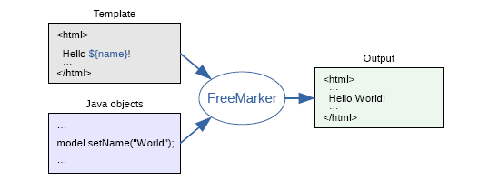
</div>

常用的java模板引擎还有哪些？

Jsp、Freemarker、Thymeleaf 、Velocity 等。

1. Jsp 为 Servlet 专用，不能单独进行使用。

2. Thymeleaf 为新技术，功能较为强大，但是执行的效率比较低。

3. Velocity从2010年更新完 2.0 版本后，便没有在更新。Spring Boot 官方在 1.4 版本后对此也不在支持，虽然 Velocity 在 2017 年版本得到迭代，但为时已晚。 

### 1. 基础语法种类

  1、注释，即<#--  -->，介于其之间的内容会被freemarker忽略

```velocity
<#--我是一个freemarker注释-->
```

  2、插值（Interpolation）：即 **`${..}`** 部分,freemarker会用真实的值代替**`${..}`**

```velocity
Hello ${name}
```

  3、FTL指令：和HTML标记类似，名字前加#予以区分，Freemarker会解析标签中的表达式或逻辑。

```velocity
<# >FTL指令</#> 
```

  4、文本，仅文本信息，这些不是freemarker的注释、插值、FTL指令的内容会被freemarker忽略解析，直接输出内容。

```velocity
我是一个普通的文本
```

### 2. 集合指令（List和Map）

实例代码

```velocity
<!DOCTYPE html>
<html>
<head>
    <meta charset="utf-8">
    <title>Hello World!</title>
</head>
<body>
    
<#-- list 数据的展示 -->
<b>展示list中的stu数据:</b>
<br>
<br>
<table>
    <tr>
        <td>序号</td>
        <td>姓名</td>
        <td>年龄</td>
        <td>钱包</td>
    </tr>
    <#list stus as stu>
        <tr>
            <td>${stu_index+1}</td>
            <td>${stu.name}</td>
            <td>${stu.age}</td>
            <td>${stu.money}</td>
        </tr>
    </#list>

</table>
<hr>
    
<#-- Map 数据的展示 -->
<b>map数据的展示：</b>
<br/><br/>
<a href="###">方式一：通过map['keyname'].property</a><br/>
输出stu1的学生信息：<br/>
姓名：${stuMap['stu1'].name}<br/>
年龄：${stuMap['stu1'].age}<br/>
<br/>
<a href="###">方式二：通过map.keyname.property</a><br/>
输出stu2的学生信息：<br/>
姓名：${stuMap.stu2.name}<br/>
年龄：${stuMap.stu2.age}<br/>

<br/>
<a href="###">遍历map中两个学生信息：</a><br/>
<table>
    <tr>
        <td>序号</td>
        <td>姓名</td>
        <td>年龄</td>
        <td>钱包</td>
    </tr>
    <#list stuMap?keys as key >
        <tr>
            <td>${key_index}</td>
            <td>${stuMap[key].name}</td>
            <td>${stuMap[key].age}</td>
            <td>${stuMap[key].money}</td>
        </tr>
    </#list>
</table>
<hr>
 
</body>
</html>
```

👆上面代码解释：

${k_index}：
	index：得到循环的下标，使用方法是在stu后边加"_index"，它的值是从0开始

### 3. if指令

​	 if 指令即判断指令，是常用的FTL指令，freemarker在解析时遇到if会进行判断，条件为真则输出if中间的内容，否则跳过内容不再输出。

- 指令格式

```html
<#if ></if>
```

### 4. 运算符

#### 4.1. 算数运算符

FreeMarker表达式中完全支持算术运算,FreeMarker支持的算术运算符包括:

- 加法： `+`
- 减法： `-`
- 乘法： `*`
- 除法： `/`
- 求模 (求余)： `%`

#### 4.2. 比较运算符

- **`=`**或者**`==`**:判断两个值是否相等. 
- **`!=`**:判断两个值是否不等. 
- **`>`**或者**`gt`**:判断左边值是否大于右边值 
- **`>=`**或者**`gte`**:判断左边值是否大于等于右边值 
- **`<`**或者**`lt`**:判断左边值是否小于右边值 
- **`<=`**或者**`lte`**:判断左边值是否小于等于右边值 

**比较运算符注意**

- **`=`**和**`!=`**可以用于字符串、数值和日期来比较是否相等
- **`=`**和**`!=`**两边必须是相同类型的值,否则会产生错误
- 字符串 **`"x"`** 、**`"x "`** 、**`"X"`**比较是不等的.因为FreeMarker是精确比较
- 其它的运行符可以作用于数字和日期,但不能作用于字符串
- 使用**`gt`**等字母运算符代替**`>`**会有更好的效果,因为 FreeMarker会把**`>`**解释成FTL标签的结束字符
- 可以使用括号来避免这种情况,如:**`<#if (x>y)>`**

#### 4.3. 逻辑运算符

- 逻辑与:&& 
- 逻辑或:|| 
- 逻辑非:! 

逻辑运算符只能作用于布尔值,否则将产生错误 。

### 5. 空值处理

**1、判断某变量是否存在使用 “??”**

用法为:variable??,如果该变量存在,返回true,否则返回false 

例：为防止stus为空报错可以加上判断如下：

**2、缺失变量默认值使用 “!”**

- 使用!要以指定一个默认值，当变量为空时显示默认值

  例：  ${name!''}表示如果name为空显示空字符串。

- 如果是嵌套对象则建议使用（）括起来

  例： ${(stu.bestFriend.name)!''}表示，如果stu或bestFriend或name为空默认显示空字符串。

### 6. 内建函数

内建函数语法格式： **`变量+?+函数名称`**  

**1、和到某个集合的大小**

**`${集合名?size}`**

**2、日期格式化**

显示年月日: **`${today?date}`** 
显示时分秒：**`${today?time}`**   
显示日期+时间：**`${today?datetime}`**   
自定义格式化：  **`${today?string("yyyy年MM月")}`**

**3、内建函数`c`**

model.addAttribute("point", 102920122);

point是数字型，使用${point}会显示这个数字的值，每三位使用逗号分隔。

如果不想显示为每三位分隔的数字，可以使用c函数将数字型转成字符串输出

**`${point?c}`**

**4、将json字符串转成对象**

一个例子：

其中用到了 assign标签，assign的作用是定义一个变量。

```velocity
<#assign text="{'bank':'工商银行','account':'10101920201920212'}" />
<#assign data=text?eval />
开户行：${data.bank}  账号：${data.account}
```

### 7. 静态化测试

&emsp;之前的测试都是SpringMVC将Freemarker作为视图解析器（ViewReporter）来集成到项目中，工作中，有的时候需要使用Freemarker原生Api来生成静态内容，下面一起来学习下原生Api生成文本文件。

使用freemarker原生Api将页面生成html文件，本节测试html文件生成的方法：

<div align="center">
    
</div>

```java
package com.heima.freemarker.test;


import com.heima.freemarker.FreemarkerDemoApplication;
import com.heima.freemarker.entity.Student;
import freemarker.template.Configuration;
import freemarker.template.Template;
import freemarker.template.TemplateException;
import org.junit.Test;
import org.junit.runner.RunWith;
import org.springframework.beans.factory.annotation.Autowired;
import org.springframework.boot.test.context.SpringBootTest;
import org.springframework.test.context.junit4.SpringRunner;

import java.io.FileWriter;
import java.io.IOException;
import java.util.*;

@SpringBootTest(classes = FreemarkerDemoApplication.class)
@RunWith(SpringRunner.class)
public class FreemarkerTest {

    @Autowired
    private Configuration configuration;

    @Test
    public void test() throws IOException, TemplateException {
        //freemarker的模板对象，获取模板
        Template template = configuration.getTemplate("02-list.ftl");
        Map params = getData();
        //合成
        //第一个参数 数据模型
        //第二个参数  输出流
        template.process(params, new FileWriter("d:/list.html"));
    }

    private Map getData() {
        Map<String, Object> map = new HashMap<>();

        //小强对象模型数据
        Student stu1 = new Student();
        stu1.setName("小强");
        stu1.setAge(18);
        stu1.setMoney(1000.86f);
        stu1.setBirthday(new Date());

        //小红对象模型数据
        Student stu2 = new Student();
        stu2.setName("小红");
        stu2.setMoney(200.1f);
        stu2.setAge(19);

        //将两个对象模型数据存放到List集合中
        List<Student> stus = new ArrayList<>();
        stus.add(stu1);
        stus.add(stu2);

        //向map中存放List集合数据
        map.put("stus", stus);


        //创建Map数据
        HashMap<String, Student> stuMap = new HashMap<>();
        stuMap.put("stu1", stu1);
        stuMap.put("stu2", stu2);
        //向map中存放Map数据
        map.put("stuMap", stuMap);

        //返回Map
        return map;
    }
}
```

## 七、对象存储服务MinIO 

### 1. MinIO简介   

&emsp;MinIO基于Apache License v2.0开源协议的对象存储服务，可以做为云存储的解决方案用来保存海量的图片，视频，文档。由于采用Golang实现，服务端可以工作在Windows,Linux, OS X和FreeBSD上。配置简单，基本是复制可执行程序，单行命令可以运行起来。

&emsp;MinIO兼容亚马逊S3云存储服务接口，非常适合于存储大容量非结构化的数据，例如图片、视频、日志文件、备份数据和容器/虚拟机镜像等，而一个对象文件可以是任意大小，从几kb到最大5T不等。

**S3 （ Simple Storage Service简单存储服务）**

基本概念

- bucket – 类比于文件系统的目录
- Object – 类比文件系统的文件
- Keys – 类比文件名

官网文档：http://docs.minio.org.cn/docs/

### 2. MinIO特点 

- 数据保护

  Minio使用Minio Erasure Code（纠删码）来防止硬件故障。即便损坏一半以上的driver，但是仍然可以从中恢复。

- 高性能

  作为高性能对象存储，在标准硬件条件下它能达到55GB/s的读、35GB/s的写速率

- 可扩容

  不同MinIO集群可以组成联邦，并形成一个全局的命名空间，并跨越多个数据中心

- SDK支持

  基于Minio轻量的特点，它得到类似Java、Python或Go等语言的sdk支持

- 有操作页面

  面向用户友好的简单操作界面，非常方便的管理Bucket及里面的文件资源

- 功能简单

  这一设计原则让MinIO不容易出错、更快启动

- 丰富的API

  支持文件资源的分享连接及分享链接的过期策略、存储桶操作、文件列表访问及文件上传下载的基本功能等。

- 文件变化主动通知

  存储桶（Bucket）如果发生改变,比如上传对象和删除对象，可以使用存储桶事件通知机制进行监控，并通过以下方式发布出去:AMQP、MQTT、Elasticsearch、Redis、NATS、MySQL、Kafka、Webhooks等。

### 3. 使用docker进行环境部署和启动

```bash
docker run -p 9000:9000 --name minio -d --restart=always -e "MINIO_ACCESS_KEY=minio" -e "MINIO_SECRET_KEY=minio123" -v /home/data:/data -v /home/config:/root/.minio minio/minio server /data
```

### 4. 核心代码

```java
package com.heima.file.service.impl;


import com.heima.file.config.MinIOConfig;
import com.heima.file.config.MinIOConfigProperties;
import com.heima.file.service.FileStorageService;
import io.minio.GetObjectArgs;
import io.minio.MinioClient;
import io.minio.PutObjectArgs;
import io.minio.RemoveObjectArgs;
import lombok.extern.slf4j.Slf4j;
import org.springframework.beans.factory.annotation.Autowired;
import org.springframework.boot.context.properties.EnableConfigurationProperties;
import org.springframework.context.annotation.Import;
import org.springframework.util.StringUtils;

import java.io.ByteArrayOutputStream;
import java.io.IOException;
import java.io.InputStream;
import java.text.SimpleDateFormat;
import java.util.Date;

@Slf4j
@EnableConfigurationProperties(MinIOConfigProperties.class)
@Import(MinIOConfig.class)
public class MinIOFileStorageService implements FileStorageService {

    @Autowired
    private MinioClient minioClient;

    @Autowired
    private MinIOConfigProperties minIOConfigProperties;

    private final static String separator = "/";

    /**
     * @param dirPath
     * @param filename  yyyy/mm/dd/file.jpg
     * @return
     */
    public String builderFilePath(String dirPath,String filename) {
        StringBuilder stringBuilder = new StringBuilder(50);
        if(!StringUtils.isEmpty(dirPath)){
            stringBuilder.append(dirPath).append(separator);
        }
        SimpleDateFormat sdf = new SimpleDateFormat("yyyy/MM/dd");
        String todayStr = sdf.format(new Date());
        stringBuilder.append(todayStr).append(separator);
        stringBuilder.append(filename);
        return stringBuilder.toString();
    }

    /**
     *  上传图片文件
     * @param prefix  文件前缀
     * @param filename  文件名
     * @param inputStream 文件流
     * @return  文件全路径
     */
    @Override
    public String uploadImgFile(String prefix, String filename,InputStream inputStream) {
        String filePath = builderFilePath(prefix, filename);
        try {
            PutObjectArgs putObjectArgs = PutObjectArgs.builder()
                    .object(filePath)
                    .contentType("image/jpg")
                    .bucket(minIOConfigProperties.getBucket()).stream(inputStream,inputStream.available(),-1)
                    .build();
            minioClient.putObject(putObjectArgs);
            StringBuilder urlPath = new StringBuilder(minIOConfigProperties.getReadPath());
            urlPath.append(separator+minIOConfigProperties.getBucket());
            urlPath.append(separator);
            urlPath.append(filePath);
            return urlPath.toString();
        }catch (Exception ex){
            log.error("minio put file error.",ex);
            throw new RuntimeException("上传文件失败");
        }
    }

    /**
     *  上传html文件
     * @param prefix  文件前缀
     * @param filename   文件名
     * @param inputStream  文件流
     * @return  文件全路径
     */
    @Override
    public String uploadHtmlFile(String prefix, String filename,InputStream inputStream) {
        String filePath = builderFilePath(prefix, filename);
        try {
            PutObjectArgs putObjectArgs = PutObjectArgs.builder()
                    .object(filePath)
                    .contentType("text/html")
                    .bucket(minIOConfigProperties.getBucket()).stream(inputStream,inputStream.available(),-1)
                    .build();
            minioClient.putObject(putObjectArgs);
            StringBuilder urlPath = new StringBuilder(minIOConfigProperties.getReadPath());
            urlPath.append(separator+minIOConfigProperties.getBucket());
            urlPath.append(separator);
            urlPath.append(filePath);
            return urlPath.toString();
        }catch (Exception ex){
            log.error("minio put file error.",ex);
            ex.printStackTrace();
            throw new RuntimeException("上传文件失败");
        }
    }

    /**
     * 删除文件
     * @param pathUrl  文件全路径
     */
    @Override
    public void delete(String pathUrl) {
        String key = pathUrl.replace(minIOConfigProperties.getEndpoint()+"/","");
        int index = key.indexOf(separator);
        String bucket = key.substring(0,index);
        String filePath = key.substring(index+1);
        // 删除Objects
        RemoveObjectArgs removeObjectArgs = RemoveObjectArgs.builder().bucket(bucket).object(filePath).build();
        try {
            minioClient.removeObject(removeObjectArgs);
        } catch (Exception e) {
            log.error("minio remove file error.  pathUrl:{}",pathUrl);
            e.printStackTrace();
        }
    }


    /**
     * 下载文件
     * @param pathUrl  文件全路径
     * @return  文件流
     *
     */
    @Override
    public byte[] downLoadFile(String pathUrl)  {
        String key = pathUrl.replace(minIOConfigProperties.getEndpoint()+"/","");
        int index = key.indexOf(separator);
        String bucket = key.substring(0,index);
        String filePath = key.substring(index+1);
        InputStream inputStream = null;
        try {
            inputStream = minioClient.getObject(GetObjectArgs.builder().bucket(minIOConfigProperties.getBucket()).object(filePath).build());
        } catch (Exception e) {
            log.error("minio down file error.  pathUrl:{}",pathUrl);
            e.printStackTrace();
        }

        ByteArrayOutputStream byteArrayOutputStream = new ByteArrayOutputStream();
        byte[] buff = new byte[100];
        int rc = 0;
        while (true) {
            try {
                if (!((rc = inputStream.read(buff, 0, 100)) > 0)) break;
            } catch (IOException e) {
                e.printStackTrace();
            }
            byteArrayOutputStream.write(buff, 0, rc);
        }
        return byteArrayOutputStream.toByteArray();
    }
}
```

## 八、文章详情

### 1. 需求分析

<div align="center">
    
</div>

### 2. 实现方案

方案一

用户某一条文章，根据文章的id去查询文章内容表，返回渲染页面

<div align="center">
    
</div>

方案二

<div align="center">
    
</div>

### 3. 核心代码

```java
package com.heima.article.test;


import com.alibaba.fastjson.JSONArray;
import com.baomidou.mybatisplus.core.toolkit.Wrappers;
import com.heima.article.ArticleApplication;
import com.heima.article.mapper.ApArticleContentMapper;
import com.heima.article.mapper.ApArticleMapper;
import com.heima.file.service.FileStorageService;
import com.heima.model.article.pojos.ApArticle;
import com.heima.model.article.pojos.ApArticleContent;
import freemarker.template.Configuration;
import freemarker.template.Template;
import org.apache.commons.lang3.StringUtils;
import org.junit.Test;
import org.junit.runner.RunWith;
import org.springframework.beans.factory.annotation.Autowired;
import org.springframework.boot.test.context.SpringBootTest;
import org.springframework.test.context.junit4.SpringRunner;

import java.io.ByteArrayInputStream;
import java.io.InputStream;
import java.io.StringWriter;
import java.util.HashMap;
import java.util.Map;

@SpringBootTest(classes = ArticleApplication.class)
@RunWith(SpringRunner.class)
public class ArticleFreemarkerTest {

    @Autowired
    private Configuration configuration;

    @Autowired
    private FileStorageService fileStorageService;


    @Autowired
    private ApArticleMapper apArticleMapper;

    @Autowired
    private ApArticleContentMapper apArticleContentMapper;

    @Test
    public void createStaticUrlTest() throws Exception {
        //1.获取文章内容
        ApArticleContent apArticleContent = apArticleContentMapper.selectOne(Wrappers.<ApArticleContent>lambdaQuery().eq(ApArticleContent::getArticleId, 1390536764510310401L));
        if(apArticleContent != null && StringUtils.isNotBlank(apArticleContent.getContent())){
            //2.文章内容通过freemarker生成html文件
            StringWriter out = new StringWriter();
            Template template = configuration.getTemplate("article.ftl");

            Map<String, Object> params = new HashMap<>();
            params.put("content", JSONArray.parseArray(apArticleContent.getContent()));

            template.process(params, out);
            InputStream is = new ByteArrayInputStream(out.toString().getBytes());

            //3.把html文件上传到minio中
            String path = fileStorageService.uploadHtmlFile("", apArticleContent.getArticleId() + ".html", is);

            //4.修改ap_article表，保存static_url字段
            ApArticle article = new ApArticle();
            article.setId(apArticleContent.getArticleId());
            article.setStaticUrl(path);
            apArticleMapper.updateById(article);

        }
    }
}
```

## 九、自媒体文章发布

### 1. 后台搭建

<div align="center">
    
</div>

### 2. 前台搭建

<div align="center">
    
</div>

### 3. 自媒体素材管理

#### 3.1 素材上传

##### 3.1.1 需求分析

<div align="center">
    
</div>

图片上传的页面，首先是展示素材信息，可以点击图片上传，弹窗后可以上传图片

##### 3.1.2 表结构

```mysql
-- auto-generated definition
create table wm_material
(
    id            int unsigned auto_increment comment '主键'
        primary key,
    user_id       int unsigned     null comment '自媒体用户ID',
    url           varchar(255)     null comment '图片地址',
    type          tinyint unsigned null comment '素材类型
            0 图片
            1 视频',
    is_collection tinyint(1)       null comment '是否收藏',
    created_time  datetime         null comment '创建时间'
)
    comment '自媒体图文素材信息表' collate = utf8mb4_unicode_ci
                                   row_format = DYNAMIC;
```

##### 3.1.3 实现思路

<div align="center">
    
</div>

①：前端发送上传图片请求，类型为MultipartFile

②：网关进行token解析后，把解析后的用户信息存储到header中

```java
//获得token解析后中的用户信息
Object userId = claimsBody.get("id");
//在header中添加新的信息
ServerHttpRequest serverHttpRequest = request.mutate().headers(httpHeaders -> {
    httpHeaders.add("userId", userId + "");
}).build();
//重置header
exchange.mutate().request(serverHttpRequest).build();
```

③：自媒体微服务使用拦截器获取到header中的的用户信息，并放入到threadlocal中

在heima-leadnews-utils中新增工具类

```java
package com.heima.utils.thread;

import com.heima.model.wemedia.pojos.WmUser;

public class WmThreadLocalUtil {

    private final static ThreadLocal<WmUser> WM_USER_THREAD_LOCAL = new ThreadLocal<>();

    /**
     * 添加用户
     * @param wmUser
     */
    public static void  setUser(WmUser wmUser){
        WM_USER_THREAD_LOCAL.set(wmUser);
    }

    /**
     * 获取用户
     */
    public static WmUser getUser(){
        return WM_USER_THREAD_LOCAL.get();
    }

    /**
     * 清理用户
     */
    public static void clear(){
        WM_USER_THREAD_LOCAL.remove();
    }
}
```

新增拦截器

```java
package com.heima.wemedia.interceptor;

import com.heima.model.wemedia.pojos.WmUser;
import com.heima.utils.thread.WmThreadLocalUtils;
import lombok.extern.slf4j.Slf4j;
import org.springframework.web.servlet.HandlerInterceptor;
import org.springframework.web.servlet.ModelAndView;

import javax.servlet.http.HttpServletRequest;
import javax.servlet.http.HttpServletResponse;
import java.util.Optional;

@Slf4j
public class WmTokenInterceptor implements HandlerInterceptor {
    @Override
    public boolean preHandle(HttpServletRequest request, HttpServletResponse response, Object handler) throws Exception {
        //得到header中的信息
        String userId = request.getHeader("userId");
        Optional<String> optional = Optional.ofNullable(userId);
        if(optional.isPresent()){
            //把用户id存入threadloacl中
            WmUser wmUser = new WmUser();
            wmUser.setId(Integer.valueOf(userId));
            WmThreadLocalUtils.setUser(wmUser);
            log.info("wmTokenFilter设置用户信息到threadlocal中...");
        }

        return true;
    }

    @Override
    public void postHandle(HttpServletRequest request, HttpServletResponse response, Object handler, ModelAndView modelAndView) throws Exception {
        log.info("清理threadlocal...");
        WmThreadLocalUtils.clear();
    }
}
```

配置使拦截器生效，拦截所有的请求

```java
package com.heima.wemedia.config;

import com.heima.wemedia.interceptor.WmTokenInterceptor;
import org.springframework.context.annotation.Configuration;
import org.springframework.web.servlet.config.annotation.InterceptorRegistry;
import org.springframework.web.servlet.config.annotation.WebMvcConfigurer;

@Configuration
public class WebMvcConfig implements WebMvcConfigurer {

    @Override
    public void addInterceptors(InterceptorRegistry registry) {
        registry.addInterceptor(new WmTokenInterceptor()).addPathPatterns("/**");
    }
}
```

④：先把图片上传到minIO中，获取到图片请求的路径

⑤：把用户id和图片上的路径保存到素材表中

##### 3.1.4 接口定义

|          | **说明**                        |
| -------- | ------------------------------- |
| 接口路径 | /api/v1/material/upload_picture |
| 请求方式 | POST                            |
| 参数     | MultipartFile                   |
| 响应结果 | ResponseResult                  |

MultipartFile  ：Springmvc指定的文件接收类型

ResponseResult  ：成功需要**回显图片**，返回素材对象

```json
{
  "host":null,
  "code":200,
  "errorMessage":"操作成功",
  "data":{
    "id":52,
    "userId":1102,
    "url":"http://192.168.200.130:9000/leadnews/2021/04/26/a73f5b60c0d84c32bfe175055aaaac40.jpg",
    "type":0,
    "isCollection":0,
    "createdTime":"2021-01-20T16:49:48.443+0000"
  }
}
```

失败：

- 参数失效
- 文章上传失败

##### 3.1.5 核心代码

```java
package com.heima.wemedia.service.impl;


import com.baomidou.mybatisplus.extension.service.impl.ServiceImpl;
import com.heima.file.service.FileStorageService;
import com.heima.model.common.dtos.ResponseResult;
import com.heima.model.common.enums.AppHttpCodeEnum;
import com.heima.model.wemedia.pojos.WmMaterial;
import com.heima.utils.thread.WmThreadLocalUtil;
import com.heima.wemedia.mapper.WmMaterialMapper;
import com.heima.wemedia.service.WmMaterialService;
import lombok.extern.slf4j.Slf4j;
import org.springframework.beans.factory.annotation.Autowired;
import org.springframework.stereotype.Service;
import org.springframework.transaction.annotation.Transactional;
import org.springframework.web.multipart.MultipartFile;

import java.io.IOException;
import java.util.Date;
import java.util.UUID;

@Slf4j
@Service
@Transactional
public class WmMaterialServiceImpl extends ServiceImpl<WmMaterialMapper, WmMaterial> implements WmMaterialService {

    @Autowired
    private FileStorageService fileStorageService;


    /**
     * 图片上传
     * @param multipartFile
     * @return
     */
    @Override
    public ResponseResult uploadPicture(MultipartFile multipartFile) {

        //1.检查参数
        if(multipartFile == null || multipartFile.getSize() == 0){
            return ResponseResult.errorResult(AppHttpCodeEnum.PARAM_INVALID);
        }

        //2.上传图片到minIO中
        String fileName = UUID.randomUUID().toString().replace("-", "");
        //aa.jpg
        String originalFilename = multipartFile.getOriginalFilename();
        String postfix = originalFilename.substring(originalFilename.lastIndexOf("."));
        String fileId = null;
        try {
            fileId = fileStorageService.uploadImgFile("", fileName + postfix, multipartFile.getInputStream());
            log.info("上传图片到MinIO中，fileId:{}",fileId);
        } catch (IOException e) {
            e.printStackTrace();
            log.error("WmMaterialServiceImpl-上传文件失败");
        }

        //3.保存到数据库中
        WmMaterial wmMaterial = new WmMaterial();
        wmMaterial.setUserId(WmThreadLocalUtil.getUser().getId());
        wmMaterial.setUrl(fileId);
        wmMaterial.setIsCollection((short)0);
        wmMaterial.setType((short)0);
        wmMaterial.setCreatedTime(new Date());
        save(wmMaterial);

        //4.返回结果

        return ResponseResult.okResult(wmMaterial);
    }

}
```

#### 3.2 素材列表查询

##### 3.2.1 核心代码

```java
/**
     * 素材列表查询
     * @param dto
     * @return
     */
@Override
public ResponseResult findList(WmMaterialDto dto) {

    //1.检查参数
    dto.checkParam();

    //2.分页查询
    IPage page = new Page(dto.getPage(),dto.getSize());
    LambdaQueryWrapper<WmMaterial> lambdaQueryWrapper = new LambdaQueryWrapper<>();
    //是否收藏
    if(dto.getIsCollection() != null && dto.getIsCollection() == 1){
        lambdaQueryWrapper.eq(WmMaterial::getIsCollection,dto.getIsCollection());
    }

    //按照用户查询
    lambdaQueryWrapper.eq(WmMaterial::getUserId,WmThreadLocalUtil.getUser().getId());

    //按照时间倒序
    lambdaQueryWrapper.orderByDesc(WmMaterial::getCreatedTime);


    page = page(page,lambdaQueryWrapper);

    //3.结果返回
    ResponseResult responseResult = new PageResponseResult(dto.getPage(),dto.getSize(),(int)page.getTotal());
    responseResult.setData(page.getRecords());
    return responseResult;
}
```

### 4. 自媒体文章管理

#### 4.1 查询所有频道

##### 4.1.1 需求分析

<div align="center">
    
</div>

##### 4.1.2 表结构

wm_channel 频道信息表

```mysql
-- auto-generated definition
create table wm_channel
(
    id           int unsigned auto_increment
        primary key,
    name         varchar(10)      null comment '频道名称',
    description  varchar(255)     null comment '频道描述',
    is_default   tinyint unsigned null comment '是否默认频道',
    status       tinyint unsigned null,
    ord          tinyint unsigned null comment '默认排序',
    created_time datetime         null comment '创建时间'
)
    comment '频道信息表' collate = utf8mb4_unicode_ci
                         row_format = DYNAMIC;
```

##### 4.1.3 接口定义

|          | **说明**                 |
| -------- | ------------------------ |
| 接口路径 | /api/v1/channel/channels |
| 请求方式 | POST                     |
| 参数     | 无                       |
| 响应结果 | ResponseResult           |

ResponseResult  ：

```json
{
  "host": "null",
  "code": 0,
  "errorMessage": "操作成功",
  "data": [
    {
      "id": 4,
      "name": "java",
      "description": "java",
      "isDefault": true,
      "status": false,
      "ord": 3,
      "createdTime": "2019-08-16T10:55:41.000+0000"
    },
    Object {  ... },
    Object {  ... }
  ]
}
```

##### 4.1.4 核心代码

```java
package com.heima.wemedia.service.impl;

import com.baomidou.mybatisplus.extension.service.impl.ServiceImpl;
import com.heima.model.common.dtos.ResponseResult;
import com.heima.model.wemedia.pojos.WmChannel;
import com.heima.wemedia.mapper.WmChannelMapper;
import com.heima.wemedia.service.WmChannelService;
import lombok.extern.slf4j.Slf4j;
import org.springframework.stereotype.Service;
import org.springframework.transaction.annotation.Transactional;

@Service
@Transactional
@Slf4j
public class WmChannelServiceImpl extends ServiceImpl<WmChannelMapper, WmChannel> implements WmChannelService {

    /**
     * 查询所有频道
     * @return
     */
    @Override
    public ResponseResult findAll() {
        return ResponseResult.okResult(list());
    }
}
```

#### 4.2 查询自媒体文章

##### 4.2.1 需求说明

<div align="center">
    
</div>

##### 4.2.2 表结构分析

wm_news 自媒体文章表

```mysql
-- auto-generated definition
create table wm_news
(
    id            int auto_increment comment '主键'
        primary key,
    user_id       int unsigned                 null comment '自媒体用户ID',
    title         varchar(36)                  null comment '标题',
    content       longtext                     null comment '图文内容',
    type          tinyint unsigned             null comment '文章布局
            0 无图文章
            1 单图文章
            3 多图文章',
    channel_id    int unsigned                 null comment '图文频道ID',
    labels        varchar(20)                  null,
    created_time  datetime                     null comment '创建时间',
    submited_time datetime                     null comment '提交时间',
    status        tinyint unsigned             null comment '当前状态
            0 草稿
            1 提交（待审核）
            2 审核失败
            3 人工审核
            4 人工审核通过
            8 审核通过（待发布）
            9 已发布',
    publish_time  datetime                     null comment '定时发布时间，不定时则为空',
    reason        varchar(50)                  null comment '拒绝理由',
    article_id    bigint unsigned              null comment '发布库文章ID',
    images        longtext                     null comment '//图片用逗号分隔',
    enable        tinyint unsigned default '1' null
)
    comment '自媒体图文内容信息表' collate = utf8mb4_unicode_ci
                                   row_format = DYNAMIC;
```

##### 4.2.3 枚举类

```java
//状态枚举类
    @Alias("WmNewsStatus")
    public enum Status{
        NORMAL((short)0),SUBMIT((short)1),FAIL((short)2),ADMIN_AUTH((short)3),ADMIN_SUCCESS((short)4),SUCCESS((short)8),PUBLISHED((short)9);
        short code;
        Status(short code){
            this.code = code;
        }
        public short getCode(){
            return this.code;
        }
    }
```

##### 4.2.4 接口定义

|          | **说明**          |
| -------- | ----------------- |
| 接口路径 | /api/v1/news/list |
| 请求方式 | POST              |
| 参数     | WmNewsPageReqDto  |
| 响应结果 | ResponseResult    |

WmNewsPageReqDto  :

```java
package com.heima.model.wemedia.dtos;

import com.heima.model.common.dtos.PageRequestDto;
import lombok.Data;

import java.util.Date;

@Data
public class WmNewsPageReqDto extends PageRequestDto {

    /**
     * 状态
     */
    private Short status;
    /**
     * 开始时间
     */
    private Date beginPubDate;
    /**
     * 结束时间
     */
    private Date endPubDate;
    /**
     * 所属频道ID
     */
    private Integer channelId;
    /**
     * 关键字
     */
    private String keyword;
}
```

ResponseResult  :

```json
{
  "host": "null",
  "code": 0,
  "errorMessage": "操作成功",
  "data": [
    Object { ... },
    Object { ... },
    Object { ... }
    
  ],
  "currentPage":1,
  "size":10,
  "total":21
}
```

##### 4.2.5 核心代码

```java
package com.heima.wemedia.service.impl;

import com.baomidou.mybatisplus.core.conditions.query.LambdaQueryWrapper;
import com.baomidou.mybatisplus.core.metadata.IPage;
import com.baomidou.mybatisplus.extension.plugins.pagination.Page;
import com.baomidou.mybatisplus.extension.service.impl.ServiceImpl;
import com.heima.model.common.dtos.PageResponseResult;
import com.heima.model.common.dtos.ResponseResult;
import com.heima.model.common.enums.AppHttpCodeEnum;
import com.heima.model.wemedia.dtos.WmNewsPageReqDto;
import com.heima.model.wemedia.pojos.WmNews;
import com.heima.model.wemedia.pojos.WmUser;
import com.heima.utils.thread.WmThreadLocalUtil;
import com.heima.wemedia.mapper.WmNewsMapper;
import com.heima.wemedia.service.WmNewsService;
import lombok.extern.slf4j.Slf4j;
import org.apache.commons.lang3.StringUtils;
import org.springframework.stereotype.Service;
import org.springframework.transaction.annotation.Transactional;

@Service
@Slf4j
@Transactional
public class WmNewsServiceImpl  extends ServiceImpl<WmNewsMapper, WmNews> implements WmNewsService {

    /**
     * 查询文章
     * @param dto
     * @return
     */
    @Override
    public ResponseResult findAll(WmNewsPageReqDto dto) {

        //1.检查参数
        if(dto == null){
            return ResponseResult.errorResult(AppHttpCodeEnum.PARAM_INVALID);
        }
        //分页参数检查
        dto.checkParam();
        //获取当前登录人的信息
        WmUser user = WmThreadLocalUtil.getUser();
        if(user == null){
            return ResponseResult.errorResult(AppHttpCodeEnum.NEED_LOGIN);
        }

        //2.分页条件查询
        IPage page = new Page(dto.getPage(),dto.getSize());
        LambdaQueryWrapper<WmNews> lambdaQueryWrapper = new LambdaQueryWrapper<>();
        //状态精确查询
        if(dto.getStatus() != null){
            lambdaQueryWrapper.eq(WmNews::getStatus,dto.getStatus());
        }

        //频道精确查询
        if(dto.getChannelId() != null){
            lambdaQueryWrapper.eq(WmNews::getChannelId,dto.getChannelId());
        }

        //时间范围查询
        if(dto.getBeginPubDate()!=null && dto.getEndPubDate()!=null){
            lambdaQueryWrapper.between(WmNews::getPublishTime,dto.getBeginPubDate(),dto.getEndPubDate());
        }

        //关键字模糊查询
        if(StringUtils.isNotBlank(dto.getKeyword())){
            lambdaQueryWrapper.like(WmNews::getTitle,dto.getKeyword());
        }

        //查询当前登录用户的文章
        lambdaQueryWrapper.eq(WmNews::getUserId,user.getId());

        //发布时间倒序查询
        lambdaQueryWrapper.orderByDesc(WmNews::getCreatedTime);

        page = page(page,lambdaQueryWrapper);

        //3.结果返回
        ResponseResult responseResult = new PageResponseResult(dto.getPage(),dto.getSize(),(int)page.getTotal());
        responseResult.setData(page.getRecords());

        return responseResult;
    }
   
}
```

#### 4.3 文章发布

##### 4.3.1 需求分析

<div align="center">
    
</div>


##### 4.3.2 表结构分析

保存文章，除了需要wm_news表以外，还需要另外两张表

wm_material 素材表

```mysql
-- auto-generated definition
create table wm_material
(
    id            int unsigned auto_increment comment '主键'
        primary key,
    user_id       int unsigned     null comment '自媒体用户ID',
    url           varchar(255)     null comment '图片地址',
    type          tinyint unsigned null comment '素材类型
            0 图片
            1 视频',
    is_collection tinyint(1)       null comment '是否收藏',
    created_time  datetime         null comment '创建时间'
)
    comment '自媒体图文素材信息表' collate = utf8mb4_unicode_ci
                                   row_format = DYNAMIC;
```

wm_news_material 文章素材关系表

```mysql
-- auto-generated definition
create table wm_news_material
(
    id          int unsigned auto_increment comment '主键'
        primary key,
    material_id int unsigned     null comment '素材ID',
    news_id     int unsigned     null comment '图文ID',
    type        tinyint unsigned null comment '引用类型
            0 内容引用
            1 主图引用',
    ord         tinyint unsigned null comment '引用排序'
)
    comment '自媒体图文引用素材信息表' collate = utf8mb4_unicode_ci
                                       row_format = DYNAMIC;
```

因为一篇文章可以引用多张素材，一张素材也可以被多篇文章引用，即wm_news表与wm_material表是**多对多**的关系，需要wm_news_material 中间表来维护两者关系

<div align="center">
    
</div>

##### 4.3.3 实现思路

<div align="center">
    
</div>
1.前端提交发布或保存为草稿

2.后台判断请求中是否包含了文章id

3.如果不包含id,则为新增

​	3.1 执行新增文章的操作

​	3.2 关联文章内容图片与素材的关系

​	3.3 关联文章封面图片与素材的关系

4.如果包含了id，则为修改请求

​	4.1 删除该文章与素材的所有关系

​	4.2 执行修改操作

​	4.3 关联文章内容图片与素材的关系

​	4.4 关联文章封面图片与素材的关系

##### 4.3.4 接口定义

|          | **说明**               |
| -------- | ---------------------- |
| 接口路径 | /api/v1/channel/submit |
| 请求方式 | POST                   |
| 参数     | WmNewsDto              |
| 响应结果 | ResponseResult         |

WmNewsDto  

```java
package com.heima.model.wemedia.dtos;

import lombok.Data;

import java.util.Date;
import java.util.List;

@Data
public class WmNewsDto {
    
    private Integer id;
     /**
     * 标题
     */
    private String title;
     /**
     * 频道id
     */
    private Integer channelId;
     /**
     * 标签
     */
    private String labels;
     /**
     * 发布时间
     */
    private Date publishTime;
     /**
     * 文章内容
     */
    private String content;
     /**
     * 文章封面类型  0 无图 1 单图 3 多图 -1 自动
     */
    private Short type;
     /**
     * 提交时间
     */
    private Date submitedTime; 
     /**
     * 状态 提交为1  草稿为0
     */
    private Short status;
     
     /**
     * 封面图片列表 多张图以逗号隔开
     */
    private List<String> images;
}
```

前端给传递过来的json数据格式为：

```json
{
    "title":"黑马头条项目背景",
    "type":"1",//这个 0 是无图  1 是单图  3 是多图  -1 是自动
    "labels":"黑马头条",
    "publishTime":"2020-03-14T11:35:49.000Z",
    "channelId":1,
    "images":[
        "http://192.168.200.130/group1/M00/00/00/wKjIgl5swbGATaSAAAEPfZfx6Iw790.png"
    ],
    "status":1,
    "content":"[
    {
        "type":"text",
        "value":"随着智能手机的普及，人们更加习惯于通过手机来看新闻。由于生活节奏的加快，很多人只能利用碎片时间来获取信息，因此，对于移动资讯客户端的需求也越来越高。黑马头条项目正是在这样背景下开发出来。黑马头条项目采用当下火热的微服务+大数据技术架构实现。本项目主要着手于获取最新最热新闻资讯，通过大数据分析用户喜好精确推送咨询新闻"
    },
    {
        "type":"image",
        "value":"http://192.168.200.130/group1/M00/00/00/wKjIgl5swbGATaSAAAEPfZfx6Iw790.png"
    }
]"
}
```

ResponseResult:

```json
{
    “code”:501,
    “errorMessage”:“参数失效"
}

{
    “code”:200,
    “errorMessage”:“操作成功"
}

{
    “code”:501,
    “errorMessage”:“素材引用失效"
}
```

##### 4.3.5 核心代码

新增WmNewsMaterialMapper类，文章与素材的关联关系需要批量保存，索引需要定义mapper文件和对应的映射文件

```java
package com.heima.wemedia.mapper;

import com.baomidou.mybatisplus.core.mapper.BaseMapper;
import com.heima.model.wemedia.pojos.WmNewsMaterial;
import org.apache.ibatis.annotations.Mapper;
import org.apache.ibatis.annotations.Param;

import java.util.List;

@Mapper
public interface WmNewsMaterialMapper extends BaseMapper<WmNewsMaterial> {

     void saveRelations(@Param("materialIds") List<Integer> materialIds,@Param("newsId") Integer newsId, @Param("type")Short type);
}
```

WmNewsMaterialMapper.xml

```xml
<?xml version="1.0" encoding="UTF-8"?>
<!DOCTYPE mapper PUBLIC "-//mybatis.org//DTD Mapper 3.0//EN" "http://mybatis.org/dtd/mybatis-3-mapper.dtd">
<mapper namespace="com.heima.wemedia.mapper.WmNewsMaterialMapper">

    <insert id="saveRelations">
        insert into wm_news_material (material_id,news_id,type,ord)
        values
        <foreach collection="materialIds" index="ord" item="mid" separator=",">
            (#{mid},#{newsId},#{type},#{ord})
        </foreach>
    </insert>

</mapper>
```

实现方法：

```java
/**
     * 发布修改文章或保存为草稿
     * @param dto
     * @return
     */
@Override
public ResponseResult submitNews(WmNewsDto dto) {

    //0.条件判断
    if(dto == null || dto.getContent() == null){
        return ResponseResult.errorResult(AppHttpCodeEnum.PARAM_INVALID);
    }

    //1.保存或修改文章

    WmNews wmNews = new WmNews();
    //属性拷贝 属性名词和类型相同才能拷贝
    BeanUtils.copyProperties(dto,wmNews);
    //封面图片  list---> string
    if(dto.getImages() != null && dto.getImages().size() > 0){
        //[1dddfsd.jpg,sdlfjldk.jpg]-->   1dddfsd.jpg,sdlfjldk.jpg
        String imageStr = StringUtils.join(dto.getImages(), ",");
        wmNews.setImages(imageStr);
    }
    //如果当前封面类型为自动 -1
    if(dto.getType().equals(WemediaConstants.WM_NEWS_TYPE_AUTO)){
        wmNews.setType(null);
    }

    saveOrUpdateWmNews(wmNews);

    //2.判断是否为草稿  如果为草稿结束当前方法
    if(dto.getStatus().equals(WmNews.Status.NORMAL.getCode())){
        return ResponseResult.okResult(AppHttpCodeEnum.SUCCESS);
    }

    //3.不是草稿，保存文章内容图片与素材的关系
    //获取到文章内容中的图片信息
    List<String> materials =  ectractUrlInfo(dto.getContent());
    saveRelativeInfoForContent(materials,wmNews.getId());

    //4.不是草稿，保存文章封面图片与素材的关系，如果当前布局是自动，需要匹配封面图片
    saveRelativeInfoForCover(dto,wmNews,materials);

    return ResponseResult.okResult(AppHttpCodeEnum.SUCCESS);

}

/**
     * 第一个功能：如果当前封面类型为自动，则设置封面类型的数据
     * 匹配规则：
     * 1，如果内容图片大于等于1，小于3  单图  type 1
     * 2，如果内容图片大于等于3  多图  type 3
     * 3，如果内容没有图片，无图  type 0
     *
     * 第二个功能：保存封面图片与素材的关系
     * @param dto
     * @param wmNews
     * @param materials
     */
private void saveRelativeInfoForCover(WmNewsDto dto, WmNews wmNews, List<String> materials) {

    List<String> images = dto.getImages();

    //如果当前封面类型为自动，则设置封面类型的数据
    if(dto.getType().equals(WemediaConstants.WM_NEWS_TYPE_AUTO)){
        //多图
        if(materials.size() >= 3){
            wmNews.setType(WemediaConstants.WM_NEWS_MANY_IMAGE);
            images = materials.stream().limit(3).collect(Collectors.toList());
        }else if(materials.size() >= 1 && materials.size() < 3){
            //单图
            wmNews.setType(WemediaConstants.WM_NEWS_SINGLE_IMAGE);
            images = materials.stream().limit(1).collect(Collectors.toList());
        }else {
            //无图
            wmNews.setType(WemediaConstants.WM_NEWS_NONE_IMAGE);
        }

        //修改文章
        if(images != null && images.size() > 0){
            wmNews.setImages(StringUtils.join(images,","));
        }
        updateById(wmNews);
    }
    if(images != null && images.size() > 0){
        saveRelativeInfo(images,wmNews.getId(),WemediaConstants.WM_COVER_REFERENCE);
    }

}


/**
     * 处理文章内容图片与素材的关系
     * @param materials
     * @param newsId
     */
private void saveRelativeInfoForContent(List<String> materials, Integer newsId) {
    saveRelativeInfo(materials,newsId,WemediaConstants.WM_CONTENT_REFERENCE);
}

@Autowired
private WmMaterialMapper wmMaterialMapper;

/**
     * 保存文章图片与素材的关系到数据库中
     * @param materials
     * @param newsId
     * @param type
     */
private void saveRelativeInfo(List<String> materials, Integer newsId, Short type) {
    if(materials!=null && !materials.isEmpty()){
        //通过图片的url查询素材的id
        List<WmMaterial> dbMaterials = wmMaterialMapper.selectList(Wrappers.<WmMaterial>lambdaQuery().in(WmMaterial::getUrl, materials));

        //判断素材是否有效
        if(dbMaterials==null || dbMaterials.size() == 0){
            //手动抛出异常   第一个功能：能够提示调用者素材失效了，第二个功能，进行数据的回滚
            throw new CustomException(AppHttpCodeEnum.MATERIASL_REFERENCE_FAIL);
        }

        if(materials.size() != dbMaterials.size()){
            throw new CustomException(AppHttpCodeEnum.MATERIASL_REFERENCE_FAIL);
        }

        List<Integer> idList = dbMaterials.stream().map(WmMaterial::getId).collect(Collectors.toList());

        //批量保存
        wmNewsMaterialMapper.saveRelations(idList,newsId,type);
    }

}


/**
     * 提取文章内容中的图片信息
     * @param content
     * @return
     */
private List<String> ectractUrlInfo(String content) {
    List<String> materials = new ArrayList<>();

    List<Map> maps = JSON.parseArray(content, Map.class);
    for (Map map : maps) {
        if(map.get("type").equals("image")){
            String imgUrl = (String) map.get("value");
            materials.add(imgUrl);
        }
    }

    return materials;
}

@Autowired
private WmNewsMaterialMapper wmNewsMaterialMapper;

/**
     * 保存或修改文章
     * @param wmNews
     */
private void saveOrUpdateWmNews(WmNews wmNews) {
    //补全属性
    wmNews.setUserId(WmThreadLocalUtil.getUser().getId());
    wmNews.setCreatedTime(new Date());
    wmNews.setSubmitedTime(new Date());
    wmNews.setEnable((short)1);//默认上架

    if(wmNews.getId() == null){
        //保存
        save(wmNews);
    }else {
        //修改
        //删除文章图片与素材的关系
        wmNewsMaterialMapper.delete(Wrappers.<WmNewsMaterial>lambdaQuery().eq(WmNewsMaterial::getNewsId,wmNews.getId()));
        updateById(wmNews);
    }

}
```

## 十、自媒体文章-自动审核

### 1. 自媒体文章自动审核流程

<div align="center">
    
</div>

1. 自媒体端发布文章后，开始审核文章

2. 审核的主要是审核文章的内容（文本内容和图片）

3. 借助第三方提供的接口审核文本

4. 借助第三方提供的接口审核图片，由于图片存储到minIO中，需要先下载才能审核

5. 如果审核失败，则需要修改自媒体文章的状态，status:2  审核失败    status:3  转到人工审核

6. 如果审核成功，则需要在文章微服务中创建app端需要的文章

### 2. 内容安全第三方接口

&emsp;内容安全是识别服务，支持对图片、视频、文本、语音等对象进行多样化场景检测，有效降低内容违规风险。目前很多平台都支持内容检测，如阿里云、腾讯云、百度AI、网易云等国内大型互联网公司都对外提供了API。

- 文本垃圾内容检测：https://help.aliyun.com/document_detail/70439.html?spm=a2c4g.11186623.6.659.35ac3db3l0wV5k 
- 文本垃圾内容Java SDK: https://help.aliyun.com/document_detail/53427.html?spm=a2c4g.11186623.6.717.466d7544QbU8Lr 
- 图片垃圾内容检测：https://help.aliyun.com/document_detail/70292.html?spm=a2c4g.11186623.6.616.5d7d1e7f9vDRz4 
- 图片垃圾内容Java SDK: https://help.aliyun.com/document_detail/53424.html?spm=a2c4g.11186623.6.715.c8f69b12ey35j4 

### 3. app端文章保存接口

#### 3.1 表结构说明

ap_article  文章基本信息表

```mysql
-- auto-generated definition
create table ap_article
(
    id           bigint unsigned auto_increment
        primary key,
    title        varchar(50)                  null comment '标题',
    author_id    int unsigned                 null comment '文章作者的ID',
    author_name  varchar(20)                  null comment '作者昵称',
    channel_id   int unsigned                 null comment '文章所属频道ID',
    channel_name varchar(10)                  null comment '频道名称',
    layout       tinyint unsigned             null comment '文章布局
            0 无图文章
            1 单图文章
            2 多图文章',
    flag         tinyint unsigned             null comment '文章标记
            0 普通文章
            1 热点文章
            2 置顶文章
            3 精品文章
            4 大V 文章',
    images       varchar(1000)                null comment '文章图片
            多张逗号分隔',
    labels       varchar(500)                 null comment '文章标签最多3个 逗号分隔',
    likes        int unsigned                 null comment '点赞数量',
    collection   int unsigned                 null comment '收藏数量',
    comment      int unsigned                 null comment '评论数量',
    views        int unsigned                 null comment '阅读数量',
    province_id  int unsigned                 null comment '省市',
    city_id      int unsigned                 null comment '市区',
    county_id    int unsigned                 null comment '区县',
    created_time datetime                     null comment '创建时间',
    publish_time datetime                     null comment '发布时间',
    sync_status  tinyint(1)       default 0   null comment '同步状态',
    origin       tinyint unsigned default '0' null comment '来源',
    static_url   varchar(150)                 null
)
    comment '文章信息表，存储已发布的文章' row_format = DYNAMIC;
```

ap_article_config  文章配置表

```mysql
-- auto-generated definition
create table ap_article_config
(
    id         bigint unsigned auto_increment comment '主键'
        primary key,
    article_id bigint unsigned  null comment '文章ID',
    is_comment tinyint unsigned null comment '是否可评论',
    is_forward tinyint unsigned null comment '是否转发',
    is_down    tinyint unsigned null comment '是否下架',
    is_delete  tinyint unsigned null comment '是否已删除'
)
    comment 'APP已发布文章配置表' row_format = DYNAMIC;

create index idx_article_id
    on ap_article_config (article_id);
```

ap_article_content 文章内容表

```mysql
-- auto-generated definition
create table ap_article_content
(
    id         bigint unsigned auto_increment comment '主键'
        primary key,
    article_id bigint unsigned null comment '文章ID',
    content    longtext        null comment '文章内容'
)
    comment 'APP已发布文章内容表' row_format = DYNAMIC;

create index idx_article_id
    on ap_article_content (article_id);
```

三张表关系分析

<div align="center">
    
</div>

#### 3.2 分布式id

&emsp;随着业务的增长，文章表可能要占用很大的物理存储空间，为了解决该问题，后期使用数据库分片技术。将一个数据库进行拆分，通过数据库中间件连接。如果数据库中该表选用ID自增策略，则可能产生重复的ID，此时应该使用分布式ID生成策略来生成ID。

<div align="center">
    
</div>

&emsp;snowflake是Twitter开源的分布式ID生成算法，结果是一个long型的ID。其核心思想是：使用41bit作为毫秒数，10bit作为机器的ID（5个bit是数据中心，5个bit的机器ID），12bit作为毫秒内的流水号（意味着每个节点在每毫秒可以产生 4096 个 ID），最后还有一个符号位，永远是0

<div align="center">
    
</div>

文章端相关的表都使用雪花算法生成id,包括ap_article、 ap_article_config、 ap_article_content

#### 3.3 思路分析

在文章审核成功以后需要在app的article库中新增文章数据

1.保存文章信息 ap_article

2.保存文章配置信息 ap_article_config

3.保存文章内容 ap_article_content

实现思路：

<div align="center">
    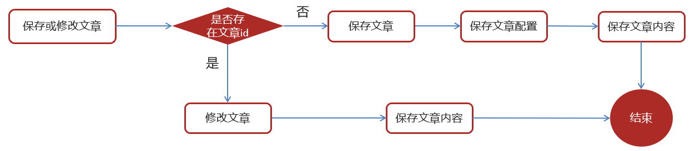
</div>

#### 3.4 feign接口

|          | **说明**             |
| -------- | -------------------- |
| 接口路径 | /api/v1/article/save |
| 请求方式 | POST                 |
| 参数     | ArticleDto           |
| 响应结果 | ResponseResult       |

ArticleDto

```java
package com.heima.model.article.dtos;

import com.heima.model.article.pojos.ApArticle;
import lombok.Data;

@Data
public class ArticleDto  extends ApArticle {
    /**
     * 文章内容
     */
    private String content;
}
```

成功：

```json
{
  "code": 200,
  "errorMessage" : "操作成功",
  "data":"1302864436297442242"
 }
```

失败：

```json
{
  "code":501,
  "errorMessage":"参数失效",
 }
```

```json
{
  "code":501,
  "errorMessage":"文章没有找到",
 }
```

#### 3.5 核心代码

```java
@Autowired
private ApArticleConfigMapper apArticleConfigMapper;

@Autowired
private ApArticleContentMapper apArticleContentMapper;

/**
     * 保存app端相关文章
     * @param dto
     * @return
     */
@Override
public ResponseResult saveArticle(ArticleDto dto) {
    //1.检查参数
    if(dto == null){
        return ResponseResult.errorResult(AppHttpCodeEnum.PARAM_INVALID);
    }

    ApArticle apArticle = new ApArticle();
    BeanUtils.copyProperties(dto,apArticle);

    //2.判断是否存在id
    if(dto.getId() == null){
        //2.1 不存在id  保存  文章  文章配置  文章内容

        //保存文章
        save(apArticle);

        //保存配置
        ApArticleConfig apArticleConfig = new ApArticleConfig(apArticle.getId());
        apArticleConfigMapper.insert(apArticleConfig);

        //保存 文章内容
        ApArticleContent apArticleContent = new ApArticleContent();
        apArticleContent.setArticleId(apArticle.getId());
        apArticleContent.setContent(dto.getContent());
        apArticleContentMapper.insert(apArticleContent);

    }else {
        //2.2 存在id   修改  文章  文章内容

        //修改  文章
        updateById(apArticle);

        //修改文章内容
        ApArticleContent apArticleContent = apArticleContentMapper.selectOne(Wrappers.<ApArticleContent>lambdaQuery().eq(ApArticleContent::getArticleId, dto.getId()));
        apArticleContent.setContent(dto.getContent());
        apArticleContentMapper.updateById(apArticleContent);
    }


    //3.结果返回  文章的id
    return ResponseResult.okResult(apArticle.getId());
}
```

### 4. 自媒体文章自动审核功能实现

#### 4.1 表结构说明

wm_news 自媒体文章表

```mysql
-- auto-generated definition
create table wm_news
(
    id            int auto_increment comment '主键'
        primary key,
    user_id       int unsigned                 null comment '自媒体用户ID',
    title         varchar(36)                  null comment '标题',
    content       longtext                     null comment '图文内容',
    type          tinyint unsigned             null comment '文章布局
            0 无图文章
            1 单图文章
            3 多图文章',
    channel_id    int unsigned                 null comment '图文频道ID',
    labels        varchar(20)                  null,
    created_time  datetime                     null comment '创建时间',
    submited_time datetime                     null comment '提交时间',
    status        tinyint unsigned             null comment '当前状态
            0 草稿
            1 提交（待审核）
            2 审核失败
            3 人工审核
            4 人工审核通过
            8 审核通过（待发布）
            9 已发布',
    publish_time  datetime                     null comment '定时发布时间，不定时则为空',
    reason        varchar(50)                  null comment '拒绝理由',
    article_id    bigint unsigned              null comment '发布库文章ID',
    images        longtext                     null comment '//图片用逗号分隔',
    enable        tinyint unsigned default '1' null
)
    comment '自媒体图文内容信息表' collate = utf8mb4_unicode_ci
                                   row_format = DYNAMIC;
```

status字段：0 草稿  1 待审核  2 审核失败  3 人工审核  4 人工审核通过  8 审核通过（待发布） 9 已发布

#### 4.2 核心代码

```java
@Service
@Slf4j
@Transactional
public class WmNewsAutoScanServiceImpl implements WmNewsAutoScanService {

    @Autowired
    private WmNewsMapper wmNewsMapper;

    /**
     * 自媒体文章审核
     *
     * @param id 自媒体文章id
     */
    @Override
    public void autoScanWmNews(Integer id) {
        //1.查询自媒体文章
        WmNews wmNews = wmNewsMapper.selectById(id);
        if(wmNews == null){
            throw new RuntimeException("WmNewsAutoScanServiceImpl-文章不存在");
        }

        if(wmNews.getStatus().equals(WmNews.Status.SUBMIT.getCode())){
            //从内容中提取纯文本内容和图片
            Map<String,Object> textAndImages = handleTextAndImages(wmNews);

            //2.审核文本内容  阿里云接口
            boolean isTextScan = handleTextScan((String) textAndImages.get("content"),wmNews);
            if(!isTextScan)return;

            //3.审核图片  阿里云接口
            boolean isImageScan =  handleImageScan((List<String>) textAndImages.get("images"),wmNews);
            if(!isImageScan)return;

            //4.审核成功，保存app端的相关的文章数据
            ResponseResult responseResult = saveAppArticle(wmNews);
            if(!responseResult.getCode().equals(200)){
                throw new RuntimeException("WmNewsAutoScanServiceImpl-文章审核，保存app端相关文章数据失败");
            }
            //回填article_id
            wmNews.setArticleId((Long) responseResult.getData());
            updateWmNews(wmNews,(short) 9,"审核成功");

        }
    }

    @Autowired
    private IArticleClient articleClient;

    @Autowired
    private WmChannelMapper wmChannelMapper;

    @Autowired
    private WmUserMapper wmUserMapper;

    /**
     * 保存app端相关的文章数据
     * @param wmNews
     */
    private ResponseResult saveAppArticle(WmNews wmNews) {

        ArticleDto dto = new ArticleDto();
        //属性的拷贝
        BeanUtils.copyProperties(wmNews,dto);
        //文章的布局
        dto.setLayout(wmNews.getType());
        //频道
        WmChannel wmChannel = wmChannelMapper.selectById(wmNews.getChannelId());
        if(wmChannel != null){
            dto.setChannelName(wmChannel.getName());
        }

        //作者
        dto.setAuthorId(wmNews.getUserId().longValue());
        WmUser wmUser = wmUserMapper.selectById(wmNews.getUserId());
        if(wmUser != null){
            dto.setAuthorName(wmUser.getName());
        }

        //设置文章id
        if(wmNews.getArticleId() != null){
            dto.setId(wmNews.getArticleId());
        }
        dto.setCreatedTime(new Date());

        ResponseResult responseResult = articleClient.saveArticle(dto);
        return responseResult;

    }


    @Autowired
    private FileStorageService fileStorageService;

    @Autowired
    private GreenImageScan greenImageScan;

    /**
     * 审核图片
     * @param images
     * @param wmNews
     * @return
     */
    private boolean handleImageScan(List<String> images, WmNews wmNews) {

        boolean flag = true;

        if(images == null || images.size() == 0){
            return flag;
        }

        //下载图片 minIO
        //图片去重
        images = images.stream().distinct().collect(Collectors.toList());

        List<byte[]> imageList = new ArrayList<>();

        for (String image : images) {
            byte[] bytes = fileStorageService.downLoadFile(image);
            imageList.add(bytes);
        }


        //审核图片
        try {
            Map map = greenImageScan.imageScan(imageList);
            if(map != null){
                //审核失败
                if(map.get("suggestion").equals("block")){
                    flag = false;
                    updateWmNews(wmNews, (short) 2, "当前文章中存在违规内容");
                }

                //不确定信息  需要人工审核
                if(map.get("suggestion").equals("review")){
                    flag = false;
                    updateWmNews(wmNews, (short) 3, "当前文章中存在不确定内容");
                }
            }

        } catch (Exception e) {
            flag = false;
            e.printStackTrace();
        }
        return flag;
    }

    @Autowired
    private GreenTextScan greenTextScan;

    /**
     * 审核纯文本内容
     * @param content
     * @param wmNews
     * @return
     */
    private boolean handleTextScan(String content, WmNews wmNews) {

        boolean flag = true;

        if((wmNews.getTitle()+"-"+content).length() == 0){
            return flag;
        }

        try {
            Map map = greenTextScan.greeTextScan((wmNews.getTitle()+"-"+content));
            if(map != null){
                //审核失败
                if(map.get("suggestion").equals("block")){
                    flag = false;
                    updateWmNews(wmNews, (short) 2, "当前文章中存在违规内容");
                }

                //不确定信息  需要人工审核
                if(map.get("suggestion").equals("review")){
                    flag = false;
                    updateWmNews(wmNews, (short) 3, "当前文章中存在不确定内容");
                }
            }
        } catch (Exception e) {
            flag = false;
            e.printStackTrace();
        }

        return flag;

    }

    /**
     * 修改文章内容
     * @param wmNews
     * @param status
     * @param reason
     */
    private void updateWmNews(WmNews wmNews, short status, String reason) {
        wmNews.setStatus(status);
        wmNews.setReason(reason);
        wmNewsMapper.updateById(wmNews);
    }

    /**
     * 1。从自媒体文章的内容中提取文本和图片
     * 2.提取文章的封面图片
     * @param wmNews
     * @return
     */
    private Map<String, Object> handleTextAndImages(WmNews wmNews) {

        //存储纯文本内容
        StringBuilder stringBuilder = new StringBuilder();

        List<String> images = new ArrayList<>();

        //1。从自媒体文章的内容中提取文本和图片
        if(StringUtils.isNotBlank(wmNews.getContent())){
            List<Map> maps = JSONArray.parseArray(wmNews.getContent(), Map.class);
            for (Map map : maps) {
                if (map.get("type").equals("text")){
                    stringBuilder.append(map.get("value"));
                }

                if (map.get("type").equals("image")){
                    images.add((String) map.get("value"));
                }
            }
        }
        //2.提取文章的封面图片
        if(StringUtils.isNotBlank(wmNews.getImages())){
            String[] split = wmNews.getImages().split(",");
            images.addAll(Arrays.asList(split));
        }

        Map<String, Object> resultMap = new HashMap<>();
        resultMap.put("content",stringBuilder.toString());
        resultMap.put("images",images);
        return resultMap;

    }
}
```

#### 4.3 feign远程接口调用方式

<div align="center">
    
</div>

在heima-leadnews-wemedia服务中已经依赖了heima-leadnews-feign-apis工程，只需要在自媒体的引导类中开启feign的远程调用即可

注解为：`@EnableFeignClients(basePackages = "com.heima.apis")` 需要指向apis这个包

#### 4.4 服务降级处理

- 服务降级是服务自我保护的一种方式，或者保护下游服务的一种方式，用于确保服务不会受请求突增影响变得不可用，确保服务不会崩溃

- 服务降级虽然会导致请求失败，但是不会导致阻塞。

##### 4.4.1 降级逻辑

①：在自媒体微服务中添加类，扫描降级代码类的包	

```java
@Component
public class IArticleClientFallback implements IArticleClient {
    @Override
    public ResponseResult saveArticle(ArticleDto dto)  {
        return ResponseResult.errorResult(AppHttpCodeEnum.SERVER_ERROR,"获取数据失败");
    }
}
```

在自媒体微服务中添加类，扫描降级代码类的包

```java
@Configuration
@ComponentScan("com.heima.apis.article.fallback")
public class InitConfig {
}
```

②：远程接口中指向降级代码

```java
@FeignClient(value = "leadnews-article",fallback = IArticleClientFallback.class)
public interface IArticleClient {

    @PostMapping("/api/v1/article/save")
    public ResponseResult saveArticle(@RequestBody ArticleDto dto);
}
```

③：客户端开启降级heima-leadnews-wemedia

在wemedia的nacos配置中心里添加如下内容，开启服务降级，也可以指定服务响应的超时的时间

```yaml
feign:
  # 开启feign对hystrix熔断降级的支持
  hystrix:
    enabled: true
  # 修改调用超时时间
  client:
    config:
      default:
        connectTimeout: 2000
        readTimeout: 2000
        
# 增加Hystrix超时时间配置
hystrix:
  command:
    default:
      execution:
        isolation:
          thread:
            timeoutInMilliseconds: 20000   # 将Hystrix超时设置为20秒
```

### 5. 发布文章提交审核集成

#### 5.1 同步调用与异步调用

同步：就是在发出一个调用时，在没有得到结果之前， 该调用就不返回（实时处理）

异步：调用在发出之后，这个调用就直接返回了，没有返回结果（分时处理）

<div align="center">
    
</div>

异步线程的方式审核文章

#### 5.2 Springboot集成异步线程调用

①：在自动审核的方法上加上@Async注解（标明要异步调用）

```java
@Override
@Async  //标明当前方法是一个异步方法
public void autoScanWmNews(Integer id) {
	//代码略
}
```

②：在文章发布成功后调用审核的方法

```java
@Autowired
private WmNewsAutoScanService wmNewsAutoScanService;

/**
 * 发布修改文章或保存为草稿
 * @param dto
 * @return
 */
@Override
public ResponseResult submitNews(WmNewsDto dto) {

    //代码略

    //审核文章
    wmNewsAutoScanService.autoScanWmNews(wmNews.getId());

    return ResponseResult.okResult(AppHttpCodeEnum.SUCCESS);

}
```

③：在自媒体引导类中使用@EnableAsync注解开启异步调用

```java
@SpringBootApplication
@EnableDiscoveryClient
@MapperScan("com.heima.wemedia.mapper")
@EnableFeignClients(basePackages = "com.heima.apis")
@EnableAsync  //开启异步调用
public class WemediaApplication {

    public static void main(String[] args) {
        SpringApplication.run(WemediaApplication.class,args);
    }

    @Bean
    public MybatisPlusInterceptor mybatisPlusInterceptor() {
        MybatisPlusInterceptor interceptor = new MybatisPlusInterceptor();
        interceptor.addInnerInterceptor(new PaginationInnerInterceptor(DbType.MYSQL));
        return interceptor;
    }
}
```

### 6. 新需求-自管理敏感词

#### 6.1 需求分析

- 文章审核不能过滤一些敏感词：

  私人侦探、针孔摄象、信用卡提现、广告代理、代开发票、刻章办、出售答案、小额贷款…

需要完成的功能：

需要自己维护一套敏感词，在文章审核的时候，需要验证文章是否包含这些敏感词

#### 6.2 敏感词-过滤

技术选型

| **方案**               | **说明**                     |
| ---------------------- | ---------------------------- |
| 数据库模糊查询         | 效率太低                     |
| String.indexOf("")查找 | 数据库量大的话也是比较慢     |
| 全文检索               | 分词再匹配                   |
| DFA算法                | 确定有穷自动机(一种数据结构) |

#### 6.3 DFA实现原理

DFA全称为：Deterministic Finite Automaton,即确定有穷自动机。

存储：一次性的把所有的敏感词存储到了多个map中，就是下图表示这种结构

敏感词：冰毒、大麻、大坏蛋

<div align="center">
    
</div>

检索的过程

<div align="center">
    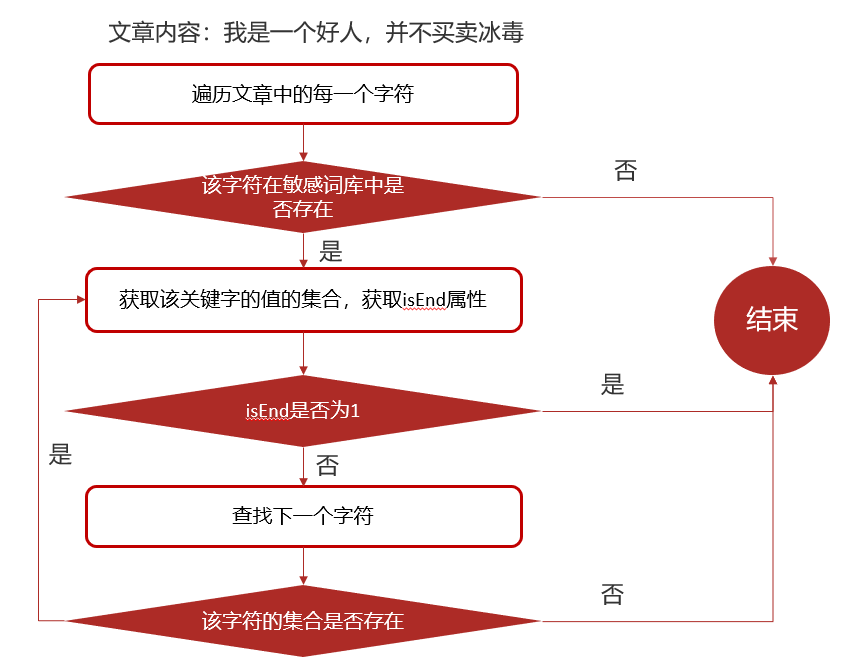
</div>

#### 6.4 自管理敏感词集成到文章审核中

创建敏感词表，wm_sensitive

```mysql
-- auto-generated definition
create table wm_sensitive
(
    id           int unsigned auto_increment comment '主键'
        primary key,
    sensitives   varchar(10) null comment '敏感词',
    created_time datetime    null comment '创建时间'
)
    comment '敏感词信息表' collate = utf8mb4_unicode_ci
                           row_format = DYNAMIC;
```

##### 6.4.1 核心代码

```java
@Autowired
private WmSensitiveMapper wmSensitiveMapper;

/**
     * 自管理的敏感词审核
     * @param content
     * @param wmNews
     * @return
     */
private boolean handleSensitiveScan(String content, WmNews wmNews) {

    boolean flag = true;

    //获取所有的敏感词
    List<WmSensitive> wmSensitives = wmSensitiveMapper.selectList(Wrappers.<WmSensitive>lambdaQuery().select(WmSensitive::getSensitives));
    List<String> sensitiveList = wmSensitives.stream().map(WmSensitive::getSensitives).collect(Collectors.toList());

    //初始化敏感词库
    SensitiveWordUtil.initMap(sensitiveList);

    //查看文章中是否包含敏感词
    Map<String, Integer> map = SensitiveWordUtil.matchWords(content);
    if(map.size() >0){
        updateWmNews(wmNews,(short) 2,"当前文章中存在违规内容"+map);
        flag = false;
    }

    return flag;
}
```


SensitiveWordUtil

```java
public class SensitiveWordUtil {

    public static Map<String, Object> dictionaryMap = new HashMap<>();

    /**
     * 生成关键词字典库
     * @param words
     * @return
     */
    public static void initMap(Collection<String> words) {
        if (words == null) {
            System.out.println("敏感词列表不能为空");
            return ;
        }

        // map初始长度words.size()，整个字典库的入口字数(小于words.size()，因为不同的词可能会有相同的首字)
        Map<String, Object> map = new HashMap<>(words.size());
        // 遍历过程中当前层次的数据
        Map<String, Object> curMap = null;
        Iterator<String> iterator = words.iterator();

        while (iterator.hasNext()) {
            String word = iterator.next();
            curMap = map;
            int len = word.length();
            for (int i =0; i < len; i++) {
                // 遍历每个词的字
                String key = String.valueOf(word.charAt(i));
                // 当前字在当前层是否存在, 不存在则新建, 当前层数据指向下一个节点, 继续判断是否存在数据
                Map<String, Object> wordMap = (Map<String, Object>) curMap.get(key);
                if (wordMap == null) {
                    // 每个节点存在两个数据: 下一个节点和isEnd(是否结束标志)
                    wordMap = new HashMap<>(2);
                    wordMap.put("isEnd", "0");
                    curMap.put(key, wordMap);
                }
                curMap = wordMap;
                // 如果当前字是词的最后一个字，则将isEnd标志置1
                if (i == len -1) {
                    curMap.put("isEnd", "1");
                }
            }
        }

        dictionaryMap = map;
    }

    /**
     * 搜索文本中某个文字是否匹配关键词
     * @param text
     * @param beginIndex
     * @return
     */
    private static int checkWord(String text, int beginIndex) {
        if (dictionaryMap == null) {
            throw new RuntimeException("字典不能为空");
        }
        boolean isEnd = false;
        int wordLength = 0;
        Map<String, Object> curMap = dictionaryMap;
        int len = text.length();
        // 从文本的第beginIndex开始匹配
        for (int i = beginIndex; i < len; i++) {
            String key = String.valueOf(text.charAt(i));
            // 获取当前key的下一个节点
            curMap = (Map<String, Object>) curMap.get(key);
            if (curMap == null) {
                break;
            } else {
                wordLength ++;
                if ("1".equals(curMap.get("isEnd"))) {
                    isEnd = true;
                }
            }
        }
        if (!isEnd) {
            wordLength = 0;
        }
        return wordLength;
    }

    /**
     * 获取匹配的关键词和命中次数
     * @param text
     * @return
     */
    public static Map<String, Integer> matchWords(String text) {
        Map<String, Integer> wordMap = new HashMap<>();
        int len = text.length();
        for (int i = 0; i < len; i++) {
            int wordLength = checkWord(text, i);
            if (wordLength > 0) {
                String word = text.substring(i, i + wordLength);
                // 添加关键词匹配次数
                if (wordMap.containsKey(word)) {
                    wordMap.put(word, wordMap.get(word) + 1);
                } else {
                    wordMap.put(word, 1);
                }

                i += wordLength - 1;
            }
        }
        return wordMap;
    }
}
```

### 7. 新需求-图片识别文字审核敏感词

#### 7.1 需求分析

文章中包含的图片要识别文字，过滤掉图片文字的敏感词

<div align="center">
    
</div>

#### 7.2 图片文字识别

&emsp;OCR （Optical Character Recognition，光学字符识别）是指电子设备（例如扫描仪或数码相机）检查纸上打印的字符，通过检测暗、亮的模式确定其形状，然后用字符识别方法将形状翻译成计算机文字的过程

| **方案**      | **说明**                                            |
| ------------- | --------------------------------------------------- |
| 百度OCR       | 收费                                                |
| Tesseract-OCR | Google维护的开源OCR引擎，支持Java，Python等语言调用 |
| Tess4J        | 封装了Tesseract-OCR  ，支持Java调用                 |

#### 7.3 Tess4j案例

```java
@Getter
@Setter
@Component
@ConfigurationProperties(prefix = "tess4j")
public class Tess4jClient {

    private String dataPath;
    private String language;

    public String doOCR(BufferedImage image) throws TesseractException {
        //创建Tesseract对象
        ITesseract tesseract = new Tesseract();
        //设置字体库路径
        tesseract.setDatapath(dataPath);
        //中文识别
        tesseract.setLanguage(language);
        //执行ocr识别
        String result = tesseract.doOCR(image);
        //替换回车和tal键  使结果为一行
        result = result.replaceAll("\\r|\\n", "-").replaceAll(" ", "");
        return result;
    }

}
```

配置中添加属性

```yaml
tess4j:
  data-path: D:\workspace\tessdata
  language: chi_sim	
```

在WmNewsAutoScanServiceImpl中的handleImageScan方法上添加如下代码

```java
try {
    for (String image : images) {
        byte[] bytes = fileStorageService.downLoadFile(image);

        //图片识别文字审核---begin-----

        //从byte[]转换为butteredImage
        ByteArrayInputStream in = new ByteArrayInputStream(bytes);
        BufferedImage imageFile = ImageIO.read(in);
        //识别图片的文字
        String result = tess4jClient.doOCR(imageFile);

        //审核是否包含自管理的敏感词
        boolean isSensitive = handleSensitiveScan(result, wmNews);
        if(!isSensitive){
            return isSensitive;
        }

        //图片识别文字审核---end-----

        imageList.add(bytes);
    } 
}catch (Exception e){
    e.printStackTrace();
}
```

### 8. 文章详情-静态文件生成

#### 8.1 思路分析

文章端创建app相关文章时，生成文章详情静态页上传到MinIO中

<div align="center">
    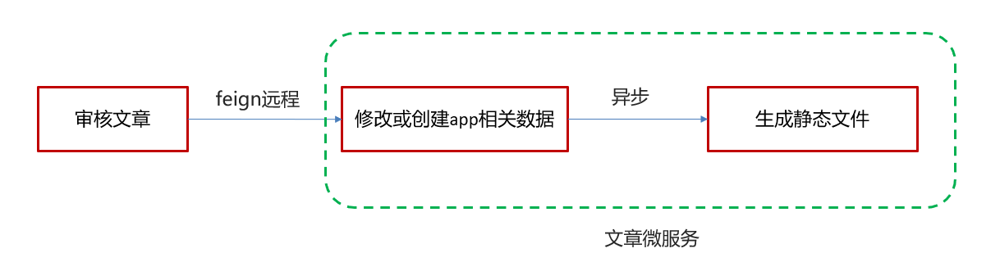
</div>

核心代码

```java
@Service
@Slf4j
@Transactional
public class ArticleFreemarkerServiceImpl implements ArticleFreemarkerService {

    @Autowired
    private ApArticleContentMapper apArticleContentMapper;

    @Autowired
    private Configuration configuration;

    @Autowired
    private FileStorageService fileStorageService;

    @Autowired
    private ApArticleService apArticleService;

    /**
     * 生成静态文件上传到minIO中
     * @param apArticle
     * @param content
     */
    @Async
    @Override
    public void buildArticleToMinIO(ApArticle apArticle, String content) {
        //已知文章的id
        //4.1 获取文章内容
        if(StringUtils.isNotBlank(content)){
            //4.2 文章内容通过freemarker生成html文件
            Template template = null;
            StringWriter out = new StringWriter();
            try {
                template = configuration.getTemplate("article.ftl");
                //数据模型
                Map<String,Object> contentDataModel = new HashMap<>();
                contentDataModel.put("content", JSONArray.parseArray(content));
                //合成
                template.process(contentDataModel,out);
            } catch (Exception e) {
                e.printStackTrace();
            }

            //4.3 把html文件上传到minio中
            InputStream in = new ByteArrayInputStream(out.toString().getBytes());
            String path = fileStorageService.uploadHtmlFile("", apArticle.getId() + ".html", in);

            //4.4 修改ap_article表，保存static_url字段
            apArticleService.update(Wrappers.<ApArticle>lambdaUpdate().eq(ApArticle::getId,apArticle.getId())
                    .set(ApArticle::getStaticUrl,path));

        }
    }
}
```

在ApArticleService的saveArticle实现方法中添加异步调用生成文件的方法

文章微服务启动类上开启异步调用`@EnableAsync`

## 十一、延迟任务精准发布文章

### 1. 概述

#### 1.1 什么是延迟任务

- 定时任务：有固定周期的，有明确的触发时间
- 延迟队列：没有固定的开始时间，它常常是由一个事件触发的，而在这个事件触发之后的一段时间内触发另一个事件，任务可以立即执行，也可以延迟

<div align="center">
    
</div>

应用场景：

场景一：订单下单之后30分钟后，如果用户没有付钱，则系统自动取消订单；如果期间下单成功，任务取消

场景二：接口对接出现网络问题，1分钟后重试，如果失败，2分钟重试，直到出现阈值终止

#### 2.2 技术对比

##### 2.2.1 DelayQueue

JDK自带DelayQueue 是一个支持延时获取元素的阻塞队列， 内部采用优先队列 PriorityQueue 存储元素，同时元素必须实现 Delayed 接口；在创建元素时可以指定多久才可以从队列中获取当前元素，只有在延迟期满时才能从队列中提取元素

<div align="center">
    
</div>

DelayQueue属于排序队列，它的特殊之处在于队列的元素必须实现Delayed接口，该接口需要实现compareTo和getDelay方法

getDelay方法：获取元素在队列中的剩余时间，只有当剩余时间为0时元素才可以出队列。

compareTo方法：用于排序，确定元素出队列的顺序。

###### DelayQueue问题-未持久化

使用线程池或者原生DelayQueue程序挂掉之后，**任务都是放在内存**，需要考虑未处理消息的丢失带来的影响，如何保证数据不丢失，需要**持久化（磁盘）**。

##### 2.2.2 RabbitMQ实现延迟任务

- TTL：Time To Live (消息存活时间)

- 死信队列：Dead Letter Exchange(死信交换机)，当消息成为Dead message后，可以重新发送另一个交换机（死信交换机）

<div align="center">
    
</div>

##### 2.2.3 redis实现

zset数据类型的去重有序（分数排序）特点进行延迟。例如：时间戳作为score进行排序

<div align="center">
    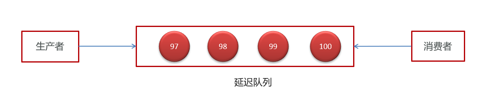
</div>

### 2. redis实现延迟任务

<div align="center">
    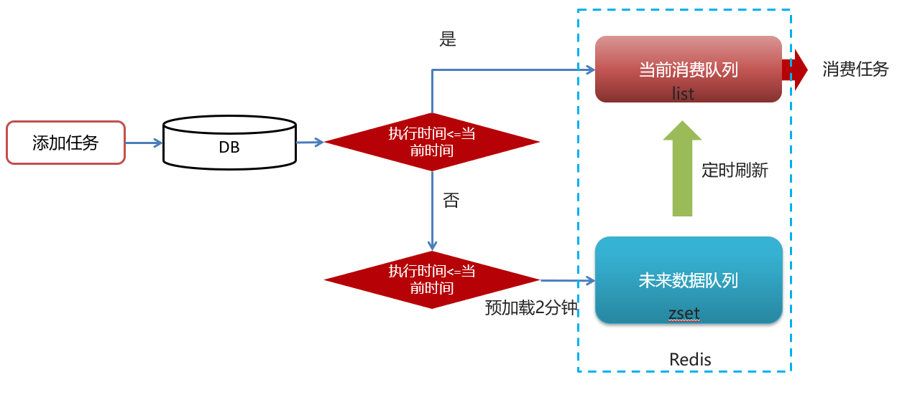
</div>

问题思路

1.为什么任务需要存储在数据库中？

延迟任务是一个通用的服务，任何需要延迟得任务都可以调用该服务，需要考虑数据持久化的问题，存储数据库中是一种数据安全的考虑。

2.为什么redis中使用两种数据类型，list和zset？

效率问题，算法的时间复杂度

3.在添加zset数据的时候，为什么不需要预加载？

任务模块是一个通用的模块，项目中任何需要延迟队列的地方，都可以调用这个接口，要考虑到数据量的问题，如果数据量特别大，为了防止阻塞，只需要把未来几分钟要执行的数据存入缓存即可。

### 3. 延迟任务服务实现

#### 3.1 表结构

taskinfo 任务表

```mysql
-- auto-generated definition
create table taskinfo
(
    task_id      bigint      not null comment '任务id'
        primary key,
    execute_time datetime(3) not null comment '执行时间',
    parameters   longblob    null comment '参数',
    priority     int         not null comment '优先级',
    task_type    int         not null comment '任务类型'
)
    charset = utf8mb3;

create index index_taskinfo_time
    on taskinfo (task_type, priority, execute_time);
```

taskinfo_logs 任务日志表

```mysql
-- auto-generated definition
create table taskinfo_logs
(
    task_id      bigint        not null comment '任务id'
        primary key,
    execute_time datetime(3)   not null comment '执行时间',
    parameters   longblob      null comment '参数',
    priority     int           not null comment '优先级',
    task_type    int           not null comment '任务类型',
    version      int           not null comment '版本号,用乐观锁',
    status       int default 0 null comment '状态 0=初始化状态 1=EXECUTED 2=CANCELLED'
)
    charset = utf8mb3;
```

乐观锁支持：

```java
/**
     * mybatis-plus乐观锁支持
     * @return
     */
@Bean
public MybatisPlusInterceptor optimisticLockerInterceptor(){
    MybatisPlusInterceptor interceptor = new MybatisPlusInterceptor();
    interceptor.addInnerInterceptor(new OptimisticLockerInnerInterceptor());
    return interceptor;
}
```

#### 3.2 添加任务

ScheduleConstants常量类

```java
public class ScheduleConstants {
    
    //task状态
    public static final int SCHEDULED=0;   //初始化状态

    public static final int EXECUTED=1;       //已执行状态

    public static final int CANCELLED=2;   //已取消状态

    public static String FUTURE="future_";   //未来数据key前缀

    public static String TOPIC="topic_";     //当前数据key前缀
}
```

##### 3.2.1 核心代码

```java
@Service
@Transactional
@Slf4j
public class TaskServiceImpl implements TaskService {
    /**
     * 添加延迟任务
     *
     * @param task
     * @return
     */
    @Override
    public long addTask(Task task) {
        //1.添加任务到数据库中

        boolean success = addTaskToDb(task);

        if (success) {
            //2.添加任务到redis
            addTaskToCache(task);
        }

        return task.getTaskId();
    }

    @Autowired
    private CacheService cacheService;

    /**
     * 把任务添加到redis中
     *
     * @param task
     */
    private void addTaskToCache(Task task) {

        String key = task.getTaskType() + "_" + task.getPriority();

        //获取5分钟之后的时间  毫秒值
        Calendar calendar = Calendar.getInstance();
        calendar.add(Calendar.MINUTE, 5);
        long nextScheduleTime = calendar.getTimeInMillis();

        //2.1 如果任务的执行时间小于等于当前时间，存入list
        if (task.getExecuteTime() <= System.currentTimeMillis()) {
            cacheService.lLeftPush(ScheduleConstants.TOPIC + key, JSON.toJSONString(task));
        } else if (task.getExecuteTime() <= nextScheduleTime) {
            //2.2 如果任务的执行时间大于当前时间 && 小于等于预设时间（未来5分钟） 存入zset中
            cacheService.zAdd(ScheduleConstants.FUTURE + key, JSON.toJSONString(task), task.getExecuteTime());
        }

    }

    @Autowired
    private TaskinfoMapper taskinfoMapper;

    @Autowired
    private TaskinfoLogsMapper taskinfoLogsMapper;

    /**
     * 添加任务到数据库中
     *
     * @param task
     * @return
     */
    private boolean addTaskToDb(Task task) {

        boolean flag = false;

        try {
            //保存任务表
            Taskinfo taskinfo = new Taskinfo();
            BeanUtils.copyProperties(task, taskinfo);
            taskinfo.setExecuteTime(new Date(task.getExecuteTime()));
            taskinfoMapper.insert(taskinfo);

            //设置taskID
            task.setTaskId(taskinfo.getTaskId());

            //保存任务日志数据
            TaskinfoLogs taskinfoLogs = new TaskinfoLogs();
            BeanUtils.copyProperties(taskinfo, taskinfoLogs);
            taskinfoLogs.setVersion(1);
            taskinfoLogs.setStatus(ScheduleConstants.SCHEDULED);
            taskinfoLogsMapper.insert(taskinfoLogs);

            flag = true;
        } catch (Exception e) {
            e.printStackTrace();
        }

        return flag;
    }
}
```

#### 3.3 取消任务

##### 3.3.1 核心代码

```java
/**
     * 取消任务
     * @param taskId
     * @return
     */
@Override
public boolean cancelTask(long taskId) {

    boolean flag = false;

    //删除任务，更新日志
    Task task = updateDb(taskId,ScheduleConstants.EXECUTED);

    //删除redis的数据
    if(task != null){
        removeTaskFromCache(task);
        flag = true;
    }

    return false;
}

/**
     * 删除redis中的任务数据
     * @param task
     */
private void removeTaskFromCache(Task task) {

    String key = task.getTaskType()+"_"+task.getPriority();

    if(task.getExecuteTime()<=System.currentTimeMillis()){
        cacheService.lRemove(ScheduleConstants.TOPIC+key,0,JSON.toJSONString(task));
    }else {
        cacheService.zRemove(ScheduleConstants.FUTURE+key, JSON.toJSONString(task));
    }
}

/**
     * 删除任务，更新任务日志状态
     * @param taskId
     * @param status
     * @return
     */
private Task updateDb(long taskId, int status) {
    Task task = null;
    try {
        //删除任务
        taskinfoMapper.deleteById(taskId);

        TaskinfoLogs taskinfoLogs = taskinfoLogsMapper.selectById(taskId);
        taskinfoLogs.setStatus(status);
        taskinfoLogsMapper.updateById(taskinfoLogs);

        task = new Task();
        BeanUtils.copyProperties(taskinfoLogs,task);
        task.setExecuteTime(taskinfoLogs.getExecuteTime().getTime());
    }catch (Exception e){
        log.error("task cancel exception taskid={}",taskId);
    }

    return task;

}
```

#### 3.4 消费任务

##### 3.4.1 核心代码

```java
/**
     * 按照类型和优先级拉取任务
     * @return
     */
@Override
public Task poll(int type,int priority) {
    Task task = null;
    try {
        String key = type+"_"+priority;
        String task_json = cacheService.lRightPop(ScheduleConstants.TOPIC + key);
        if(StringUtils.isNotBlank(task_json)){
            task = JSON.parseObject(task_json, Task.class);
            //更新数据库信息
            updateDb(task.getTaskId(),ScheduleConstants.EXECUTED);
        }
    }catch (Exception e){
        e.printStackTrace();
        log.error("poll task exception");
    }

    return task;
}
```

#### 3.5 未来数据定时刷新

##### 3.5.1 reids key值匹配

方案1：keys 模糊匹配

keys的模糊匹配功能很方便也很强大，但是在生产环境需要慎用！开发中使用keys的模糊匹配却发现redis的**CPU使用率极高**，所以公司的redis生产环境将**keys命令禁用**了！**redis是单线程，会被堵塞**。

<div align="center">
    
</div>

方案2：scan 

SCAN 命令是一个**基于游标的迭代器**，SCAN命令每次被调用之后， 都会向用户**返回一个新的游标**， 用户在下次迭代时需要使用这个新游标作为SCAN命令的**游标参数**， 以此来延续之前的迭代过程。

<div align="center">
    
</div>

##### 3.5.2 reids管道

普通redis客户端和服务器交互模式

<div align="center">
    
</div>

Pipeline请求模型

<div align="center">
    
</div>

官方测试结果数据对比

<div align="center">
    
</div>

##### 3.5.3 核心代码

```java
@Scheduled(cron = "0 */1 * * * ?")
public void refresh() {
    System.out.println(System.currentTimeMillis() / 1000 + "执行了定时任务");

    // 获取所有未来数据集合的key值
    Set<String> futureKeys = cacheService.scan(ScheduleConstants.FUTURE + "*");// future_*
    for (String futureKey : futureKeys) { // future_250_250

        String topicKey = ScheduleConstants.TOPIC + futureKey.split(ScheduleConstants.FUTURE)[1];
        //获取该组key下当前需要消费的任务数据
        Set<String> tasks = cacheService.zRangeByScore(futureKey, 0, System.currentTimeMillis());
        if (!tasks.isEmpty()) {
            //将这些任务数据添加到消费者队列中
            cacheService.refreshWithPipeline(futureKey, topicKey, tasks);
            System.out.println("成功的将" + futureKey + "下的当前需要执行的任务数据刷新到" + topicKey + "下");
        }
    }
}
```

在引导类中添加开启任务调度注解：`@EnableScheduling`

#### 3.6 分布式锁解决集群下的方法抢占执行

##### 3.6.1 问题描述

启动两台heima-leadnews-schedule服务，每台服务都会去执行refresh定时任务方法

<div align="center">
    
</div>

##### 3.6.2 分布式锁

分布式锁：控制分布式系统有序的去对共享资源进行操作，通过互斥来保证数据的一致性。

解决方案：

<div align="center">
    
</div>

##### 3.6.3 redis分布式锁

sexnx （SET if Not eXists） 命令在指定的 key 不存在时，为 key 设置指定的值。

<div align="center">
    
</div>

这种加锁的思路是，如果 key 不存在则为 key 设置 value，如果 key 已存在则 SETNX 命令不做任何操作

- 客户端A请求服务器设置key的值，如果设置成功就表示加锁成功
- 客户端B也去请求服务器设置key的值，如果返回失败，那么就代表加锁失败
- 客户端A执行代码完成，删除锁
- 客户端B在等待一段时间后再去请求设置key的值，设置成功
- 客户端B执行代码完成，删除锁

##### 3.6.4 在工具类CacheService中添加方法

```java
/**
 * 加锁
 *
 * @param name
 * @param expire
 * @return
 */
public String tryLock(String name, long expire) {
    name = name + "_lock";
    String token = UUID.randomUUID().toString();
    RedisConnectionFactory factory = stringRedisTemplate.getConnectionFactory();
    RedisConnection conn = factory.getConnection();
    try {

        //参考redis命令：
        //set key value [EX seconds] [PX milliseconds] [NX|XX]
        Boolean result = conn.set(
                name.getBytes(),
                token.getBytes(),
                Expiration.from(expire, TimeUnit.MILLISECONDS),
                RedisStringCommands.SetOption.SET_IF_ABSENT //NX
        );
        if (result != null && result)
            return token;
    } finally {
        RedisConnectionUtils.releaseConnection(conn, factory,false);
    }
    return null;
}
```

修改未来数据定时刷新的方法，如下：

```java
/**
 * 未来数据定时刷新
 */
@Scheduled(cron = "0 */1 * * * ?")
public void refresh(){

    String token = cacheService.tryLock("FUTURE_TASK_SYNC", 1000 * 30);
    if(StringUtils.isNotBlank(token)){
        log.info("未来数据定时刷新---定时任务");

        //获取所有未来数据的集合key
        Set<String> futureKeys = cacheService.scan(ScheduleConstants.FUTURE + "*");
        for (String futureKey : futureKeys) {//future_100_50

            //获取当前数据的key  topic
            String topicKey = ScheduleConstants.TOPIC+futureKey.split(ScheduleConstants.FUTURE)[1];

            //按照key和分值查询符合条件的数据
            Set<String> tasks = cacheService.zRangeByScore(futureKey, 0, System.currentTimeMillis());

            //同步数据
            if(!tasks.isEmpty()){
                cacheService.refreshWithPipeline(futureKey,topicKey,tasks);
                log.info("成功的将"+futureKey+"刷新到了"+topicKey);
            }
        }
    }
}
```

#### 3.7 数据库同步到redis

<div align="center">
    
</div>


```java
@Scheduled(cron = "0 */5 * * * ?")
@PostConstruct //机器宕机了，希望在恢复之后第一时间做数据的同步
public void reloadData() {
    clearCache();
    log.info("数据库数据同步到缓存");
    Calendar calendar = Calendar.getInstance();
    calendar.add(Calendar.MINUTE, 5);

    //查看小于未来5分钟的所有任务
    List<Taskinfo> allTasks = taskinfoMapper.selectList(Wrappers.<Taskinfo>lambdaQuery().lt(Taskinfo::getExecuteTime,calendar.getTime()));
    if(allTasks != null && allTasks.size() > 0){
        for (Taskinfo taskinfo : allTasks) {
            Task task = new Task();
            BeanUtils.copyProperties(taskinfo,task);
            task.setExecuteTime(taskinfo.getExecuteTime().getTime());
            addTaskToCache(task);
        }
    }
}

private void clearCache(){
    // 删除缓存中未来数据集合和当前消费者队列的所有key
    Set<String> futurekeys = cacheService.scan(ScheduleConstants.FUTURE + "*");// future_
    Set<String> topickeys = cacheService.scan(ScheduleConstants.TOPIC + "*");// topic_
    cacheService.delete(futurekeys);
    cacheService.delete(topickeys);
}
```

### 4. 延迟队列解决精准时间发布文章

##### 4.1 延迟队列服务提供对外接口

提供远程的feign接口，在heima-leadnews-feign-api编写类如下：

```java
@FeignClient("leadnews-schedule")
public interface IScheduleClient {

    /**
     * 添加任务
     * @param task   任务对象
     * @return       任务id
     */
    @PostMapping("/api/v1/task/add")
    public ResponseResult  addTask(@RequestBody Task task);

    /**
     * 取消任务
     * @param taskId        任务id
     * @return              取消结果
     */
    @GetMapping("/api/v1/task/cancel/{taskId}")
    public ResponseResult cancelTask(@PathVariable("taskId") long taskId);

    /**
     * 按照类型和优先级来拉取任务
     * @param type
     * @param priority
     * @return
     */
    @GetMapping("/api/v1/task/poll/{type}/{priority}")
    public ResponseResult poll(@PathVariable("type") int type,@PathVariable("priority")  int priority);
}
```

在heima-leadnews-schedule微服务下提供对应的实现

```java
@RestController
public class ScheduleClient implements IScheduleClient {

    @Autowired
    private TaskService taskService;

    /**
     * 添加任务
     * @param task 任务对象
     * @return 任务id
     */
    @PostMapping("/api/v1/task/add")
    @Override
    public ResponseResult addTask(@RequestBody Task task) {
        return ResponseResult.okResult(taskService.addTask(task));
    }

    /**
     * 取消任务
     * @param taskId 任务id
     * @return 取消结果
     */
    @GetMapping("/api/v1/task/cancel/{taskId}")
    @Override
    public ResponseResult cancelTask(@PathVariable("taskId") long taskId) {
        return ResponseResult.okResult(taskService.cancelTask(taskId));
    }

    /**
     * 按照类型和优先级来拉取任务
     * @param type
     * @param priority
     * @return
     */
    @GetMapping("/api/v1/task/poll/{type}/{priority}")
    @Override
    public ResponseResult poll(@PathVariable("type") int type, @PathVariable("priority") int priority) {
        return ResponseResult.okResult(taskService.poll(type,priority));
    }
}
```

##### 4.2 发布文章集成添加延迟队列接口

枚举类：

```java
@Getter
@AllArgsConstructor
public enum TaskTypeEnum {

    NEWS_SCAN_TIME(1001, 1,"文章定时审核"),
    REMOTEERROR(1002, 2,"第三方接口调用失败，重试");
    private final int taskType; //对应具体业务
    private final int priority; //业务不同级别
    private final String desc; //描述信息
}
```

###### 4.2.1 序列化工具对比

- JdkSerialize：java内置的序列化能将实现了Serilazable接口的对象进行序列化和反序列化， ObjectOutputStream的writeObject()方法可序列化对象生成字节数组
- Protostuff：google开源的protostuff采用更为紧凑的二进制数组，表现更加优异，然后使用protostuff的编译工具生成pojo类

###### 4.2.2 核心代码

```java
@Service
@Slf4j
public class WmNewsTaskServiceImpl  implements WmNewsTaskService {

    @Autowired
    private IScheduleClient scheduleClient;

    /**
     * 添加任务到延迟队列中
     * @param id          文章的id
     * @param publishTime 发布的时间  可以做为任务的执行时间
     */
    @Override
    @Async //异步方法
    public void addNewsToTask(Integer id, Date publishTime) {

        log.info("添加任务到延迟服务中----begin");

        Task task = new Task();
        task.setExecuteTime(publishTime.getTime());
        task.setTaskType(TaskTypeEnum.NEWS_SCAN_TIME.getTaskType());
        task.setPriority(TaskTypeEnum.NEWS_SCAN_TIME.getPriority());
        WmNews wmNews = new WmNews();
        wmNews.setId(id);
        task.setParameters(ProtostuffUtil.serialize(wmNews));

        scheduleClient.addTask(task);

        log.info("添加任务到延迟服务中----end");
    }
    
}
```

修改发布文章代码：

把之前的异步调用修改为调用延迟任务

```java
    //审核文章
    //        wmNewsAutoScanService.autoScanWmNews(wmNews.getId());
    wmNewsTaskService.addNewsToTask(wmNews.getId(),wmNews.getPublishTime());
```

##### 4.3 消费任务进行审核文章

实现

```java
@Autowired
private WmNewsAutoScanServiceImpl wmNewsAutoScanService;

/**
     * 消费延迟队列数据
     */
@Scheduled(fixedRate = 1000)
@Override
@SneakyThrows
public void scanNewsByTask() {

    log.info("文章审核---消费任务执行---begin---");

    ResponseResult responseResult = scheduleClient.poll(TaskTypeEnum.NEWS_SCAN_TIME.getTaskType(), TaskTypeEnum.NEWS_SCAN_TIME.getPriority());
    if(responseResult.getCode().equals(200) && responseResult.getData() != null){
        String json_str = JSON.toJSONString(responseResult.getData());
        Task task = JSON.parseObject(json_str, Task.class);
        byte[] parameters = task.getParameters();
        WmNews wmNews = ProtostuffUtil.deserialize(parameters, WmNews.class);
        System.out.println(wmNews.getId()+"-----------");
        wmNewsAutoScanService.autoScanWmNews(wmNews.getId());
    }
    log.info("文章审核---消费任务执行---end---");
}
```

在WemediaApplication自媒体的引导类中添加开启任务调度注解`@EnableScheduling`

## 十二、kafka及异步通知文章上下架

### 1. 自媒体文章上下架

需求分析

<div align="center">
    
</div>

<div align="center">
    
</div>

### 2. kafka概述

消息中间件对比                              

| 特性       | ActiveMQ                               | RabbitMQ                   | RocketMQ                 | Kafka                                    |
| ---------- | -------------------------------------- | -------------------------- | ------------------------ | ---------------------------------------- |
| 开发语言   | java                                   | erlang                     | java                     | scala                                    |
| 单机吞吐量 | 万级                                   | 万级                       | 10万级                   | 100万级                                  |
| 时效性     | ms                                     | us                         | ms                       | ms级以内                                 |
| 可用性     | 高（主从）                             | 高（主从）                 | 非常高（分布式）         | 非常高（分布式）                         |
| 功能特性   | 成熟的产品、较全的文档、各种协议支持好 | 并发能力强、性能好、延迟低 | MQ功能比较完善，扩展性佳 | 只支持主要的MQ功能，主要应用于大数据领域 |

消息中间件对比-选择建议

| **消息中间件** | **建议**                                                     |
| -------------- | ------------------------------------------------------------ |
| Kafka          | 追求高吞吐量，适合产生大量数据的互联网服务的数据收集业务     |
| RocketMQ       | 可靠性要求很高的金融互联网领域,稳定性高，经历了多次阿里双11考验 |
| RabbitMQ       | 性能较好，社区活跃度高，数据量没有那么大，优先选择功能比较完备的RabbitMQ |

kafka介绍

Kafka 是一个**分布式流媒体平台**,类似于消息队列或企业消息传递系统。kafka官网：http://kafka.apache.org/  

<div align="center">
    
</div>

kafka介绍-名词解释

<div align="center">
    
</div>

- producer：发布消息的对象称之为主题生产者（Kafka topic producer）

- topic：Kafka将消息分门别类，每一类的消息称之为一个主题（Topic）

- consumer：订阅消息并处理发布的消息的对象称之为主题消费者（consumers）

- broker：已发布的消息保存在一组服务器中，称之为Kafka集群。集群中的**每一个服务器**都是一个**代理（Broker）**。 消费者可以订阅一个或多个主题（topic），并从Broker拉数据，从而消费这些已发布的消息。

### 3. kafka安装配置

Kafka对于zookeeper是强依赖，保存kafka相关的节点数据，所以安装Kafka之前必须先安装zookeeper

- Docker安装zookeeper

下载镜像：

```shell
docker pull zookeeper:3.4.14
```

创建容器

```shell
docker run -d --name zookeeper -p 2181:2181 zookeeper:3.4.14
```

- Docker安装kafka

下载镜像：

```shell
docker pull wurstmeister/kafka:2.12-2.3.1
```

创建容器

```shell
docker run -d --name kafka \
--env KAFKA_ADVERTISED_HOST_NAME=192.168.200.130 \
--env KAFKA_ZOOKEEPER_CONNECT=192.168.200.130:2181 \
--env KAFKA_ADVERTISED_LISTENERS=PLAINTEXT://192.168.200.130:9092 \
--env KAFKA_LISTENERS=PLAINTEXT://0.0.0.0:9092 \
--env KAFKA_HEAP_OPTS="-Xmx256M -Xms256M" \
--net=host wurstmeister/kafka:2.12-2.3.1
```

### 4. kafka高可用设计

#### 4.1 集群

<div align="center">
    
</div>

- Kafka 的服务器端由被称为 Broker 的**服务进程**构成，即一个 Kafka 集群由多个 Broker 组成

- 这样如果集群中某一台机器宕机，其他机器上的 Broker 也依然能够对外提供服务。这其实就是 Kafka 提供高可用的手段之一

#### 4.2 备份机制(Replication）

<div align="center">
    
</div>

Kafka 中消息的备份又叫做 **副本（Replica）**

Kafka 定义了两类副本：

- 领导者副本（Leader Replica）

- 追随者副本（Follower Replica）

##### 同步方式

<div align="center">
    
</div>

ISR（in-**sync** replica）需要**同步复制**保存的follower


如果leader失效后，需要选出新的leader，选举的原则如下：

第一：选举时**优先从ISR**中选定，因为这个列表中follower的数据是与leader**同步**的

第二：如果ISR列表中的follower**都不行了**，就**只能从其他follower中选取**


极端情况，就是所有副本都失效了，这时有两种方案

第一：**等待ISR中的一个活过来，**选为Leader，**数据可靠**，但活过来的**时间不确定**

第二：**选择第一个活**过来的Replication，不一定是ISR中的，选为leader，以**最快速度恢复可用性**，**但数据不一定完整**

### 5. 生产者详解

#### 5.1 参数详解

- ack

代码的配置方式：

```java
//ack配置  消息确认机制
prop.put(ProducerConfig.ACKS_CONFIG,"all");
```

参数的选择说明

| **确认机制**     | **说明**                                                     |
| ---------------- | ------------------------------------------------------------ |
| acks=0           | 生产者在成功写入消息之前不会等待任何来自服务器的响应,消息有丢失的风险，但是速度最快 |
| acks=1（默认值） | 只要集群**首领节点**收到消息，生产者就会收到一个来自服务器的成功响应 |
| acks=all         | 只有当所有参与赋值的节点全部收到消息时，生产者才会收到一个来自服务器的成功响应 |

- retries

生产者从服务器收到的错误有可能是临时性错误，在这种情况下，retries参数的值决定了生产者可以重发消息的次数，如果达到这个次数，生产者会放弃重试返回错误，**默认情况**下，生产者会在每次重试之间等待**100ms**

代码中配置方式：

```java
//重试次数
prop.put(ProducerConfig.RETRIES_CONFIG,10);
```

- 消息压缩

默认情况下， 消息发送时不会被压缩。

代码中配置方式：

```java
//数据压缩
prop.put(ProducerConfig.COMPRESSION_TYPE_CONFIG,"lz4");
```

| **压缩算法** | **说明**                                                     |
| ------------ | ------------------------------------------------------------ |
| snappy       | 占用较少的  CPU，  却能提供较好的性能和相当可观的压缩比， 如果看重性能和网络带宽，建议采用 |
| lz4          | 占用较少的 CPU， 压缩和解压缩速度较快，压缩比也很客观        |
| gzip         | 占用较多的  CPU，但会提供更高的压缩比，网络带宽有限，可以使用这种算法 |

**使用压缩可以降低网络传输开销和存储开销，而这往往是向 Kafka 发送消息的瓶颈所在**。

### 6.消费者详解

#### 6.1 消费者组

<div align="center">
    
</div>

- 消费者组（Consumer Group） ：指的就是由**一个或多个消费者**组成的群体

- 一个发布在Topic上消息被分发给**此消费者组中的一个消费者**

  - 所有的消费者都在一个组中，那么这就变成了queue模型

  - 所有的消费者都在不同的组中，那么就完全变成了发布-订阅模型

#### 6.2 消息有序性

应用场景：

- 即时消息中的单对单聊天和群聊，保证发送方消息发送顺序与接收方的顺序一致

- 充值转账两个渠道在同一个时间进行余额变更，短信通知必须要有顺序

<div align="center">
    
</div>

**topic分区**中消息只能由**消费者组中的唯一一个消费者**处理，所以消息肯定是**按照先后顺序**进行处理的。但是它也仅仅是保证Topic的一个分区顺序处理，**不能保证跨分区的消息先后处理顺序**。 所以，如果你**想要顺序的处理**Topic的所有消息，那就**只提供一个分区**。

#### 6.3 提交和偏移量

kafka**不会**像其他JMS队列那样**需要得到消费者的确认**，消费者可以使用kafka来追踪消息在分区的位置（偏移量）

消费者会往一个叫做**_consumer_offset**的特殊主题发送消息，消息里包含了每个分区的偏移量。如果消费者发生**崩溃**或有新的消费者**加入**群组，就会**触发再均衡**

<div align="center">
    
</div>

正常的情况

<div align="center">
    
</div>

如果消费者2挂掉以后，会发生再均衡，消费者2**负责的分区**会被**其他消费者**进行消费

再均衡后不可避免会出现一些问题

问题一：

<div align="center">
    
</div>

如果**提交偏移量**小于客户端**处理的最后一个消息的偏移量**，那么处于两个偏移量之间的消息就会被**重复处理**。


问题二：

<div align="center">
    
</div>

如果提交的偏移量**大于**客户端的最后一个消息的偏移量，那么处于两个偏移量之间的消息将会**丢失**。

如果想要解决这些问题，还要知道目前kafka提交偏移量的方式：

提交偏移量的方式有两种，分别是自动提交偏移量和手动提交

- 自动提交偏移量

当enable.auto.commit被设置为true，提交方式就是让消费者自动提交偏移量，**每隔5秒**消费者会自动把从**poll()**方法接收的**最大偏移量**提交上去

- 手动提交 ，当enable.auto.commit被设置为false可以有以下三种提交方式

  - 提交当前偏移量（同步提交）

  - 异步提交

  - 同步和异步组合提交

1.提交当前偏移量（同步提交）

把`enable.auto.commit`设置为false,让应用程序决定何时提交偏移量。使用**commitSync()**提交偏移量，commitSync()将会**提交poll返回的最新的偏移量**，所以在处理完所有记录后要确保调用了commitSync()方法。否则还是会有消息丢失的风险。

只要没有发生不可恢复的错误，commitSync()方法会一直尝试直至提交成功，如果提交失败也可以记录到错误日志里。

2.异步提交

手动提交有一个缺点，那就是当发起提交调用时应用会**阻塞**。当然我们可以减少手动提交的频率，但这个会增加消息重复的概率（和自动提交一样）。另外一个解决办法是，使用异步提交的API。

3.同步和异步组合提交

**异步**提交也有个**缺点**，那就是如果服务器返回提交失败，**异步提交不会进行重试**。相比较起来，同步提交会进行重试直到成功或者最后抛出异常给应用。**异步提交没有实现重试是因为，如果同时存在多个异步提交，进行重试可能会导致位移覆盖。**

举个例子，假如我们发起了一个异步提交**commitA**，此时的提交位移为**2000**，随后又发起了一个异步提交**commitB**且位移为**3000**；**commitA提交失败但commitB提交成功**，此时commitA进行**重试并成功**的话，会将实际上将已经提交的位移从**3000回滚到2000**，导致消息**重复消费**。

### 7. 自媒体文章上下架功能完成

#### 7.1 需求分析

- 已发表且已上架的文章可以下架

- 已发表且已下架的文章可以上架

#### 7.2 流程说明

<div align="center">
    
</div>

#### 7.3 接口定义

|          | **说明**                |
| -------- | ----------------------- |
| 接口路径 | /api/v1/news/down_or_up |
| 请求方式 | POST                    |
| 参数     | DTO                     |
| 响应结果 | ResponseResult          |

 DTO  

```java
@Data
public class WmNewsDto {
    
    private Integer id;
    /**
    * 是否上架  0 下架  1 上架
    */
    private Short enable;
                       
}
```

#### 7.4 核心代码

```java
/**
 * 文章的上下架
 * @param dto
 * @return
 */
@Override
public ResponseResult downOrUp(WmNewsDto dto) {
    //1.检查参数
    if(dto.getId() == null){
        return ResponseResult.errorResult(AppHttpCodeEnum.PARAM_INVALID);
    }

    //2.查询文章
    WmNews wmNews = getById(dto.getId());
    if(wmNews == null){
        return ResponseResult.errorResult(AppHttpCodeEnum.DATA_NOT_EXIST,"文章不存在");
    }

    //3.判断文章是否已发布
    if(!wmNews.getStatus().equals(WmNews.Status.PUBLISHED.getCode())){
        return ResponseResult.errorResult(AppHttpCodeEnum.PARAM_INVALID,"当前文章不是发布状态，不能上下架");
    }

    //4.修改文章enable
    if(dto.getEnable() != null && dto.getEnable() > -1 && dto.getEnable() < 2){
        update(Wrappers.<WmNews>lambdaUpdate().set(WmNews::getEnable,dto.getEnable())
                .eq(WmNews::getId,wmNews.getId()));
    }
    return ResponseResult.okResult(AppHttpCodeEnum.SUCCESS);
}
```

#### 7.5 消息通知article端文章上下架

在自媒体端文章上下架后发送消息

```java
//发送消息，通知article端修改文章配置
if(wmNews.getArticleId() != null){
    Map<String,Object> map = new HashMap<>();
    map.put("articleId",wmNews.getArticleId());
    map.put("enable",dto.getEnable());
    kafkaTemplate.send(WmNewsMessageConstants.WM_NEWS_UP_OR_DOWN_TOPIC,JSON.toJSONString(map));
}
```

常量类：

```java
public class WmNewsMessageConstants {

    public static final String WM_NEWS_UP_OR_DOWN_TOPIC="wm.news.up.or.down.topic";
}
```

在**article端**编写监听，接收数据

```java
@Component
@Slf4j
public class ArtilceIsDownListener {

    @Autowired
    private ApArticleConfigService apArticleConfigService;

    @KafkaListener(topics = WmNewsMessageConstants.WM_NEWS_UP_OR_DOWN_TOPIC)
    public void onMessage(String message){
        if(StringUtils.isNotBlank(message)){
            Map map = JSON.parseObject(message, Map.class);
            apArticleConfigService.updateByMap(map);
            log.info("article端文章配置修改，articleId={}",map.get("articleId"));
        }
    }
}
```

```java
@Service
@Slf4j
@Transactional
public class ApArticleConfigServiceImpl extends ServiceImpl<ApArticleConfigMapper, ApArticleConfig> implements ApArticleConfigService {
    /**
     * 修改文章配置
     * @param map
     */
    @Override
    public void updateByMap(Map map) {
        //0 下架 1 上架
        Object enable = map.get("enable");
        boolean isDown = true;
        if(enable.equals(1)){
            isDown = false;
        }
        //修改文章配置
        update(Wrappers.<ApArticleConfig>lambdaUpdate().eq(ApArticleConfig::getArticleId,map.get("articleId")).set(ApArticleConfig::getIsDown,isDown));
    }
}
```

## 十三、app端文章搜索

### 1. App端搜索-效果图

<div align="center">
    
</div>

### 2. 搭建ElasticSearch环境

#### 2.1 拉取镜像

```shell
docker pull elasticsearch:7.4.0
```

#### 2.2 创建容器

```shell
docker run -id --name elasticsearch -d --restart=always -p 9200:9200 -p 9300:9300 -v /usr/share/elasticsearch/plugins:/usr/share/elasticsearch/plugins -e "discovery.type=single-node" elasticsearch:7.4.0
```

#### 2.3 配置中文分词器 ik

因为在创建elasticsearch容器的时候，映射了目录，所以可以在宿主机上进行配置ik中文分词器

在去选择ik分词器的时候，需要与elasticsearch的版本对应上

把`elasticsearch-analysis-ik-7.4.0.zip`上传到服务器上,放到对应目录（plugins）解压

```shell
#切换目录
cd /usr/share/elasticsearch/plugins
#新建目录
mkdir analysis-ik
cd analysis-ik
#root根目录中拷贝文件
mv elasticsearch-analysis-ik-7.4.0.zip /usr/share/elasticsearch/plugins/analysis-ik
#解压文件
cd /usr/share/elasticsearch/plugins/analysis-ik
unzip elasticsearch-analysis-ik-7.4.0.zip
```

### 3. app端文章搜索

#### 3.1 需求分析

- 用户输入关键可搜索文章列表

- 关键词高亮显示

- 文章列表展示与home展示一样，当用户点击某一篇文章，可查看文章详情

#### 3.2 思路分析

为了加快检索的效率，在查询的时候不会直接从数据库中查询文章，需要在elasticsearch中进行高速检索。

<div align="center">
    
</div>

#### 3.3 创建索引和映射

使用postman添加映射

put请求 ： http://192.168.200.130:9200/app_info_article

```json
{
    "mappings":{
        "properties":{
            "id":{
                "type":"long"
            },
            "publishTime":{
                "type":"date"
            },
            "layout":{
                "type":"integer"
            },
            "images":{
                "type":"keyword",
                "index": false
            },
            "staticUrl":{
                "type":"keyword",
                "index": false
            },
            "authorId": {
                "type": "long"
            },
            "authorName": {
                "type": "text"
            },
            "title":{
                "type":"text",
                "analyzer":"ik_smart"
            },
            "content":{
                "type":"text",
                "analyzer":"ik_smart"
            }
        }
    }
}
```

GET请求查询映射：http://192.168.200.130:9200/app_info_article

DELETE请求，删除索引及映射：http://192.168.200.130:9200/app_info_article

GET请求，查询所有文档：http://192.168.200.130:9200/app_info_article/_search

### 4. 数据初始化到索引库

#### 4.1 核心代码

```java
@SpringBootTest
@RunWith(SpringRunner.class)
public class ApArticleTest {
    
    @Autowired
    private ApArticleMapper apArticleMapper;
    @Autowired
    private RestHighLevelClient restHighLevelClient;
    
    /**
     * 注意：数据量的导入，如果数据量过大，需要分页导入
     * @throws Exception
     */
    @Test
    public void init() throws Exception {

        //1.查询所有符合条件的文章数据
        List<SearchArticleVo> searchArticleVos = apArticleMapper.loadArticleList();

        //2.批量导入到es索引库
        BulkRequest bulkRequest = new BulkRequest("app_info_article");

        for (SearchArticleVo searchArticleVo : searchArticleVos) {

            IndexRequest indexRequest = new IndexRequest().id(searchArticleVo.getId().toString())
                    .source(JSON.toJSONString(searchArticleVo), XContentType.JSON);

            //批量添加数据
            bulkRequest.add(indexRequest);

        }
        restHighLevelClient.bulk(bulkRequest, RequestOptions.DEFAULT);
    }
}
```

### 5. 文章搜索功能实现

#### 5.1 搭建搜索微服务

```xml
<!--elasticsearch-->
<dependency>
    <groupId>org.elasticsearch.client</groupId>
    <artifactId>elasticsearch-rest-high-level-client</artifactId>
    <version>7.4.0</version>
</dependency>
<dependency>
    <groupId>org.elasticsearch.client</groupId>
    <artifactId>elasticsearch-rest-client</artifactId>
    <version>7.4.0</version>
</dependency>
<dependency>
    <groupId>org.elasticsearch</groupId>
    <artifactId>elasticsearch</artifactId>
    <version>7.4.0</version>
</dependency>
```

nacos配置中心leadnews-search

```yaml
spring:
  autoconfigure:
    exclude: org.springframework.boot.autoconfigure.jdbc.DataSourceAutoConfiguration
elasticsearch:
  host: 192.168.200.130
  port: 9200
```

UserSearchDto

```java
@Data
public class UserSearchDto {
    /**
    * 搜索关键字
    */
    String searchWords;
    /**
    * 当前页
    */
    int pageNum;
    /**
    * 分页条数
    */
    int pageSize;
    /**
    * 最小时间
    */
    Date minBehotTime;

    public int getFromIndex(){
        if(this.pageNum<1)return 0;
        if(this.pageSize<1) this.pageSize = 10;
        return this.pageSize * (pageNum-1);
    }
}
```

#### 5.2 核心代码

```java
@Service
@Slf4j
public class ArticleSearchServiceImpl implements ArticleSearchService {
    @Autowired
    private RestHighLevelClient restHighLevelClient;
    /**
     * es文章分页检索
     * @param dto
     * @return
     */
    @Override
    public ResponseResult search(UserSearchDto dto) throws IOException {

        //1.检查参数
        if(dto == null || StringUtils.isBlank(dto.getSearchWords())){
            return ResponseResult.errorResult(AppHttpCodeEnum.PARAM_INVALID);
        }

        //2.设置查询条件
        SearchRequest searchRequest = new SearchRequest("app_info_article");
        SearchSourceBuilder searchSourceBuilder = new SearchSourceBuilder();

        //布尔查询
        BoolQueryBuilder boolQueryBuilder = QueryBuilders.boolQuery();

        //关键字的分词之后查询
        QueryStringQueryBuilder queryStringQueryBuilder = QueryBuilders.queryStringQuery(dto.getSearchWords()).field("title").field("content").defaultOperator(Operator.OR);
        boolQueryBuilder.must(queryStringQueryBuilder);//must参与算分

        //查询小于mindate的数据
        RangeQueryBuilder rangeQueryBuilder = QueryBuilders.rangeQuery("publishTime").lt(dto.getMinBehotTime().getTime());
        boolQueryBuilder.filter(rangeQueryBuilder);//不参与算分

        //分页查询(查出来的文章都是比当前用户显示文章的发布时间早的，直接取前PageSize条)
        searchSourceBuilder.from(0);
        searchSourceBuilder.size(dto.getPageSize());

        //按照发布时间倒序查询
        searchSourceBuilder.sort("publishTime", SortOrder.DESC);

        //设置高亮  title
        HighlightBuilder highlightBuilder = new HighlightBuilder();
        highlightBuilder.field("title");
        highlightBuilder.preTags("<font style='color: red; font-size: inherit;'>");
        highlightBuilder.postTags("</font>");
        searchSourceBuilder.highlighter(highlightBuilder);


        searchSourceBuilder.query(boolQueryBuilder);
        searchRequest.source(searchSourceBuilder);
        SearchResponse searchResponse = restHighLevelClient.search(searchRequest, RequestOptions.DEFAULT);

        //3.结果封装返回
        List<Map> list = new ArrayList<>();

        SearchHit[] hits = searchResponse.getHits().getHits();
        for (SearchHit hit : hits) {
            String json = hit.getSourceAsString();
            Map map = JSON.parseObject(json, Map.class);
            //处理高亮
            if(hit.getHighlightFields() != null && hit.getHighlightFields().size() > 0){
                Text[] titles = hit.getHighlightFields().get("title").getFragments();
                String title = StringUtils.join(titles);
                //高亮标题
                map.put("h_title",title);
            }else {
                //原始标题
                map.put("h_title",map.get("title"));
            }
            list.add(map);
        }
        return ResponseResult.okResult(list);
    }
}
```

需要在app的网关中添加搜索微服务的路由配置

```yaml
#搜索微服务
- id: leadnews-search
 uri: lb://leadnews-search
 predicates:
   - Path=/search/**
 filters:
   - StripPrefix= 1
```

### 6. 文章自动审核构建索引

#### 6.1 思路分析

<div align="center">
    
</div>

#### 6.2 文章微服务发送消息

SearchArticleVo

```java
package com.heima.model.search.vos;

import lombok.Data;

import java.util.Date;

@Data
public class SearchArticleVo {

    // 文章id
    private Long id;
    // 文章标题
    private String title;
    // 文章发布时间
    private Date publishTime;
    // 文章布局
    private Integer layout;
    // 封面
    private String images;
    // 作者id
    private Long authorId;
    // 作者名词
    private String authorName;
    //静态url
    private String staticUrl;
    //文章内容
    private String content;

}
```

2.文章微服务的ArticleFreemarkerService中的buildArticleToMinIO方法中收集数据并发送消息

```java
@Service
@Slf4j
@Transactional
public class ArticleFreemarkerServiceImpl implements ArticleFreemarkerService {

    @Autowired
    private ApArticleContentMapper apArticleContentMapper;
    @Autowired
    private Configuration configuration;
    @Autowired
    private FileStorageService fileStorageService;
    @Autowired
    private ApArticleService apArticleService;

    /**
     * 生成静态文件上传到minIO中
     * @param apArticle
     * @param content
     */
    @Async
    @Override
    public void buildArticleToMinIO(ApArticle apArticle, String content) {
        //已知文章的id
        //4.1 获取文章内容
        if(StringUtils.isNotBlank(content)){
            //4.2 文章内容通过freemarker生成html文件
            Template template = null;
            StringWriter out = new StringWriter();
            try {
                template = configuration.getTemplate("article.ftl");
                //数据模型
                Map<String,Object> contentDataModel = new HashMap<>();
                contentDataModel.put("content", JSONArray.parseArray(content));
                //合成
                template.process(contentDataModel,out);
            } catch (Exception e) {
                e.printStackTrace();
            }
            
            //4.3 把html文件上传到minio中
            InputStream in = new ByteArrayInputStream(out.toString().getBytes());
            String path = fileStorageService.uploadHtmlFile("", apArticle.getId() + ".html", in);
            
            //4.4 修改ap_article表，保存static_url字段
            apArticleService.update(Wrappers.<ApArticle>lambdaUpdate().eq(ApArticle::getId,apArticle.getId())
                    .set(ApArticle::getStaticUrl,path));

            //发送消息，创建索引
            createArticleESIndex(apArticle,content,path);
        }
    }

    @Autowired
    private KafkaTemplate<String,String> kafkaTemplate;

    /**
     * 送消息，创建索引
     * @param apArticle
     * @param content
     * @param path
     */
    private void createArticleESIndex(ApArticle apArticle, String content, String path) {
        SearchArticleVo vo = new SearchArticleVo();
        BeanUtils.copyProperties(apArticle,vo);
        vo.setContent(content);
        vo.setStaticUrl(path);

        kafkaTemplate.send(ArticleConstants.ARTICLE_ES_SYNC_TOPIC, JSON.toJSONString(vo));
    }
}
```

在ArticleConstants类中添加新的常量，完整代码如下

```java
public class ArticleConstants {
    public static final Short LOADTYPE_LOAD_MORE = 1;
    public static final Short LOADTYPE_LOAD_NEW = 2;
    public static final String DEFAULT_TAG = "__all__";

    public static final String ARTICLE_ES_SYNC_TOPIC = "article.es.sync.topic";

    public static final Integer HOT_ARTICLE_LIKE_WEIGHT = 3;
    public static final Integer HOT_ARTICLE_COMMENT_WEIGHT = 5;
    public static final Integer HOT_ARTICLE_COLLECTION_WEIGHT = 8;

    public static final String HOT_ARTICLE_FIRST_PAGE = "hot_article_first_page_";
}
```

#### 6.4 搜索微服务接收消息并创建索引

##### 6.4.1 核心代码

```java
@Component
@Slf4j
public class SyncArticleListener {

    @Autowired
    private RestHighLevelClient restHighLevelClient;

    @KafkaListener(topics = ArticleConstants.ARTICLE_ES_SYNC_TOPIC)
    public void onMessage(String message){
        if(StringUtils.isNotBlank(message)){

            log.info("SyncArticleListener,message={}",message);

            SearchArticleVo searchArticleVo = JSON.parseObject(message, SearchArticleVo.class);
            IndexRequest indexRequest = new IndexRequest("app_info_article");
            indexRequest.id(searchArticleVo.getId().toString());
            indexRequest.source(message, XContentType.JSON);
            try {
                restHighLevelClient.index(indexRequest, RequestOptions.DEFAULT);
            } catch (IOException e) {
                e.printStackTrace();
                log.error("sync es error={}",e);
            }
        }
    }
}
```

### 7. app端搜索-搜索记录

#### 7.1 需求分析

<div align="center">
    
</div>

- 展示用户的搜索记录10条，按照搜索关键词的时间倒序
- 可以删除搜索记录
- 保存历史记录，保存10条，多余的则删除最久的历史记录

#### 7.2 数据存储说明

用户的搜索记录，需要给每一个用户都保存一份，数据量较大，要求加载速度快，通常这样的数据存储到mongodb更合适，不建议直接存储到关系型数据库中

<div align="center">
    
</div>

#### 7.3MongoDB安装及集成

##### 3.1 安装MongoDB

拉取镜像

```
docker pull mongo
```

创建容器

```
docker run -di --name mongo-service --restart=always -p 27017:27017 -v ~/data/mongodata:/data mongo
```

映射

```java
/**
 * <p>
 * 联想词表
 * </p>
 */
@Data
@Document("ap_associate_words")
public class ApAssociateWords implements Serializable {

    private static final long serialVersionUID = 1L;

    private String id;

    /**
     * 联想词
     */
    private String associateWords;

    /**
     * 创建时间
     */
    private Date createdTime;
}
```

#### 7.3 核心方法

```java
@SpringBootTest(classes = MongoApplication.class)
@RunWith(SpringRunner.class)
public class MongoTest {

    @Autowired
    private MongoTemplate mongoTemplate;

    //保存
    @Test
    public void saveTest(){
        /*for (int i = 0; i < 10; i++) {
            ApAssociateWords apAssociateWords = new ApAssociateWords();
            apAssociateWords.setAssociateWords("黑马头条");
            apAssociateWords.setCreatedTime(new Date());
            mongoTemplate.save(apAssociateWords);
        }*/
        ApAssociateWords apAssociateWords = new ApAssociateWords();
        apAssociateWords.setAssociateWords("黑马直播");
        apAssociateWords.setCreatedTime(new Date());
        mongoTemplate.save(apAssociateWords);
    }

    //查询一个
    @Test
    public void saveFindOne(){
        ApAssociateWords apAssociateWords = mongoTemplate.findById("60bd973eb0c1d430a71a7928", ApAssociateWords.class);
        System.out.println(apAssociateWords);
    }

    //条件查询
    @Test
    public void testQuery(){
        Query query = Query.query(Criteria.where("associateWords").is("黑马头条"))
                .with(Sort.by(Sort.Direction.DESC,"createdTime"));
        List<ApAssociateWords> apAssociateWordsList = mongoTemplate.find(query, ApAssociateWords.class);
        System.out.println(apAssociateWordsList);
    }

    @Test
    public void testDel(){
        mongoTemplate.remove(Query.query(Criteria.where("associateWords").is("黑马头条")),ApAssociateWords.class);
    }
}
```

#### 7.4 保存搜索记录

##### 7.4.1 实现思路

<div align="center">
    
</div>

用户输入关键字进行搜索的异步记录关键字

<div align="center">
    
</div>

用户搜索记录对应的集合，对应实体类：

```java
/**
 * <p>
 * APP用户搜索信息表
 * </p>
 */
@Data
@Document("ap_user_search")
public class ApUserSearch implements Serializable {

    private static final long serialVersionUID = 1L;

    /**
     * 主键
     */
    private String id;

    /**
     * 用户ID
     */
    private Integer userId;

    /**
     * 搜索词
     */
    private String keyword;

    /**
     * 创建时间
     */
    private Date createdTime;

}
```

搜索微服务集成mongodb

①：pom依赖

```xml
<dependency>
    <groupId>org.springframework.boot</groupId>
    <artifactId>spring-boot-starter-data-mongodb</artifactId>
</dependency>
```

②：nacos配置

```yaml
spring:
  data:
   mongodb:
    host: 192.168.200.130
    port: 27017
    database: leadnews-history
```

##### 7.4.2 核心代码

```java
@Service
@Slf4j
public class ApUserSearchServiceImpl implements ApUserSearchService {

    @Autowired
    private MongoTemplate mongoTemplate;
    /**
     * 保存用户搜索历史记录
     * @param keyword
     * @param userId
     */
    @Override
    @Async //---------------！！！异步方法，不能从ThreadLocal获取userId了，要作为参数传入！！！---------------
    public void insert(String keyword, Integer userId) {
        //1.查询当前用户的搜索关键词
        Query query = Query.query(Criteria.where("userId").is(userId).and("keyword").is(keyword));
        ApUserSearch apUserSearch = mongoTemplate.findOne(query, ApUserSearch.class);

        //2.存在 更新创建时间
        if(apUserSearch != null){
            apUserSearch.setCreatedTime(new Date());
            mongoTemplate.save(apUserSearch);
            return;
        }

        //3.不存在，判断当前历史记录总数量是否超过10
        apUserSearch = new ApUserSearch();
        apUserSearch.setUserId(userId);
        apUserSearch.setKeyword(keyword);
        apUserSearch.setCreatedTime(new Date());

        Query query1 = Query.query(Criteria.where("userId").is(userId));
        query1.with(Sort.by(Sort.Direction.DESC,"createdTime"));
        List<ApUserSearch> apUserSearchList = mongoTemplate.find(query1, ApUserSearch.class);

        if(apUserSearchList == null || apUserSearchList.size() < 10){
            mongoTemplate.save(apUserSearch);
        }else {
            ApUserSearch lastUserSearch = apUserSearchList.get(apUserSearchList.size() - 1);
            mongoTemplate.findAndReplace(Query.query(Criteria.where("id").is(lastUserSearch.getId())),apUserSearch);
        }
    }
}
```

3.参考自媒体相关微服务，在搜索微服务中获取当前登录的用户

4.在ArticleSearchService的search方法中调用保存历史记录

```java
@Service
@Slf4j
public class ArticleSearchServiceImpl implements ArticleSearchService {

    @Autowired
    private RestHighLevelClient restHighLevelClient;

    @Autowired
    private ApUserSearchService apUserSearchService;

    /**
     * es文章分页检索
     *
     * @param dto
     * @return
     */
    @Override
    public ResponseResult search(UserSearchDto dto) throws IOException {

        //1.检查参数
        if(dto == null || StringUtils.isBlank(dto.getSearchWords())){
            return ResponseResult.errorResult(AppHttpCodeEnum.PARAM_INVALID);
        }

        ApUser user = AppThreadLocalUtil.getUser();

        //异步调用 保存搜索记录  只有首次搜索需要保存记录，后续下拉加载更多搜索内容不需要
        if(user != null && dto.getFromIndex() == 0){
            apUserSearchService.insert(dto.getSearchWords(), user.getId());
        }


        //2.设置查询条件
        SearchRequest searchRequest = new SearchRequest("app_info_article");
        SearchSourceBuilder searchSourceBuilder = new SearchSourceBuilder();

        //布尔查询
        BoolQueryBuilder boolQueryBuilder = QueryBuilders.boolQuery();

        //关键字的分词之后查询
        QueryStringQueryBuilder queryStringQueryBuilder = QueryBuilders.queryStringQuery(dto.getSearchWords()).field("title").field("content").defaultOperator(Operator.OR);
        boolQueryBuilder.must(queryStringQueryBuilder);

        //查询小于mindate的数据
        RangeQueryBuilder rangeQueryBuilder = QueryBuilders.rangeQuery("publishTime").lt(dto.getMinBehotTime().getTime());
        boolQueryBuilder.filter(rangeQueryBuilder);

        //分页查询
        searchSourceBuilder.from(0);
        searchSourceBuilder.size(dto.getPageSize());

        //按照发布时间倒序查询
        searchSourceBuilder.sort("publishTime", SortOrder.DESC);

        //设置高亮  title
        HighlightBuilder highlightBuilder = new HighlightBuilder();
        highlightBuilder.field("title");
        highlightBuilder.preTags("<font style='color: red; font-size: inherit;'>");
        highlightBuilder.postTags("</font>");
        searchSourceBuilder.highlighter(highlightBuilder);


        searchSourceBuilder.query(boolQueryBuilder);
        searchRequest.source(searchSourceBuilder);
        SearchResponse searchResponse = restHighLevelClient.search(searchRequest, RequestOptions.DEFAULT);


        //3.结果封装返回

        List<Map> list = new ArrayList<>();

        SearchHit[] hits = searchResponse.getHits().getHits();
        for (SearchHit hit : hits) {
            String json = hit.getSourceAsString();
            Map map = JSON.parseObject(json, Map.class);
            //处理高亮
            if(hit.getHighlightFields() != null && hit.getHighlightFields().size() > 0){
                Text[] titles = hit.getHighlightFields().get("title").getFragments();
                String title = StringUtils.join(titles);
                //高亮标题
                map.put("h_title",title);
            }else {
                //原始标题
                map.put("h_title",map.get("title"));
            }
            list.add(map);
        }

        return ResponseResult.okResult(list);

    }
}
```

5.保存历史记录中开启异步调用，添加注解@Async

6.在搜索微服务引导类上开启异步调用

<div align="center">
    
</div>

7.测试，搜索后查看结果

#### 7.5 加载搜索记录列表

##### 7.5.1 思路分析

按照当前用户，按照时间倒序查询

|          | **说明**             |
| -------- | -------------------- |
| 接口路径 | /api/v1/history/load |
| 请求方式 | POST                 |
| 参数     | 无                   |
| 响应结果 | ResponseResult       |

##### 7.5.2核心代码

```java
 /**
     * 查询搜索历史
     *
     * @return
     */
@Override
public ResponseResult findUserSearch() {
    //获取当前用户
    ApUser user = AppThreadLocalUtil.getUser();
    if(user == null){
        return ResponseResult.errorResult(AppHttpCodeEnum.NEED_LOGIN);
    }

    //根据用户查询数据，按照时间倒序
    List<ApUserSearch> apUserSearches = mongoTemplate.find(Query.query(Criteria.where("userId").is(user.getId())).with(Sort.by(Sort.Direction.DESC, "createdTime")), ApUserSearch.class);
    return ResponseResult.okResult(apUserSearches);
}
```

#### 7.6 删除搜索记录

##### 7.6.1 思路分析

按照搜索历史id删除

|          | **说明**            |
| -------- | ------------------- |
| 接口路径 | /api/v1/history/del |
| 请求方式 | POST                |
| 参数     | HistorySearchDto    |
| 响应结果 | ResponseResult      |

HistorySearchDto

```java
@Data
public class HistorySearchDto {
    /**
    * 接收搜索历史记录id
    */
    String id;
}
```

### 8. app端搜索-关键字联想词

#### 8.1 需求分析

<div align="center">
    
</div>

- 根据用户输入的关键字展示联想词

对应实体类

```java
/**
 * <p>
 * 联想词表
 * </p>
 */
@Data
@Document("ap_associate_words")
public class ApAssociateWords implements Serializable {

    private static final long serialVersionUID = 1L;

    private String id;

    /**
     * 联想词
     */
    private String associateWords;

    /**
     * 创建时间
     */
    private Date createdTime;
}
```

#### 8.2 搜索词-数据来源

通常是网上搜索频率比较高的一些词，通常在企业中有两部分来源：

第一：自己维护搜索词

通过分析用户搜索频率较高的词，按照排名作为搜索词

第二：第三方获取

关键词规划师（百度）、5118、爱站网

#### 8.3 核心代码

```java
/**
 * @Description:
 * @Version: V1.0
 */
@Service
public class ApAssociateWordsServiceImpl implements ApAssociateWordsService {

    @Autowired
    MongoTemplate mongoTemplate;

    /**
     * 联想词
     * @param userSearchDto
     * @return
     */
    @Override
    public ResponseResult findAssociate(UserSearchDto userSearchDto) {
        //1 参数检查
        if(userSearchDto == null || StringUtils.isBlank(userSearchDto.getSearchWords())){
            return ResponseResult.errorResult(AppHttpCodeEnum.PARAM_INVALID);
        }
        //分页检查
        if (userSearchDto.getPageSize() > 20) {
            userSearchDto.setPageSize(20);
        }

        //3 执行查询 模糊查询
        Query query = Query.query(Criteria.where("associateWords").regex(".*?\\" + userSearchDto.getSearchWords() + ".*"));
        query.limit(userSearchDto.getPageSize());
        List<ApAssociateWords> wordsList = mongoTemplate.find(query, ApAssociateWords.class);

        return ResponseResult.okResult(wordsList);
    }
}
```

## 十四、xxl-Job分布式任务调度

### 1. 需求分析

<div align="center">
    
</div>

目前实现的思路：从数据库直接按照发布时间倒序查询

- 问题1：

  如何访问量较大，直接查询数据库，压力较大

- 问题2：

  新发布的文章会展示在前面，并不是热点文章

### 2. 实现思路

把热点数据存入redis进行展示

判断文章是否是热点，有几项标准： 点赞数量，评论数量，阅读数量，收藏数量

计算文章热度，有两种方案：

1.定时计算文章热度

<div align="center">
    
</div>

- 根据文章的行为（点赞、评论、阅读、收藏）计算文章的分值，利用定时任务每天完成一次计算

- 把分值较大的文章数据存入到redis中

- App端用户查询文章列表的时候，优先从redis中查询热度较高的文章数据

2.实时计算文章热度

### 3. 定时任务框架-xxljob

spring传统的定时任务@Scheduled，但是这样存在这一些问题 ：

- 做集群任务的重复执行问题

- cron表达式定义在代码之中，修改不方便

- 定时任务失败了，无法重试也没有统计

- 如果任务量过大，不能有效的分片执行

解决这些问题的方案为：

xxl-job 分布式任务调度框架

### 4. 分布式任务调度

#### 4.1 什么是分布式任务调度

当前软件的架构已经开始向分布式架构转变，将单体结构拆分为若干服务，服务之间通过网络交互来完成业务处理。在分布式架构下，一个服务往往会部署多个实例来运行我们的业务，如果在这种分布式系统环境下运行任务调度，我们称之为**分布式任务调度**。

<div align="center">
    
</div>

将任务调度程序分布式构建，这样就可以具有分布式系统的特点，并且提高任务的调度处理能力：

1、并行任务调度

并行任务调度实现靠多线程，如果有大量任务需要调度，此时光靠多线程就会有瓶颈了，因为一台计算机CPU的处理能力是有限的。

如果将任务调度程序分布式部署，每个结点还可以部署为集群，这样就可以让多台计算机共同去完成任务调度，我们可以将任务分割为若干个分片，由不同的实例并行执行，来提高任务调度的处理效率。

2、高可用

若某一个实例宕机，不影响其他实例来执行任务。

3、弹性扩容

当集群中增加实例就可以提高并执行任务的处理效率。

4、任务管理与监测

对系统中存在的所有定时任务进行统一的管理及监测。让开发人员及运维人员能够时刻了解任务执行情况，从而做出快速的应急处理响应。

**分布式任务调度面临的问题：**

当任务调度以集群方式部署，同一个任务调度可能会执行多次，例如：电商系统定期发放优惠券，就可能重复发放优惠券，对公司造成损失，信用卡还款提醒就会重复执行多次，给用户造成烦恼，所以我们需要控制相同的任务在多个运行实例上只执行一次。常见解决方案：

- 分布式锁，多个实例在任务执行前首先需要获取锁，如果获取失败那么就证明有其他服务已经在运行，如果获取成功那么证明没有服务在运行定时任务，那么就可以执行。
- ZooKeeper选举，利用ZooKeeper对Leader实例执行定时任务，执行定时任务的时候判断自己是否是Leader，如果不是则不执行，如果是则执行业务逻辑，这样也能达到目的。

#### 4.2 xxl-Job简介

针对分布式任务调度的需求，市场上出现了很多的产品：

1） TBSchedule：淘宝推出的一款非常优秀的高性能分布式调度框架，目前被应用于阿里、京东、支付宝、国美等很多互联网企业的流程调度系统中。但是已经多年未更新，文档缺失严重，缺少维护。

2） XXL-Job：大众点评的分布式任务调度平台，是一个轻量级分布式任务调度平台, 其核心设计目标是开发迅速、学习简单、轻量级、易扩展。现已开放源代码并接入多家公司线上产品线，开箱即用。

3）Elastic-job：当当网借鉴TBSchedule并基于quartz 二次开发的弹性分布式任务调度系统，功能丰富强大，采用zookeeper实现分布式协调，具有任务高可用以及分片功能。

4）Saturn： 唯品会开源的一个分布式任务调度平台，基于Elastic-job，可以全域统一配置，统一监
控，具有任务高可用以及分片功能。 

XXL-JOB是一个分布式任务调度平台，其核心设计目标是开发迅速、学习简单、轻量级、易扩展。现已开放源代码并接入多家公司线上产品线，开箱即用。

源码地址：https://gitee.com/xuxueli0323/xxl-job

文档地址：https://www.xuxueli.com/xxl-job/

**特性**

- **简单灵活**
  提供Web页面对任务进行管理，管理系统支持用户管理、权限控制；
  支持容器部署；
  支持通过通用HTTP提供跨平台任务调度；
- **丰富的任务管理功能**
  支持页面对任务CRUD操作；
  支持在页面编写脚本任务、命令行任务、Java代码任务并执行；
  支持任务级联编排，父任务执行结束后触发子任务执行；
  支持设置指定任务执行节点路由策略，包括轮询、随机、广播、故障转移、忙碌转移等；
  支持Cron方式、任务依赖、调度中心API接口方式触发任务执行
- **高性能**
  任务调度流程全异步化设计实现，如异步调度、异步运行、异步回调等，有效对密集调度进行流量削峰；
- **高可用**
  任务调度中心、任务执行节点均 集群部署，支持动态扩展、故障转移
  支持任务配置路由故障转移策略，执行器节点不可用是自动转移到其他节点执行
  支持任务超时控制、失败重试配置
  支持任务处理阻塞策略：调度当任务执行节点忙碌时来不及执行任务的处理策略，包括：串行、抛弃、覆盖策略
- **易于监控运维**
  支持设置任务失败邮件告警，预留接口支持短信、钉钉告警；
  支持实时查看任务执行运行数据统计图表、任务进度监控数据、任务完整执行日志；

#### 4.3 8张表

```java
- xxl_job_lock：任务调度锁表；
- xxl_job_group：执行器信息表，维护任务执行器信息；
- xxl_job_info：调度扩展信息表： 用于保存XXL-JOB调度任务的扩展信息，如任务分组、任务名、机器地址、执行器、执行入参和报警邮件等等；
- xxl_job_log：调度日志表： 用于保存XXL-JOB任务调度的历史信息，如调度结果、执行结果、调度入参、调度机器和执行器等等；
- xxl_job_logglue：任务GLUE日志：用于保存GLUE更新历史，用于支持GLUE的版本回溯功能；
- xxl_job_registry：执行器注册表，维护在线的执行器和调度中心机器地址信息；
- xxl_job_user：系统用户表；
```

调度中心支持集群部署，集群情况下各节点务必连接同一个mysql实例;

如果mysql做主从,调度中心集群节点务必强制走主库;

#### 4.4 配置部署调度中心-docker安装

1.创建mysql容器，初始化xxl-job的SQL脚本

```shell
docker run -p 3306:3306 --name mysql57 \
-v /opt/mysql/conf:/etc/mysql \
-v /opt/mysql/logs:/var/log/mysql \
-v /opt/mysql/data:/var/lib/mysql \
-e MYSQL_ROOT_PASSWORD=root \
-d mysql:5.7
```

2.拉取镜像

```shell
docker pull xuxueli/xxl-job-admin:2.3.0
```

3.创建容器

```shell
docker run -e PARAMS="--spring.datasource.url=jdbc:mysql://192.168.200.130:3306/xxl_job?Unicode=true&characterEncoding=UTF-8 \
--spring.datasource.username=root \
--spring.datasource.password=root" \
-p 8888:8080 -v /tmp:/data/applogs \
--name xxl-job-admin --restart=always  -d xuxueli/xxl-job-admin:2.3.0
```

#### 4.5 配置

**基础配置**

- 执行器：每个任务必须绑定一个执行器, 方便给任务进行分组

- 任务描述：任务的描述信息，便于任务管理；

- 负责人：任务的负责人；

- 报警邮件：任务调度失败时邮件通知的邮箱地址，支持配置多邮箱地址，配置多个邮箱地址时用逗号分隔

**调度配置**

- 调度类型：
  - 无：该类型不会主动触发调度；
  - CRON：该类型将会通过CRON，触发任务调度；
  - 固定速度：该类型将会以固定速度，触发任务调度；按照固定的间隔时间，周期性触发；

**任务配置**

- 运行模式：

​    BEAN模式：任务以JobHandler方式维护在执行器端；需要结合 "JobHandler" 属性匹配执行器中任务；

- JobHandler：运行模式为 "BEAN模式" 时生效，对应执行器中新开发的JobHandler类“@JobHandler”注解自定义的value值；

- 执行参数：任务执行所需的参数；

**阻塞处理策略**

阻塞处理策略：调度过于密集执行器来不及处理时的处理策略；

- 单机串行（默认）：调度请求进入单机执行器后，调度请求进入FIFO(First Input First Output)队列并以串行方式运行；

- 丢弃后续调度：调度请求进入单机执行器后，发现执行器存在运行的调度任务，本次请求将会被丢弃并标记为失败；

- 覆盖之前调度：调度请求进入单机执行器后，发现执行器存在运行的调度任务，将会终止运行中的调度任务并清空队列，然后运行本地调度任务；

**路由策略**

当执行器集群部署时，提供丰富的路由策略，包括；

- FIRST（第一个）：固定选择第一个机器；

- LAST（最后一个）：固定选择最后一个机器；

- **ROUND（轮询）**

- RANDOM（随机）：随机选择在线的机器；

- CONSISTENT_HASH（一致性HASH）：每个任务按照Hash算法固定选择某一台机器，且所有任务均匀散列在不同机器上。

- LEAST_FREQUENTLY_USED（最不经常使用）：使用频率最低的机器优先被选举；

- LEAST_RECENTLY_USED（最近最久未使用）：最久未使用的机器优先被选举；

- FAILOVER（故障转移）：按照顺序依次进行心跳检测，第一个心跳检测成功的机器选定为目标执行器并发起调度；

- BUSYOVER（忙碌转移）：按照顺序依次进行空闲检测，第一个空闲检测成功的机器选定为目标执行器并发起调度；

- **SHARDING_BROADCAST(分片广播)：广播触发对应集群中所有机器执行一次任务，同时系统自动传递分片参数；可根据分片参数开发分片任务；**

#### 4.6 路由策略(分片广播)

##### 4.6.1 分片逻辑

执行器集群部署时，任务路由策略选择”分片广播”情况下，一次任务调度将会广播触发对应集群中所有执行器执行一次任务

<div align="center">
    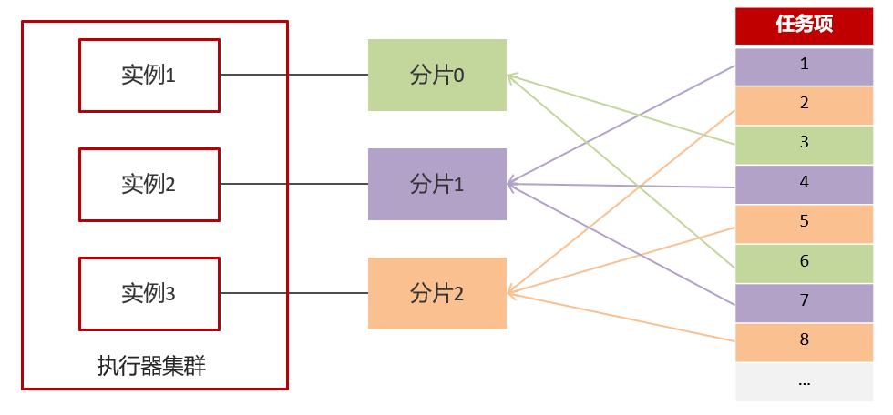
</div>

### 5. 热点文章-定时计算

#### 5.1 实现思路

<div align="center">
    
</div>

#### 5.2 实现步骤

分值计算不涉及到前端工程，也无需提供api接口，是一个纯后台的功能的开发。

#### 5.3 频道列表远程接口准备

计算完成新热数据后，需要给每个频道缓存一份数据，所以需要查询所有频道信息

① 在heima-leadnews-feign-api定义远程接口

```java
@FeignClient("leadnews-wemedia")
public interface IWemediaClient {
    @GetMapping("/api/v1/channel/list")
    public ResponseResult getChannels();
}
```

② heima-leadnews-wemedia端提供接口

```java
@RestController
public class WemediaClient implements IWemediaClient {
    @Autowired
    private WmChannelService wmChannelService;
    
    @GetMapping("/api/v1/channel/list")
    @Override
    public ResponseResult getChannels() {
        return wmChannelService.findAll();
    }
}
```

在ApArticleMapper.xml新增方法

```xml
<select id="findArticleListByLast5days" resultMap="resultMap">
    SELECT
    aa.*
    FROM
    `ap_article` aa
    LEFT JOIN ap_article_config aac ON aa.id = aac.article_id
    <where>
        and aac.is_delete != 1
        and aac.is_down != 1
        <if test="dayParam != null">
            and aa.publish_time <![CDATA[>=]]> #{dayParam}
        </if>
    </where>
</select>
```

修改ApArticleMapper类

```java
@Mapper
public interface ApArticleMapper extends BaseMapper<ApArticle> {

    /**
     * 加载文章列表
     * @param dto
     * @param type  1  加载更多   2记载最新
     * @return
     */
    public List<ApArticle> loadArticleList(ArticleHomeDto dto,Short type);
	//@Param: 这个注解是为SQL语句中参数赋值而服务的
    public List<ApArticle> findArticleListByLast5days(@Param("dayParam") Date dayParam);
}
```

#### 5.3.4 热文章业务层

修改ArticleConstans

```java
public class ArticleConstants {
    public static final Short LOADTYPE_LOAD_MORE = 1;
    public static final Short LOADTYPE_LOAD_NEW = 2;
    public static final String DEFAULT_TAG = "__all__";

    public static final String ARTICLE_ES_SYNC_TOPIC = "article.es.sync.topic";

    public static final Integer HOT_ARTICLE_LIKE_WEIGHT = 3;
    public static final Integer HOT_ARTICLE_COMMENT_WEIGHT = 5;
    public static final Integer HOT_ARTICLE_COLLECTION_WEIGHT = 8;

    public static final String HOT_ARTICLE_FIRST_PAGE = "hot_article_first_page_";
}
```

创建一个vo接收计算分值后的对象

```java
@Data
public class HotArticleVo extends ApArticle {
    /**
     * 文章分值
     */
    private Integer score;
}
```

业务层实现类

```java
@Service
@Slf4j
@Transactional
public class HotArticleServiceImpl implements HotArticleService {

    @Autowired
    private ApArticleMapper apArticleMapper;

    /**
     * 计算热点文章
     */
    @Override
    public void computeHotArticle() {
        //1.查询前5天的文章数据
        Date dateParam = DateTime.now().minusDays(5).toDate();
        List<ApArticle> apArticleList = apArticleMapper.findArticleListByLast5days(dateParam);

        //2.计算文章的分值
        List<HotArticleVo> hotArticleVoList = computeHotArticle(apArticleList);

        //3.为每个频道缓存30条分值较高的文章
        cacheTagToRedis(hotArticleVoList);

    }

    @Autowired
    private IWemediaClient wemediaClient;

    @Autowired
    private CacheService cacheService;

    /**
     * 为每个频道缓存30条分值较高的文章
     * @param hotArticleVoList
     */
    private void cacheTagToRedis(List<HotArticleVo> hotArticleVoList) {
        //每个频道缓存30条分值较高的文章
        ResponseResult responseResult = wemediaClient.getChannels();
        if(responseResult.getCode().equals(200)){
            String channelJson = JSON.toJSONString(responseResult.getData());
            List<WmChannel> wmChannels = JSON.parseArray(channelJson, WmChannel.class);
            //检索出每个频道的文章
            if(wmChannels != null && wmChannels.size() > 0){
                for (WmChannel wmChannel : wmChannels) {
                    List<HotArticleVo> hotArticleVos = hotArticleVoList.stream().filter(x -> x.getChannelId().equals(wmChannel.getId())).collect(Collectors.toList());
                    //给文章进行排序，取30条分值较高的文章存入redis  key：频道id   value：30条分值较高的文章
                    sortAndCache(hotArticleVos, ArticleConstants.HOT_ARTICLE_FIRST_PAGE + wmChannel.getId());
                }
            }
        }
        //设置推荐数据
        //给文章进行排序，取30条分值较高的文章存入redis  key：频道id   value：30条分值较高的文章
        sortAndCache(hotArticleVoList, ArticleConstants.HOT_ARTICLE_FIRST_PAGE+ArticleConstants.DEFAULT_TAG);
    }

    /**
     * 排序并且缓存数据
     * @param hotArticleVos
     * @param key
     */
    private void sortAndCache(List<HotArticleVo> hotArticleVos, String key) {
        hotArticleVos = hotArticleVos.stream().sorted(Comparator.comparing(HotArticleVo::getScore).reversed()).collect(Collectors.toList());
        if (hotArticleVos.size() > 30) {
            hotArticleVos = hotArticleVos.subList(0, 30);
        }
        cacheService.set(key, JSON.toJSONString(hotArticleVos));
    }

    /**
     * 计算文章分值
     * @param apArticleList
     * @return
     */
    private List<HotArticleVo> computeHotArticle(List<ApArticle> apArticleList) {

        List<HotArticleVo> hotArticleVoList = new ArrayList<>();

        if(apArticleList != null && apArticleList.size() > 0){
            for (ApArticle apArticle : apArticleList) {
                HotArticleVo hot = new HotArticleVo();
                BeanUtils.copyProperties(apArticle,hot);
                Integer score = computeScore(apArticle);
                hot.setScore(score);
                hotArticleVoList.add(hot);
            }
        }
        return hotArticleVoList;
    }

    /**
     * 计算文章的具体分值
     * @param apArticle
     * @return
     */
    private Integer computeScore(ApArticle apArticle) {
        Integer scere = 0;
        if(apArticle.getLikes() != null){
            scere += apArticle.getLikes() * ArticleConstants.HOT_ARTICLE_LIKE_WEIGHT;
        }
        if(apArticle.getViews() != null){
            scere += apArticle.getViews();
        }
        if(apArticle.getComment() != null){
            scere += apArticle.getComment() * ArticleConstants.HOT_ARTICLE_COMMENT_WEIGHT;
        }
        if(apArticle.getCollection() != null){
            scere += apArticle.getCollection() * ArticleConstants.HOT_ARTICLE_COLLECTION_WEIGHT;
        }

        return scere;
    }
}
```

在ArticleApplication的引导类中添加以下注解

```java
@EnableFeignClients(basePackages = "com.heima.apis")
```

#### 3.3.5 xxl-job定时计算-步骤

①：在heima-leadnews-article中的pom文件中新增依赖

```xml
<!--xxl-job-->
<dependency>
    <groupId>com.xuxueli</groupId>
    <artifactId>xxl-job-core</artifactId>
    <version>2.3.0</version>
</dependency>
```

② 在xxl-job-admin中新建执行器和任务

新建执行器：leadnews-hot-article-executor

<div align="center">
    
</div>

新建任务：路由策略为轮询，Cron表达式：0 0 2 * * ? 

<div align="center">
    
</div>

③ leadnews-article中集成xxl-job

XxlJobConfig

```java
/**
 * xxl-job config
 *
 * @author xuxueli 2017-04-28
 */
@Configuration
public class XxlJobConfig {
    private Logger logger = LoggerFactory.getLogger(XxlJobConfig.class);

    @Value("${xxl.job.admin.addresses}")
    private String adminAddresses;

    @Value("${xxl.job.executor.appname}")
    private String appname;

    @Value("${xxl.job.executor.port}")
    private int port;
    
    @Bean
    public XxlJobSpringExecutor xxlJobExecutor() {
        logger.info(">>>>>>>>>>> xxl-job config init.");
        XxlJobSpringExecutor xxlJobSpringExecutor = new XxlJobSpringExecutor();
        xxlJobSpringExecutor.setAdminAddresses(adminAddresses);
        xxlJobSpringExecutor.setAppname(appname);
        xxlJobSpringExecutor.setPort(port);
        return xxlJobSpringExecutor;
    }
}
```

在nacos配置新增配置

```yaml
xxl:
  job:
    admin:
      addresses: http://192.168.200.130:8888/xxl-job-admin
    executor:
      appname: leadnews-hot-article-executor
      port: 9999
```

④：在article微服务中新建任务类

```java
@Component
@Slf4j
public class ComputeHotArticleJob {

    @Autowired
    private HotArticleService hotArticleService;

    @XxlJob("computeHotArticleJob")
    public void handle(){
        log.info("热文章分值计算调度任务开始执行...");
        hotArticleService.computeHotArticle();
        log.info("热文章分值计算调度任务结束...");

    }
}
```

### 6. 查询文章接口改造

#### 6.1 思路分析

<div align="center">
    
</div>

#### 6.2 核心代码

```java
/**
     * 加载文章列表
     * @param dto
     * @param type      1 加载更多   2 加载最新
     * @param firstPage true  是首页  flase 非首页
     * @return
     */
@Override
public ResponseResult load2(ArticleHomeDto dto, Short type, boolean firstPage) {
        if(firstPage){
            String jsonStr = cacheService.get(ArticleConstants.HOT_ARTICLE_FIRST_PAGE + dto.getTag());
            if(StringUtils.isNotBlank(jsonStr)){
                List<HotArticleVo> hotArticleVoList = JSON.parseArray(jsonStr, HotArticleVo.class);
                //没数据的时候redis返回的是 “[]”，此时字符串NotBlank但是没数据
                if(hotArticleVoList != null && hotArticleVoList.size() > 0){
                    ResponseResult responseResult = ResponseResult.okResult(hotArticleVoList);
                    return responseResult;
                }
            }
        }
        return load(dto, type);
    }
```

## 十五、热点文章-实时计算

### 1. 定时计算与实时计算

<div align="center">
    
</div>

实时计算

- 用户行为发送消息

- kafkaStream聚合处理消息

- 更新文章行为数量

- 替换热点文章数据

### 2. 实时流式计算

#### 2.1 概念

一般流式计算会与批量计算相比较。在流式计算模型中，输入是持续的，可以认为在时间上是无界的，也就意味着，永远拿不到全量数据去做计算。同时，计算结果是持续输出的，也即计算结果在时间上也是无界的。

流式计算一般对实时性要求较高，同时一般是先定义目标计算，然后数据到来之后将计算逻辑应用于数据。同时为了提高计算效率，往往尽可能采用增量计算代替全量计算。

<div align="center">
    
</div>

流式计算就相当于上图的右侧扶梯，是可以源源不断的产生数据，源源不断的接收数据，没有边界。

#### 2.2 应用场景

- 日志分析

  网站的用户访问日志进行实时的分析，计算访问量，用户画像，留存率等等，实时的进行数据分析，帮助企业进行决策

- 大屏看板统计

  可以实时的查看网站注册数量，订单数量，购买数量，金额等。

- 公交实时数据

  可以随时更新公交车方位，计算多久到达站牌等

- 实时文章分值计算

- 头条类文章的分值计算，通过用户的行为实时文章的分值，分值越高就越被推荐。

#### 2.3 技术方案选型

- Hadoop

<div align="center">
    
</div>

- Apche Storm

  Storm 是一个分布式实时大数据处理系统，可以帮助我们方便地处理海量数据，具有高可靠、高容错、高扩展的特点。是流式框架，有很高的数据吞吐能力。

- Kafka Stream 

  可以轻松地将其嵌入任何Java应用程序中，并与用户为其流应用程序所拥有的任何现有打包，部署和操作工具集成。

### 3. Kafka Stream 

#### 3.1 概述

Kafka Stream是Apache Kafka从0.10版本引入的一个新Feature。它是提供了对存储于Kafka内的数据进行流式处理和分析的功能。

Kafka Stream的特点如下：

- Kafka Stream提供了一个非常简单而轻量的Library，它可以非常方便地嵌入任意Java应用中，也可以任意方式打包和部署
- 除了Kafka外，无任何外部依赖
- 充分利用Kafka分区机制实现水平扩展和顺序性保证
- 通过可容错的state store实现高效的状态操作（如windowed join和aggregation）
- 支持正好一次处理语义
- 提供记录级的处理能力，从而实现毫秒级的低延迟
- 支持基于事件时间的窗口操作，并且可处理晚到的数据（late arrival of records）
- 同时提供底层的处理原语Processor（类似于Storm的spout和bolt），以及高层抽象的DSL（类似于Spark的map/group/reduce）

<div align="center">
    
</div>

#### 3.2 Kafka Streams的关键概念

- **源处理器（Source Processor）**：源处理器是一个没有任何上游处理器的特殊类型的流处理器。它从一个或多个kafka主题生成输入流。通过消费这些主题的消息并将它们转发到下游处理器。
- **Sink处理器**：sink处理器是一个没有下游流处理器的特殊类型的流处理器。它接收上游流处理器的消息发送到一个指定的**Kafka主题**。

<div align="center">
    
</div>

#### 3.3 KStream

（1）数据结构类似于map,如下图，key-value键值对

<div align="center">
    
</div>

（2）KStream

<div align="center">
    
</div>

**KStream**数据流（data stream），即是一段顺序的，**可以无限长**，**不断更新的数据集**。
数据流中比较常记录的是事件，这些事件可以是**一次鼠标点击**（click），**一次交易**，或是**传感器记录的位置**数据。

KStream负责抽象的，就是数据流。与Kafka自身topic中的数据一样，**类似日志**，每一次操作都是**向其中插入（insert）新数据。**

为了说明这一点，让我们想象一下以下两个数据记录正在发送到流中：

（“ alice”，1）->（“” alice“，3）

如果您的流处理应用是要总结每个用户的价值，它将返回`4`了`alice`。为什么？因为第二条数据记录将不被视为先前记录的更新。而是（insert）新数据

#### 3.4 Kafka Stream入门案例编写

##### 3.4.1 需求分析，求单词个数（word count）

<div align="center">
    
</div>

##### 3.4.2 引入依赖

在之前的kafka-demo工程的pom文件中引入

```xml
<dependency>
    <groupId>org.apache.kafka</groupId>
    <artifactId>kafka-streams</artifactId>
    <exclusions>
        <exclusion>
            <artifactId>connect-json</artifactId>
            <groupId>org.apache.kafka</groupId>
        </exclusion>
        <exclusion>
            <groupId>org.apache.kafka</groupId>
            <artifactId>kafka-clients</artifactId>
        </exclusion>
    </exclusions>
</dependency>
```

##### 3.4.3 创建原生的kafka staream入门案例

```java
/**
 * 流式处理
 */
public class KafkaStreamQuickStart {

    public static void main(String[] args) {

        //kafka的配置信心
        Properties prop = new Properties();
        prop.put(StreamsConfig.BOOTSTRAP_SERVERS_CONFIG,"192.168.200.130:9092");
        prop.put(StreamsConfig.DEFAULT_KEY_SERDE_CLASS_CONFIG, Serdes.String().getClass());
        prop.put(StreamsConfig.DEFAULT_VALUE_SERDE_CLASS_CONFIG, Serdes.String().getClass());
        prop.put(StreamsConfig.APPLICATION_ID_CONFIG,"streams-quickstart");

        //stream 构建器
        StreamsBuilder streamsBuilder = new StreamsBuilder();

        //流式计算
        streamProcessor(streamsBuilder);


        //创建kafkaStream对象
        KafkaStreams kafkaStreams = new KafkaStreams(streamsBuilder.build(),prop);
        //开启流式计算
        kafkaStreams.start();
    }

    /**
     * 流式计算
     * 消息的内容：hello kafka  hello itcast
     * @param streamsBuilder
     */
    private static void streamProcessor(StreamsBuilder streamsBuilder) {
        //创建kstream对象，同时指定从那个topic中接收消息
        KStream<String, String> stream = streamsBuilder.stream("itcast-topic-input");
        /**
         * 处理消息的value
         */
        //flatMapValues: ("a", ["x", "y", "z"])->[('a', 'x'), ('a', 'y'), ('a', 'z')]
        stream.flatMapValues(new ValueMapper<String, Iterable<String>>() {
            @Override
            public Iterable<String> apply(String value) {
                return Arrays.asList(value.split(" "));
            }
        })
                //按照value进行分组
                .groupBy((key,value)->value)
                //时间窗口
                .windowedBy(TimeWindows.of(Duration.ofSeconds(10)))
                //统计单词的个数，(key,value)->(value,count(value))
                .count()
                //转换为kStream
                .toStream()
                .map((key,value)->{
                    System.out.println("key:"+key+",vlaue:"+value);
                    return new KeyValue<>(key.key().toString(),value.toString());
                })
                //发送消息
                .to("itcast-topic-out");
    }
}
```

(4)测试准备

- 使用生产者在topic为：itcast_topic_input中发送多条消息

- 使用消费者接收topic为：itcast_topic_out

结果：

- 通过流式计算，会把生产者的多条消息汇总成一条发送到消费者中输出

#### 3.5 SpringBoot集成Kafka Stream

##### 3.5.1 自定配置参数

```java
/**
 * 通过重新注册KafkaStreamsConfiguration对象，设置自定配置参数
 */
@Setter
@Getter
@Configuration
@EnableKafkaStreams  
@ConfigurationProperties(prefix="kafka")
public class KafkaStreamConfig {
    private static final int MAX_MESSAGE_SIZE = 16* 1024 * 1024;
    private String hosts;
    private String group;
    @Bean(name = KafkaStreamsDefaultConfiguration.DEFAULT_STREAMS_CONFIG_BEAN_NAME)
    public KafkaStreamsConfiguration defaultKafkaStreamsConfig() {
        Map<String, Object> props = new HashMap<>();
        props.put(StreamsConfig.BOOTSTRAP_SERVERS_CONFIG, hosts);
        props.put(StreamsConfig.APPLICATION_ID_CONFIG, this.getGroup()+"_stream_aid");
        props.put(StreamsConfig.CLIENT_ID_CONFIG, this.getGroup()+"_stream_cid");
        props.put(StreamsConfig.RETRIES_CONFIG, 10);
        props.put(StreamsConfig.DEFAULT_KEY_SERDE_CLASS_CONFIG, Serdes.String().getClass());
        props.put(StreamsConfig.DEFAULT_VALUE_SERDE_CLASS_CONFIG, Serdes.String().getClass());
        return new KafkaStreamsConfiguration(props);
    }
}
```

修改application.yml文件，在最下方添加自定义配置

```yaml
kafka:
  hosts: 192.168.200.130:9092
  group: ${spring.application.name}
```

(2)新增配置类，创建KStream对象，进行聚合

```java
//标记这个类是一个Spring配置类，Spring容器会在这个类中查找带有@Bean注解的方法，并将它们注册为Spring应用上下文中的bean
@Configuration
@Slf4j
public class KafkaStreamHelloListener {

    @Bean
    public KStream<String,String> kStream(StreamsBuilder streamsBuilder){
        //创建kstream对象，同时指定从那个topic中接收消息
        KStream<String, String> stream = streamsBuilder.stream("itcast-topic-input");
        stream.flatMapValues(new ValueMapper<String, Iterable<String>>() {
            @Override
            public Iterable<String> apply(String value) {
                return Arrays.asList(value.split(" "));
            }
        })
                //根据value进行聚合分组
                .groupBy((key,value)->value)
                //聚合计算时间间隔
                .windowedBy(TimeWindows.of(Duration.ofSeconds(10)))
                //求单词的个数
                .count()
                .toStream()
                //处理后的结果转换为string字符串
                .map((key,value)->{
                    System.out.println("key:"+key+",value:"+value);
                    return new KeyValue<>(key.key().toString(),value.toString());
                })
                //发送消息
                .to("itcast-topic-out");
        return stream;
    }
}
```

测试：

​	启动微服务，正常发送消息，可以正常接收到消息

### 4. app端热点文章计算

#### 4.1 思路说明

<div align="center">
    
</div>

#### 4.2 功能实现

##### 4.2.1 用户行为（阅读量，评论，点赞，收藏）发送消息，以阅读和点赞为例

①在heima-leadnews-behavior微服务中集成kafka生产者配置

修改nacos，新增内容

```yaml
spring:
  application:
    name: leadnews-behavior
  kafka:
    bootstrap-servers: 192.168.200.130:9092
    producer:
      retries: 10
      key-serializer: org.apache.kafka.common.serialization.StringSerializer
      value-serializer: org.apache.kafka.common.serialization.StringSerializer
```

②修改ApLikesBehaviorServiceImpl新增发送消息

定义消息发送封装类：UpdateArticleMess

```java
@Data
public class UpdateArticleMess {

    /**
     * 修改文章的字段类型
      */
    private UpdateArticleType type;
    /**
     * 文章ID
     */
    private Long articleId;
    /**
     * 修改数据的增量，可为正负
     */
    private Integer add;

    public enum UpdateArticleType{
        COLLECTION,COMMENT,LIKES,VIEWS;
    }
}
```

topic常量类：

```java
public class HotArticleConstants {

    public static final String HOT_ARTICLE_SCORE_TOPIC="hot.article.score.topic";
   
}
```

完整代码如下：

```java
@Service
@Transactional
@Slf4j
public class ApLikesBehaviorServiceImpl implements ApLikesBehaviorService {

    @Autowired
    private CacheService cacheService;

    @Autowired
    private KafkaTemplate<String,String> kafkaTemplate;

    @Override
    public ResponseResult like(LikesBehaviorDto dto) {

        //1.检查参数
        if (dto == null || dto.getArticleId() == null || checkParam(dto)) {
            return ResponseResult.errorResult(AppHttpCodeEnum.PARAM_INVALID);
        }

        //2.是否登录
        ApUser user = AppThreadLocalUtil.getUser();
        if (user == null) {
            return ResponseResult.errorResult(AppHttpCodeEnum.NEED_LOGIN);
        }

        UpdateArticleMess mess = new UpdateArticleMess();
        mess.setArticleId(dto.getArticleId());
        mess.setType(UpdateArticleMess.UpdateArticleType.LIKES);

        //3.点赞  保存数据
        if (dto.getOperation() == 0) {
            Object obj = cacheService.hGet(BehaviorConstants.LIKE_BEHAVIOR + dto.getArticleId().toString(), user.getId().toString());
            if (obj != null) {
                return ResponseResult.errorResult(AppHttpCodeEnum.PARAM_INVALID, "已点赞");
            }
            // 保存当前key
            log.info("保存当前key:{} ,{}, {}", dto.getArticleId(), user.getId(), dto);
            cacheService.hPut(BehaviorConstants.LIKE_BEHAVIOR + dto.getArticleId().toString(), user.getId().toString(), JSON.toJSONString(dto));
            mess.setAdd(1);
        } else {
            // 删除当前key
            log.info("删除当前key:{}, {}", dto.getArticleId(), user.getId());
            cacheService.hDelete(BehaviorConstants.LIKE_BEHAVIOR + dto.getArticleId().toString(), user.getId().toString());
            mess.setAdd(-1);
        }

        //发送消息，数据聚合
        kafkaTemplate.send(HotArticleConstants.HOT_ARTICLE_SCORE_TOPIC,JSON.toJSONString(mess));

        return ResponseResult.okResult(AppHttpCodeEnum.SUCCESS);
    }

    /**
     * 检查参数
     * @return
     */
    private boolean checkParam(LikesBehaviorDto dto) {
        if (dto.getType() > 2 || dto.getType() < 0 || dto.getOperation() > 1 || dto.getOperation() < 0) {
            return true;
        }
        return false;
    }
}
```

③修改阅读行为的类ApReadBehaviorServiceImpl发送消息

完整代码：

```java
@Service
@Transactional
@Slf4j
public class ApReadBehaviorServiceImpl implements ApReadBehaviorService {

    @Autowired
    private CacheService cacheService;

    @Autowired
    private KafkaTemplate<String,String> kafkaTemplate;

    @Override
    public ResponseResult readBehavior(ReadBehaviorDto dto) {
        //1.检查参数
        if (dto == null || dto.getArticleId() == null) {
            return ResponseResult.errorResult(AppHttpCodeEnum.PARAM_INVALID);
        }

        //2.是否登录
        ApUser user = AppThreadLocalUtil.getUser();
        if (user == null) {
            return ResponseResult.errorResult(AppHttpCodeEnum.NEED_LOGIN);
        }
        //更新阅读次数
        String readBehaviorJson = (String) cacheService.hGet(BehaviorConstants.READ_BEHAVIOR + dto.getArticleId().toString(), user.getId().toString());
        if (StringUtils.isNotBlank(readBehaviorJson)) {
            ReadBehaviorDto readBehaviorDto = JSON.parseObject(readBehaviorJson, ReadBehaviorDto.class);
            dto.setCount((short) (readBehaviorDto.getCount() + dto.getCount()));
        }
        // 保存当前key
        log.info("保存当前key:{} {} {}", dto.getArticleId(), user.getId(), dto);
        cacheService.hPut(BehaviorConstants.READ_BEHAVIOR + dto.getArticleId().toString(), user.getId().toString(), JSON.toJSONString(dto));

        //发送消息，数据聚合
        UpdateArticleMess mess = new UpdateArticleMess();
        mess.setArticleId(dto.getArticleId());
        mess.setType(UpdateArticleMess.UpdateArticleType.VIEWS);
        mess.setAdd(1);
        kafkaTemplate.send(HotArticleConstants.HOT_ARTICLE_SCORE_TOPIC,JSON.toJSONString(mess));
        
        return ResponseResult.okResult(AppHttpCodeEnum.SUCCESS);
    }
}
```

##### 4.2.2 使用kafkaStream实时接收消息，聚合内容

①在leadnews-article微服务中集成kafkaStream (参考kafka-demo)

②定义实体类，用于聚合之后的分值封装

```java
@Data
public class ArticleVisitStreamMess {
    /**
     * 文章id
     */
    private Long articleId;
    /**
     * 阅读
     */
    private int view;
    /**
     * 收藏
     */
    private int collect;
    /**
     * 评论
     */
    private int comment;
    /**
     * 点赞
     */
    private int like;
}
```

修改常量类：增加常量

```java
public class HotArticleConstants {

    public static final String HOT_ARTICLE_SCORE_TOPIC="hot.article.score.topic";
    public static final String HOT_ARTICLE_INCR_HANDLE_TOPIC="hot.article.incr.handle.topic";
}
```

③ 定义stream,接收消息并聚合

```java
@Configuration
@Slf4j
public class HotArticleStreamHandler {

    @Bean
    public KStream<String,String> kStream(StreamsBuilder streamsBuilder){
        //接收消息
        KStream<String,String> stream = streamsBuilder.stream(HotArticleConstants.HOT_ARTICLE_SCORE_TOPIC);
        //聚合流式处理
        stream.map((key,value)->{
            UpdateArticleMess mess = JSON.parseObject(value, UpdateArticleMess.class);
            //重置消息的key:1234343434   和  value: likes:1
            return new KeyValue<>(mess.getArticleId().toString(),mess.getType().name()+":"+mess.getAdd());
        })
                //按照文章id进行分组
                .groupBy((key,value)->key)
                //时间窗口
                .windowedBy(TimeWindows.of(Duration.ofSeconds(10)))
                /**
                 * 自行的完成聚合的计算
                 */
                .aggregate(new Initializer<String>() {
                    /**
                     * 初始方法，返回值是消息的value
                     * 这个初始值表示了聚合操作的起点，即在没有任何数据流入时，聚合结果应该是什么样子的
                     * 该方法只会在一开始调用一次
                     * @return
                     */
                    @Override
                    public String apply() {
                        return "COLLECTION:0,COMMENT:0,LIKES:0,VIEWS:0";
                    }
                    /**
                     * 真正的聚合操作，返回值是消息的value
                     * <String,String,String>分别表示键（Key）、值（Value）和聚合结果（Aggregated Value）
                     * 聚合器会根据输入的数据值和当前的聚合结果来计算出一个新的聚合结果。
                     * 也就是聚合结果又作为下一轮的第三个String参数
                     */
                }, new Aggregator<String, String, String>() {
                    @Override
                    public String apply(String key, String value, String aggValue) {
                        if(StringUtils.isBlank(value)){
                            return aggValue;
                        }
                        String[] aggAry = aggValue.split(",");
                        int col = 0,com=0,lik=0,vie=0;
                        for (String agg : aggAry) {
                            String[] split = agg.split(":");
                            /**
                             * 获得上一轮聚合的结果，也是时间窗口内计算之后的值
                             */
                            switch (UpdateArticleMess.UpdateArticleType.valueOf(split[0])){
                                case COLLECTION:
                                    col = Integer.parseInt(split[1]);
                                    break;
                                case COMMENT:
                                    com = Integer.parseInt(split[1]);
                                    break;
                                case LIKES:
                                    lik = Integer.parseInt(split[1]);
                                    break;
                                case VIEWS:
                                    vie = Integer.parseInt(split[1]);
                                    break;
                            }
                        }
                        /**
                         * 累加操作
                         */
                        String[] valAry = value.split(":");
                        switch (UpdateArticleMess.UpdateArticleType.valueOf(valAry[0])){
                            case COLLECTION:
                                col += Integer.parseInt(valAry[1]);
                                break;
                            case COMMENT:
                                com += Integer.parseInt(valAry[1]);
                                break;
                            case LIKES:
                                lik += Integer.parseInt(valAry[1]);
                                break;
                            case VIEWS:
                                vie += Integer.parseInt(valAry[1]);
                                break;
                        }

                        String formatStr = String.format("COLLECTION:%d,COMMENT:%d,LIKES:%d,VIEWS:%d", col, com, lik, vie);
                        System.out.println("文章的id:"+key);
                        System.out.println("当前时间窗口内的消息处理结果："+formatStr);
                        return formatStr;
                    }
                }, Materialized.as("hot-atricle-stream-count-001"))//将流处理的结果物化（即保存为状态，可以持久化也可以仅在内存中）
                .toStream()
                .map((key,value)->{
                    return new KeyValue<>(key.key().toString(),formatObj(key.key().toString(),value));
                })
                //发送消息
                .to(HotArticleConstants.HOT_ARTICLE_INCR_HANDLE_TOPIC);

        return stream;
    }

    /**
     * 格式化消息的value数据
     * @param articleId
     * @param value
     * @return
     */
    public String formatObj(String articleId,String value){
        ArticleVisitStreamMess mess = new ArticleVisitStreamMess();
        mess.setArticleId(Long.valueOf(articleId));
        //COLLECTION:0,COMMENT:0,LIKES:0,VIEWS:0
        String[] valAry = value.split(",");
        for (String val : valAry) {
            String[] split = val.split(":");
            switch (UpdateArticleMess.UpdateArticleType.valueOf(split[0])){
                case COLLECTION:
                    mess.setCollect(Integer.parseInt(split[1]));
                    break;
                case COMMENT:
                    mess.setComment(Integer.parseInt(split[1]));
                    break;
                case LIKES:
                    mess.setLike(Integer.parseInt(split[1]));
                    break;
                case VIEWS:
                    mess.setView(Integer.parseInt(split[1]));
                    break;
            }
        }
        log.info("聚合消息处理之后的结果为:{}",JSON.toJSONString(mess));
        return JSON.toJSONString(mess);
    }
}
```

##### 4.2.3 重新计算文章的分值，更新到数据库和缓存中

①在ApArticleService添加方法，用于更新数据库中的文章分值

```java
/**
     * 更新文章的分值  同时更新缓存中的热点文章数据
     * @param mess
     */
public void updateScore(ArticleVisitStreamMess mess);
```

实现类方法

```java
/**
     * 更新文章的分值  同时更新缓存中的热点文章数据
     * @param mess
     */
@Override
public void updateScore(ArticleVisitStreamMess mess) {
    //1.更新文章的阅读、点赞、收藏、评论的数量
    ApArticle apArticle = updateArticle(mess);
    //2.计算文章的分值
    Integer score = computeScore(apArticle);
    score = score * 3;

    //3.替换当前文章对应频道的热点数据
    replaceDataToRedis(apArticle, score, ArticleConstants.HOT_ARTICLE_FIRST_PAGE + apArticle.getChannelId());

    //4.替换推荐对应的热点数据
    replaceDataToRedis(apArticle, score, ArticleConstants.HOT_ARTICLE_FIRST_PAGE + ArticleConstants.DEFAULT_TAG);

}

/**
     * 替换数据并且存入到redis
     * @param apArticle
     * @param score
     * @param s
     */
private void replaceDataToRedis(ApArticle apArticle, Integer score, String s) {
    String articleListStr = cacheService.get(s);
    if (StringUtils.isNotBlank(articleListStr)) {
        List<HotArticleVo> hotArticleVoList = JSON.parseArray(articleListStr, HotArticleVo.class);

        boolean flag = true;

        //如果缓存中存在该文章，只更新分值
        for (HotArticleVo hotArticleVo : hotArticleVoList) {
            if (hotArticleVo.getId().equals(apArticle.getId())) {
                hotArticleVo.setScore(score);
                flag = false;
                break;
            }
        }

        //如果缓存中不存在，查询缓存中分值最小的一条数据，进行分值的比较，如果当前文章的分值大于缓存中的数据，就替换
        if (flag) {
            if (hotArticleVoList.size() >= 30) {
                hotArticleVoList = hotArticleVoList.stream().sorted(Comparator.comparing(HotArticleVo::getScore).reversed()).collect(Collectors.toList());
                HotArticleVo lastHot = hotArticleVoList.get(hotArticleVoList.size() - 1);
                if (lastHot.getScore() < score) {
                    hotArticleVoList.remove(lastHot);
                    HotArticleVo hot = new HotArticleVo();
                    BeanUtils.copyProperties(apArticle, hot);
                    hot.setScore(score);
                    hotArticleVoList.add(hot);
                }


            } else {
                HotArticleVo hot = new HotArticleVo();
                BeanUtils.copyProperties(apArticle, hot);
                hot.setScore(score);
                hotArticleVoList.add(hot);
            }
        }
        //缓存到redis
        hotArticleVoList = hotArticleVoList.stream().sorted(Comparator.comparing(HotArticleVo::getScore).reversed()).collect(Collectors.toList());
        cacheService.set(s, JSON.toJSONString(hotArticleVoList));
    }
}

/**
     * 更新文章行为数量
     * @param mess
     */
private ApArticle updateArticle(ArticleVisitStreamMess mess) {
    ApArticle apArticle = getById(mess.getArticleId());
    //这里是get apArticle的，也就是get数据库的，如果数据库为null，当然要设置为0
    apArticle.setCollection(apArticle.getCollection()==null?0:apArticle.getCollection()+mess.getCollect());
    apArticle.setComment(apArticle.getComment()==null?0:apArticle.getComment()+mess.getComment());
    apArticle.setLikes(apArticle.getLikes()==null?0:apArticle.getLikes()+mess.getLike());
    apArticle.setViews(apArticle.getViews()==null?0:apArticle.getViews()+mess.getView());
    updateById(apArticle);
    return apArticle;
}

/**
     * 计算文章的具体分值
     * @param apArticle
     * @return
     */
private Integer computeScore(ApArticle apArticle) {
    Integer score = 0;
    if(apArticle.getLikes() != null){
        score += apArticle.getLikes() * ArticleConstants.HOT_ARTICLE_LIKE_WEIGHT;
    }
    if(apArticle.getViews() != null){
        score += apArticle.getViews();
    }
    if(apArticle.getComment() != null){
        score += apArticle.getComment() * ArticleConstants.HOT_ARTICLE_COMMENT_WEIGHT;
    }
    if(apArticle.getCollection() != null){
        score += apArticle.getCollection() * ArticleConstants.HOT_ARTICLE_COLLECTION_WEIGHT;
    }

    return score;
}
```

②定义监听，接收聚合之后的数据，文章的分值重新进行计算

```java
@Component
@Slf4j
public class ArticleIncrHandleListener {

    @Autowired
    private ApArticleService apArticleService;

    @KafkaListener(topics = HotArticleConstants.HOT_ARTICLE_INCR_HANDLE_TOPIC)
    public void onMessage(String mess){
        if(StringUtils.isNotBlank(mess)){
            ArticleVisitStreamMess articleVisitStreamMess = JSON.parseObject(mess, ArticleVisitStreamMess.class);
            apArticleService.updateScore(articleVisitStreamMess);
        }
    }
}
```

## 十六、项目部署_持续集成

### 1.概念

#### 1.1 什么是持续集成

持续集成（ Continuous integration ， 简称 CI ）指的是，频繁地（一天多次）将代码集成到主干

<div align="center">
    
</div>

**持续集成的组成要素**

一个自动构建过程， 从检出代码、 编译构建、 运行测试、 结果记录、 测试统计等都是自动完成的， 无需人工干预。

一个代码存储库，即需要版本控制软件来保障代码的可维护性，同时作为构建过程的素材库，一般使用SVN或Git。

一个持续集成服务器， Jenkins 就是一个配置简单和使用方便的持续集成服务器。

#### 1.2 持续集成的好处

1、降低风险，由于持续集成不断去构建，编译和测试，可以很早期发现问题，所以修复的代价就少；
2、对系统健康持续检查，减少发布风险带来的问题；
3、减少重复性工作；
4、持续部署，提供可部署单元包；
5、持续交付可供使用的版本；
6、增强团队信心；

### 2. 软件开发模式

<div align="center">
    
</div>

#### 2.1 软件开发生命周期

软件开发生命周期又叫做SDLC（Software Development Life Cycle），它是集合了计划、开发、测试和部署过程的集合。如下图所示 ：

<div align="center">
    
</div>

- 需求分析

  这是生命周期的第一阶段，根据项目需求，团队执行一个可行性计划的分析。项目需求可能是公司内部或者客户提出的。这阶段主要是对信息的收集，也有可能是对现有项目的改善和重新做一个新的项目。还要分析项目的预算多长，可以从哪方面受益及布局，这也是项目创建的目标。

- 设计

  第二阶段就是设计阶段，系统架构和满意状态（就是要做成什么样子，有什么功能），和创建一个项目计划。计划可以使用图表，布局设计或者文字的方式呈现。

- 实现

  第三阶段就是实现阶段，项目经理创建和分配工作给开者，开发者根据任务和在设计阶段定义的目标进行开发代码。依据项目的大小和复杂程度，可以需要数月或更长时间才能完成。

- 测试

  测试人员进行代码测试 ，包括功能测试、代码测试、压力测试等。

- 进化

  最后阶段就是对产品不断的进化改进和维护阶段，根据用户的使用情况，可能需要对某功能进行修改，bug修复，功能增加等。

#### 2.2 软件开发瀑布模型

瀑布模型是最著名和最常使用的软件开发模型。瀑布模型就是一系列的软件开发过程。它是由制造业繁衍出来的。一个高度化的结构流程在一个方向上流动，有点像生产线一样。在瀑布模型创建之初，没有其它开发的模型，有很多东西全靠开发人员去猜测，去开发。这样的模型仅适用于那些简单的软件开发， 但是已经不适合现在的开发了。

下图对软件开发模型的一个阐述。

<div align="center">
    
</div>


| 优势                                       | 劣势                                                         |
| ------------------------------------------ | ------------------------------------------------------------ |
| 简单易用和理解                             | 各个阶段的划分完全固定，阶段之间产生大量的文档，极大地增加了工作量。 |
| 当前一阶段完成后，您只需要去关注后续阶段。 | 由于开发模型是线性的，用户只有等到整个过程的末期才能见到开发成果，从而增加了开发风险。 |
| 为项目提供了按阶段划分的检查节点           | 瀑布模型的突出缺点是不适应用户需求的变化。                   |

#### 2.3 软件的敏捷开发

- 什么是敏捷开发？

  敏捷开发（Agile Development） 的核心是迭代开发（Iterative Development） 与 增量开发（Incremental Development）。

- 何为迭代开发？

  对于大型软件项目，传统的开发方式是采用一个大周期（比如一年）进行开发，整个过程就是一次"大开发"；迭代开发的方式则不一样，它将开发过程拆分成多个小周期，即一次"大开发"变成多次"小开发"，每次小开发都是同样的流程，所以看上去就好像重复在做同样的步骤。

  举例来说，SpaceX 公司想造一个大推力火箭，将人类送到火星。但是，它不是一开始就造大火箭，而是先造一个最简陋的小火箭 Falcon 1。结果，第一次发射就爆炸了，直到第四次发射，才成功进入轨道。然后，开发了中型火箭 Falcon 9，九年中发射了70次。最后，才开发 Falcon 重型火箭。如果SpaceX 不采用迭代开发，它可能直到现在还无法上天。

- 何为增量开发？

  软件的每个版本，都会新增一个用户可以感知的完整功能。也就是说，按照新增功能来划分迭代。

  举例来说，房产公司开发一个10栋楼的小区。如果采用增量开发的模式，该公司第一个迭代就是交付一号楼，第二个迭代交付二号楼......每个迭代都是完成一栋完整的楼。而不是第一个迭代挖好10栋楼的地基，第二个迭代建好每栋楼的骨架，第三个迭代架设屋顶......

- 敏捷开发如何迭代？

  虽然敏捷开发将软件开发分成多个迭代，但是也要求，每次迭代都是一个完整的软件开发周期，必须按照软件工程的方法论，进行正规的流程管理。

<div align="center">
    
</div>

敏捷开发有什么好处？

- 早期交付

  敏捷开发的第一个好处，就是早期交付，从而大大降低成本。 还是以房产公司为例，如果按照传统的"瀑布开发模式"，先挖10栋楼的地基、再盖骨架、然后架设屋顶，每个阶段都等到前一个阶段完成后开始，可能需要两年才能一次性交付10栋楼。也就是说，如果不考虑预售，该项目必须等到两年后才能回款。 敏捷开发是六个月后交付一号楼，后面每两个月交付一栋楼。因此，半年就能回款10%，后面每个月都会有现金流，资金压力就大大减轻了。

- 降低风险

  敏捷开发的第二个好处是，及时了解市场需求，降低产品不适用的风险。 请想一想，哪一种情况损失比较小：10栋楼都造好以后，才发现卖不出去，还是造好第一栋楼，就发现卖不出去，从而改进或停建后面9栋楼？

### 3. Jenkins安装配置

#### 3.1 Jenkins介绍

<div align="center">
    
</div>

Jenkins  是一款流行的开源持续集成（Continuous Integration）工具，广泛用于项目开发，具有自动化构建、测试和部署等功能。官网：  http://jenkins-ci.org/。

Jenkins的特征：

- 开源的 Java语言开发持续集成工具，支持持续集成，持续部署。
- 易于安装部署配置：可通过 yum安装,或下载war包以及通过docker容器等快速实现安装部署，可方便web界面配置管理。
- 消息通知及测试报告：集成 RSS/E-mail通过RSS发布构建结果或当构建完成时通过e-mail通知，生成JUnit/TestNG测试报告。
- 分布式构建：支持 Jenkins能够让多台计算机一起构建/测试。
- 文件识别： Jenkins能够跟踪哪次构建生成哪些jar，哪次构建使用哪个版本的jar等。
- 丰富的插件支持：支持扩展插件，你可以开发适合自己团队使用的工具，如 git，svn，maven，docker等。


Jenkins安装和持续集成环境配置

<div align="center">
    
</div>

1 ）首先，开发人员每天进行代码提交，提交到Git仓库

2）然后，Jenkins作为持续集成工具，使用Git工具到Git仓库拉取代码到集成服务器，再配合JDK，Maven等软件完成代码编译，代码测试与审查，测试，打包等工作，在这个过程中每一步出错，都重新再执行一次整个流程。

3）最后，Jenkins把生成的jar或war包分发到测试服务器或者生产服务器，测试人员或用户就可以访问应用。

#### 3.2 Jenkins环境搭建

##### 3.2.1  Jenkins安装配置

如果启动失败， 出现错误信息：

```
Starting Jenkins bash: /usr/bin/java: No such file or directory
```

创建JAVA环境的软链接：

```
ln -s /usr/local/jdk/bin/java /usr/bin/java
```

软连接的应用场景：下载的东西（Java）在一个文件中，而某个（Jenkins）要的这个东西（Java）必须在指定的另一个文件，此时就可以通过软连接的方式。

##### 3.2.2  Jenkins插件安装

在实现持续集成之前， 需要确保以下插件安装成功。

- Maven Integration plugin： Maven 集成管理插件。
- Docker plugin： Docker集成插件。
- GitLab Plugin： GitLab集成插件。
- Publish Over SSH：远程文件发布插件。
- SSH: 远程脚本执行插件。

勾选插件， 点击直接安装即可。

>注意，如果没有安装按钮，需要更改配置
>
>在安装插件的高级配置中，修改升级站点的连接为：http://updates.jenkins.io/update-center.json   保存

Docker

设置开机启动：

```sh
systemctl enable docker
```

启动docker

```sh
systemctl start docker
```

### 4. 后端项目部署

#### 4.1 多环境切换-微服务中多环境配置

在项目开发部署的过程中，一般都会有三套项目环境

- Development ：开发环境

- Production ：生产环境

- Test ：测试环境

例如：开发环境的mysql连接的是本地，生产环境需要连接线上的mysql环境

在nacos的配置中心中新增各个环境的配置文件，例如user微服务中新增

修改bootstrap.yml 添加内容

```properties
spring:
  profiles:
    active: dev
```

创建对应的nacos的多环境配置：

注意事项：

<div align="center">
    
</div>

其中DataID属性命名有规范：

- prefix，默认使用${spring.application.name}，也可以通过spring.cloud.nacos.config.prefix来配置。
- spring.profile.active，即为当前环境对应的 profile，详情可以参考 Spring Boot文档。 注意：当 spring.profile.active 为空时，对应的连接符 - 也将不存在，dataId 的拼接格式变成 ${prefix}.${file-extension}
- file-exetension，为配置内容的数据格式，可以通过配置项 spring.cloud.nacos.config.file-extension 来配置。目前只支持 properties 和 yaml 类型。

#### 4.2 整体思路

目标：把黑马头条的app端相关的微服务部署到192.168.200.100这台服务器上

<div align="center">
    
</div>

<div align="center">
    
</div>

#### 4.3 服务集成Docker配置

目标：部署的每一个微服务都是先创建docker镜像后创建对应容器启动

方式一：本地微服务打包以后上传到服务器，编写Dockerfile文件完成。

方式二：使用dockerfile-maven-plugin插件，可以直接把微服务创建为镜像使用（更省事）

**服务集成Docker配置**

<div align="center">
    
</div>

每个微服务都引入该依赖,以heima-leadnews-user微服务为例

```xml
<?xml version="1.0" encoding="UTF-8"?>
<project xmlns="http://maven.apache.org/POM/4.0.0"
         xmlns:xsi="http://www.w3.org/2001/XMLSchema-instance"
         xsi:schemaLocation="http://maven.apache.org/POM/4.0.0 http://maven.apache.org/xsd/maven-4.0.0.xsd">
    <parent>
        <artifactId>heima-leadnews-service</artifactId>
        <groupId>com.heima</groupId>
        <version>1.0-SNAPSHOT</version>
    </parent>
    <modelVersion>4.0.0</modelVersion>

    <artifactId>heima-leadnews-user</artifactId>

    <properties>
        <maven.compiler.source>8</maven.compiler.source>
        <maven.compiler.target>8</maven.compiler.target>
        <docker.image>docker_storage</docker.image>
    </properties>

    <build>
        <finalName>heima-leadnews-user</finalName>
        <plugins>
            <plugin>
                <groupId>org.springframework.boot</groupId>
                <artifactId>spring-boot-maven-plugin</artifactId>
                <executions>
                    <execution>
                        <goals>
                            <goal>repackage</goal>
                        </goals>
                    </execution>
                </executions>
            </plugin>
            <plugin>
                <groupId>org.apache.maven.plugins</groupId>
                <artifactId>maven-compiler-plugin</artifactId>
                <version>3.7.0</version>
                <configuration>
                    <source>${java.version}</source>
                    <target>${java.version}</target>
                </configuration>
            </plugin>
            <plugin>
                <groupId>com.spotify</groupId>
                <artifactId>dockerfile-maven-plugin</artifactId>
                <version>1.3.6</version>
                <configuration>
                    <repository>${docker.image}/${project.artifactId}</repository>
                    <buildArgs>
                        <JAR_FILE>target/${project.build.finalName}.jar</JAR_FILE>
                    </buildArgs>
                </configuration>
            </plugin>
        </plugins>
    </build>

</project>
```

**服务集成Dockerfile文件**

```dockerfile
# 设置JAVA版本
FROM java:8
# 指定存储卷, 任何向/tmp写入的信息都不会记录到容器存储层
VOLUME /tmp
# 拷贝运行JAR包
ARG JAR_FILE
COPY ${JAR_FILE} app.jar
# 设置JVM运行参数， 这里限定下内存大小，减少开销
ENV JAVA_OPTS="\
-server \
-Xms256m \
-Xmx512m \
-XX:MetaspaceSize=256m \
-XX:MaxMetaspaceSize=512m"
#空参数，方便创建容器时传参
ENV PARAMS=""
# 入口点， 执行JAVA运行命令
ENTRYPOINT ["sh","-c","java -jar $JAVA_OPTS /app.jar $PARAMS"]
```

#### 4.4 jenkins微服务打包配置

所有微服务打包的方式类似，以heima-leadnews-user微服务为例

1. 新建任务

<div align="center">
    
</div>

2. 找到自己指定的git仓库，设置用户名和密码

<div align="center">
    
</div>

3. 执行maven命令

<div align="center">
    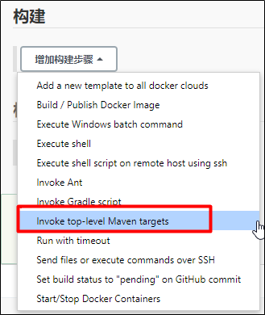
</div>


```java
clean install -Dmaven.test.skip=true  dockerfile:build -f heima-leadnews/heima-leadnews-service/heima-leadnews-user/pom.xml
```

<font color='red'>注意：根据自己的实际代码路径配置</font>

-Dmaven.test.skip=true  跳过测试

dockerfile:build 启动dockerfile插件构建容器

-f heima-leadnews-user/pom.xml 指定需要构建的文件（必须是pom）

4. 并执行shell脚本

<div align="center">
    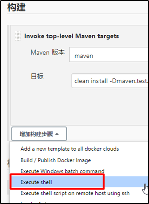
</div>

```java
if [ -n  "$(docker ps -a -f  name=$JOB_NAME  --format '{{.ID}}' )" ]
 then
 #删除之前的容器
 docker rm -f $(docker ps -a -f  name=$JOB_NAME  --format '{{.ID}}' )
fi
 # 清理镜像
docker image prune -f 
 # 启动docker服务
docker run -d --net=host -e PARAMS="--spring.profiles.active=prod"  --name $JOB_NAME docker_storage/$JOB_NAME
```

5. 执行日志

拉取代码 -> 编译打包 -> 构建镜像 -> 清理容器，创建新的容器

#### 4.4 部署服务到远程服务器上

<div align="center">
    
</div>

##### 4.4.1 安装配置私有仓库

对于持续集成环境的配置，Jenkins会发布大量的微服务， 要与多台机器进行交互， 可以采用docker镜像的保存与导出功能结合SSH实现， 但这样交互繁琐，稳定性差， 而且不便管理， 这里我们通过搭建Docker的私有仓库来实现， 这个有点类似GIT仓库， 集中统一管理资源， 由客户端拉取或更新。

1. 下载最新Registry镜像

   ```sh
   docker pull registry:latest
   ```

2. 启动Registry镜像服务

   ```sh
   docker run -d -p 5000:5000 --name registry -v /usr/local/docker/registry:/var/lib/registry registry:latest
   ```

   映射5000端口； -v是将Registry内的镜像数据卷与本地文件关联， 便于管理和维护Registry内的数据。

3. 查看仓库资源

   访问地址：http://192.168.200.100:5000/v2/_catalog

   启动正常， 可以看到返回：

   ```json
   {"repositories":[]}
   ```

   目前并没有上传镜像， 显示空数据。

4. 配置Docker客户端

   正常生产环境中使用， 要配置HTTPS服务， 确保安全，内部开发或测试集成的局域网环境，可以采用简便的方式， 不做安全控制。

   先确保持续集成环境的机器已安装好Docker客户端， 然后做以下修改：

   ```sh
   vi /lib/systemd/system/docker.service
   ```

   修改内容：

   ```sh
   ExecStart=/usr/bin/dockerd --insecure-registry 192.168.200.100:5000
   ```

   指向安装Registry的服务IP与端口。

   重启生效：

   ```sh
   systemctl daemon-reolad
   systemctl restart docker.service
   ```

##### 4.4.2 jenkins中安装插件

位置：Manage Jenkins-->Configure System

<div align="center">
    
</div>

##### 4.4.3 jenkins系统配置远程服务器链接

位置：Manage Jenkins-->Configure System

<div align="center">
    
</div>
maven命令

```java
clean install -Dmaven.test.skip=true dockerfile:build -f heima-leadnews/heima-leadnews-service/heima-leadnews-article/pom.xml
```

shell脚本

```shell
image_tag=$docker_registry/docker_storage/$JOB_NAME
echo '================docker镜像清理================'
if [ -n  "$(docker ps -a -f  name=$JOB_NAME  --format '{{.ID}}' )" ]
 then
 #删除之前的容器
 docker rm -f $(docker ps -a -f  name=$JOB_NAME  --format '{{.ID}}' )
fi
 # 清理镜像
docker image prune -f 

# 创建TAG
docker tag docker_storage/$JOB_NAME $image_tag
echo '================docker镜像推送================'
# 推送镜像
docker push $image_tag
# 删除TAG
docker rmi $image_tag
echo '================docker tag 清理 ================'
```

##### 4.4.4 在远程服务器上执行脚本

远程服务器执行的shell脚本

```shell
echo '================拉取最新镜像================'
docker pull $docker_registry/docker_storage/$JOB_NAME

echo '================删除清理容器镜像================'
if [ -n  "$(docker ps -a -f  name=$JOB_NAME  --format '{{.ID}}' )" ]
 then
 #删除之前的容器
 docker rm -f $(docker ps -a -f  name=$JOB_NAME  --format '{{.ID}}' )
fi
 # 清理镜像
docker image prune -f 

echo '===============启动容器================'
docker run -d   --net=host -e PARAMS="--spring.profiles.active=prod" --name $JOB_NAME $docker_registry/docker_storage/$JOB_NAME
```

##### 4.4.5 构建完成以后，可以登录130服务器，查看是否有相关的镜像和容器

#### 4.5 联调测试

1.参考jenkins中heima-leadnews-user微服务把app端网关部署起来

2.修改本地nginx中的配置反向代理地址为100这台服务器：heima-leadnews-app.conf

```html
upstream  heima-app-gateway{
	server 192.168.200.100:51601;
}
```

3.启动nginx，打开页面进行测试

### 5. jenkins触发器配置

#### 5.1 URL触发远程构建

触发远程构建，修改jenkins的配置，如下

<div align="center">
    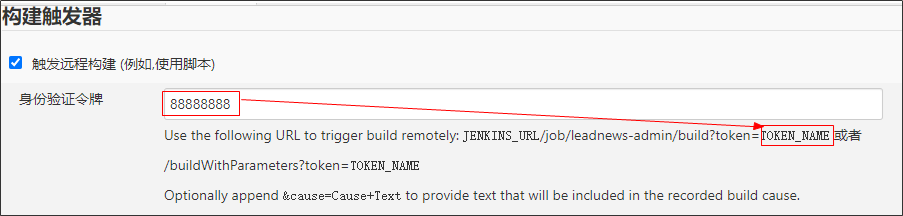
</div>

触发构建url： http://192.168.200.100:16060/job/leadnews-admin/build?token=88888888

#### 5.2 其他工程构建后触发

配置需要触发的工程

<div align="center">
    
</div>

#### 5.3 定时构建

定时构建（ Build periodically）

<div align="center">
    
</div>

定时字符串从左往右分别为： 分 时 日 月 周

**定时构建-定时表达式**

定时字符串从左往右分别为： 分 时 日 月 周

| 组成部分 | 含义        | 取值范围                   |
| -------- | ----------- | -------------------------- |
| 第一部分 | minute (分) | 0~59                       |
| 第二部分 | hour(小时)  | 0~23                       |
| 第三部分 | day(天)     | 1~31                       |
| 第四部分 | month(月)   | 1~12                       |
| 第五部分 | week(周)    | 0~7，0 和 7 都是表示星期天 |

- 符号H 表示一个随机数

- 符号*  取值范围的任意值

案例：

- 每30分钟构建一次：H/30 * * * * 10:02 10:32

- 每2个小时构建一次: H H/2 * * *

- 每天的8点，12点，22点，一天构建3次： (多个时间点中间用逗号隔开) 0 8,12,22 * * *

- 每天中午12点定时构建一次 H 12 * * *

- 每天下午18点定时构建一次 H 18 * * *

#### 5.4 轮询

轮询 SCM（Poll SCM）

轮询SCM，是指定时扫描本地代码仓库的代码是否有变更，如果代码有变更就触发项目构建。

<div align="center">
    
</div>

Jenkins会定时扫描本地整个项目的代码，增大系统的开销，不建议使用。
